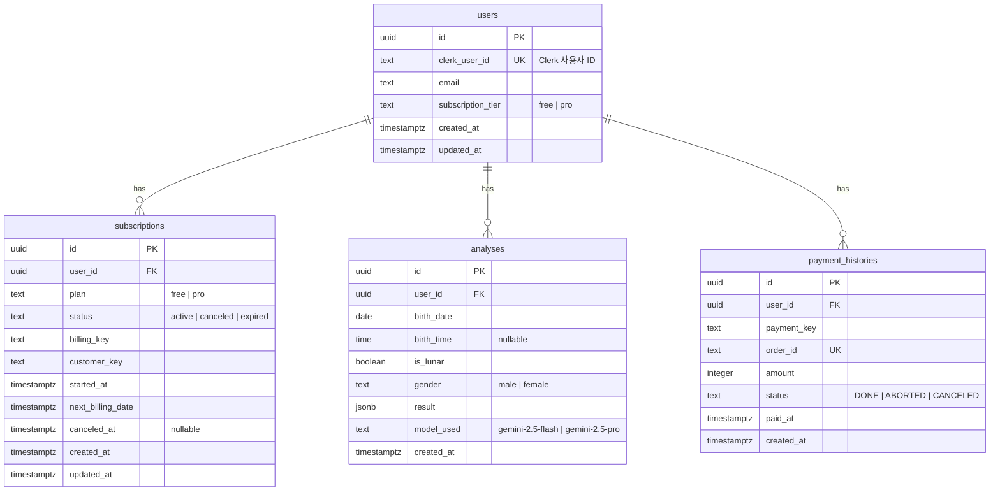

# Database Design - AI 사주 분석 구독 서비스

## 개요

본 문서는 AI 기반 구독제 사주 분석 서비스의 데이터베이스 설계를 정의합니다. PostgreSQL(Supabase)을 사용하며, Clerk 인증 시스템 및 토스페이먼츠 결제 시스템과 연동됩니다.

**설계 원칙**:
- 요구사항에 명시된 기능만 구현 (오버엔지니어링 금지)
- 간결하면서도 확장 가능한 구조
- 분석 결과 영구 보관
- 구독 시작일 기준 월별 사용량 초기화
- RLS 비활성화 (애플리케이션 레벨에서 접근 제어)

---

## 1. 데이터 플로우

### 1.1 회원가입
```
Clerk 회원가입 → Webhook → users 생성
```

### 1.2 첫 분석 (무료 유저)
```
분석 요청 → 사용량 체크 → Gemini Flash 호출 → analyses 저장 → 사용량 차감
```

### 1.3 Pro 구독
```
결제창 → 빌링키 발급 → subscriptions 생성 → payment_histories 기록
```

### 1.4 정기결제
```
토스페이먼츠 자동결제 → Webhook → payment_histories 기록 → next_billing_date 업데이트
```

### 1.5 구독 취소
```
취소 요청 → status='canceled', canceled_at 기록 → 만료일까지 Pro 유지
```

### 1.6 구독 만료
```
만료일 도달 → status='expired' → 빌링키 삭제
```

---

## 2. ERD



---

## 3. 테이블 스키마

### 3.1 users

Clerk 인증 시스템과 1:1 매칭되는 사용자 테이블.

| 컬럼 | 타입 | 제약조건 | 설명 |
|------|------|---------|------|
| id | uuid | PK, DEFAULT gen_random_uuid() | 내부 사용자 ID |
| clerk_user_id | text | UNIQUE, NOT NULL | Clerk 사용자 ID |
| email | text | NOT NULL | 이메일 |
| subscription_tier | text | NOT NULL, DEFAULT 'free' | free \| pro |
| created_at | timestamptz | NOT NULL, DEFAULT now() | 생성일 |
| updated_at | timestamptz | NOT NULL, DEFAULT now() | 수정일 |

**인덱스**:
- `idx_users_clerk_user_id` UNIQUE ON clerk_user_id
- `idx_users_email` ON email

**트리거**:
- `set_updated_at` - updated_at 자동 업데이트

**비고**:
- billing_key, customer_key는 subscriptions 테이블에서 관리 (중복 제거)
- subscription_tier는 구독 상태와 동기화

---

### 3.2 subscriptions

구독 정보 및 빌링키 관리.

| 컬럼 | 타입 | 제약조건 | 설명 |
|------|------|---------|------|
| id | uuid | PK, DEFAULT gen_random_uuid() | 구독 ID |
| user_id | uuid | FK (users.id), NOT NULL | 사용자 ID |
| plan | text | NOT NULL, DEFAULT 'free' | free \| pro |
| status | text | NOT NULL, DEFAULT 'active' | active \| canceled \| expired |
| billing_key | text | NULL | 토스페이먼츠 빌링키 |
| customer_key | text | NULL | 토스페이먼츠 고객키 |
| started_at | timestamptz | NULL | 구독 시작일 |
| next_billing_date | timestamptz | NULL | 다음 결제일 |
| canceled_at | timestamptz | NULL | 취소 요청 시각 |
| created_at | timestamptz | NOT NULL, DEFAULT now() | 생성일 |
| updated_at | timestamptz | NOT NULL, DEFAULT now() | 수정일 |

**인덱스**:
- `idx_subscriptions_user_id` ON user_id
- `idx_subscriptions_status` ON status
- `idx_subscriptions_next_billing_date` ON next_billing_date WHERE status = 'active'

**트리거**:
- `set_updated_at`

**비고**:
- status='canceled'일 때도 next_billing_date까지는 Pro 유지
- 만료 시 billing_key, customer_key NULL로 설정

---

### 3.3 analyses

사주 분석 결과 영구 보관.

| 컬럼 | 타입 | 제약조건 | 설명 |
|------|------|---------|------|
| id | uuid | PK, DEFAULT gen_random_uuid() | 분석 ID |
| user_id | uuid | FK (users.id), NOT NULL | 사용자 ID |
| birth_date | date | NOT NULL | 생년월일 |
| birth_time | time | NULL | 출생 시간 (모름 가능) |
| is_lunar | boolean | NOT NULL | 음력 여부 |
| gender | text | NOT NULL | male \| female |
| result | jsonb | NOT NULL | 분석 결과 |
| model_used | text | NOT NULL | gemini-2.5-flash \| gemini-2.5-pro |
| created_at | timestamptz | NOT NULL, DEFAULT now() | 분석일 |

**인덱스**:
- `idx_analyses_user_id_created_at` ON (user_id, created_at DESC)

**비고**:
- DELETE 작업 없음 (영구 보관)
- 개인정보 암호화는 애플리케이션 레벨에서 처리 권장

**result JSONB 구조 예시**:
```json
{
  "basic": {
    "천간지지": "...",
    "오행분석": "..."
  },
  "personality": {
    "특성": "...",
    "장단점": "..."
  },
  "fortune": {
    "대운": "...",
    "세운": "...",
    "직업운": "...",
    "재물운": "...",
    "건강운": "...",
    "연애운": "...",
    "대인관계운": "..."
  },
  "advice": {
    "긍정적방향": "...",
    "주의점": "..."
  }
}
```

---

### 3.4 payment_histories

결제 이력 기록.

| 컬럼 | 타입 | 제약조건 | 설명 |
|------|------|---------|------|
| id | uuid | PK, DEFAULT gen_random_uuid() | 이력 ID |
| user_id | uuid | FK (users.id), NOT NULL | 사용자 ID |
| payment_key | text | NOT NULL | 토스페이먼츠 결제 키 |
| order_id | text | UNIQUE, NOT NULL | 고유 주문 ID |
| amount | integer | NOT NULL | 결제 금액 (원) |
| status | text | NOT NULL | DONE \| ABORTED \| CANCELED |
| paid_at | timestamptz | NOT NULL | 결제 완료 시각 |
| created_at | timestamptz | NOT NULL, DEFAULT now() | 기록 생성일 |

**인덱스**:
- `idx_payment_histories_user_id` ON user_id
- `idx_payment_histories_order_id` UNIQUE ON order_id
- `idx_payment_histories_paid_at` ON paid_at DESC

**비고**:
- order_id UNIQUE로 Webhook 멱등성 보장

---

## 4. 사용량 관리 전략

### 4.1 설계 결정: 애플리케이션 레벨 관리

요구사항 분석 결과, 사용량 관리는 **별도 테이블 없이 애플리케이션 레벨에서 처리**하는 것이 더 간결합니다.

**이유**:
1. 무료 유저: 1회 체험 → `analyses` 테이블에서 COUNT 조회
2. Pro 유저: 월 10회 → 구독 시작일 기준으로 `analyses` 테이블 필터링하여 COUNT

### 4.2 구현 방법

```sql
-- 무료 유저 사용 횟수 조회
SELECT COUNT(*) FROM analyses WHERE user_id = $1;

-- Pro 유저 이번 달 사용 횟수 조회 (구독 시작일 기준)
SELECT COUNT(*)
FROM analyses
WHERE user_id = $1
  AND created_at >= date_trunc('month',
      (SELECT started_at FROM subscriptions WHERE user_id = $1 AND status IN ('active', 'canceled'))
    )
  AND created_at < date_trunc('month',
      (SELECT started_at FROM subscriptions WHERE user_id = $1 AND status IN ('active', 'canceled'))
    ) + INTERVAL '1 month';
```

**장점**:
- 테이블 하나 감소 (간결성)
- 월별 초기화 로직 불필요 (쿼리로 해결)
- 데이터 일관성 유지 용이

---

## 5. 제약조건

### 5.1 외래키

```sql
ALTER TABLE subscriptions
  ADD CONSTRAINT fk_subscriptions_user_id
  FOREIGN KEY (user_id) REFERENCES users(id) ON DELETE CASCADE;

ALTER TABLE analyses
  ADD CONSTRAINT fk_analyses_user_id
  FOREIGN KEY (user_id) REFERENCES users(id) ON DELETE CASCADE;

ALTER TABLE payment_histories
  ADD CONSTRAINT fk_payment_histories_user_id
  FOREIGN KEY (user_id) REFERENCES users(id) ON DELETE CASCADE;
```

### 5.2 CHECK 제약조건

```sql
ALTER TABLE users
  ADD CONSTRAINT check_subscription_tier
  CHECK (subscription_tier IN ('free', 'pro'));

ALTER TABLE subscriptions
  ADD CONSTRAINT check_plan
  CHECK (plan IN ('free', 'pro')),
  ADD CONSTRAINT check_status
  CHECK (status IN ('active', 'canceled', 'expired'));

ALTER TABLE analyses
  ADD CONSTRAINT check_gender
  CHECK (gender IN ('male', 'female')),
  ADD CONSTRAINT check_model_used
  CHECK (model_used IN ('gemini-2.5-flash', 'gemini-2.5-pro'));

ALTER TABLE payment_histories
  ADD CONSTRAINT check_amount_positive
  CHECK (amount >= 0),
  ADD CONSTRAINT check_status
  CHECK (status IN ('DONE', 'ABORTED', 'CANCELED'));
```

---

## 6. 트리거

### 6.1 updated_at 자동 업데이트

```sql
CREATE OR REPLACE FUNCTION set_updated_at()
RETURNS TRIGGER AS $$
BEGIN
  NEW.updated_at = now();
  RETURN NEW;
END;
$$ LANGUAGE plpgsql;

CREATE TRIGGER trigger_users_updated_at
  BEFORE UPDATE ON users
  FOR EACH ROW
  EXECUTE FUNCTION set_updated_at();

CREATE TRIGGER trigger_subscriptions_updated_at
  BEFORE UPDATE ON subscriptions
  FOR EACH ROW
  EXECUTE FUNCTION set_updated_at();
```

---

## 7. 마이그레이션 전략

### 7.1 파일 구조

```
supabase/migrations/
  ├── 0001_create_example_table.sql (기존)
  ├── 0002_create_users_table.sql
  ├── 0003_create_subscriptions_table.sql
  ├── 0004_create_analyses_table.sql
  ├── 0005_create_payment_histories_table.sql
  ├── 0006_add_indexes.sql
  ├── 0007_add_constraints.sql
  └── 0008_add_triggers.sql
```

### 7.2 실행 순서

1. 테이블 생성 (users → subscriptions → analyses → payment_histories)
2. 인덱스 생성
3. 제약조건 추가
4. 트리거 추가

### 7.3 멱등성 보장

```sql
-- 예시
CREATE TABLE IF NOT EXISTS users (...);
CREATE INDEX IF NOT EXISTS idx_users_clerk_user_id ON users(clerk_user_id);
```

---

## 8. 보안

### 8.1 RLS 비활성화

요구사항에 따라 RLS를 사용하지 않으므로, 모든 접근 제어는 애플리케이션 레벨에서 처리합니다.

```sql
ALTER TABLE users DISABLE ROW LEVEL SECURITY;
ALTER TABLE subscriptions DISABLE ROW LEVEL SECURITY;
ALTER TABLE analyses DISABLE ROW LEVEL SECURITY;
ALTER TABLE payment_histories DISABLE ROW LEVEL SECURITY;
```

### 8.2 개인정보 보호

- 생년월일, 출생시간은 애플리케이션 레벨에서 암호화 권장
- 환경 변수로 암호화 키 관리
- HTTPS 필수

### 8.3 SQL Injection 방지

- Supabase SDK의 쿼리 빌더 사용
- 직접 SQL 작성 시 prepared statement 필수

---

## 9. 성능 최적화

### 9.1 인덱스 전략

| 테이블 | 인덱스 | 목적 |
|--------|--------|------|
| users | clerk_user_id (UNIQUE) | Clerk 인증 조회 |
| users | email | 이메일 검색 |
| subscriptions | user_id | 사용자별 구독 조회 |
| subscriptions | status | 활성 구독 필터링 |
| subscriptions | next_billing_date (조건부) | 정기결제 스케줄링 |
| analyses | (user_id, created_at DESC) | 사용자별 최신 분석 조회 |
| payment_histories | user_id | 사용자별 결제 이력 |
| payment_histories | order_id (UNIQUE) | Webhook 멱등성 |
| payment_histories | paid_at DESC | 최신 결제 조회 |

### 9.2 쿼리 최적화

- 사용량 조회 시 COUNT 대신 EXISTS 사용 (제한 확인 시)
- 페이지네이션: OFFSET 대신 커서 기반 페이징 권장

---

## 10. 모니터링

### 10.1 주요 지표

- 테이블별 레코드 수 증가 추이
- Slow Query 탐지 (> 1초)
- 디스크 사용량
- 연결 수

### 10.2 알림 설정

- 디스크 사용량 > 80%
- 분석 API 성공률 < 95%
- 결제 실패 발생 시 즉시 알림

---

## 11. 예상 데이터 볼륨

### 11.1 6개월 예상

| 테이블 | 월간 증가 | 6개월 누적 | 평균 행 크기 | 예상 용량 |
|--------|----------|-----------|------------|----------|
| users | 500 | 3,000 | 500 bytes | 1.5 MB |
| subscriptions | 100 | 600 | 500 bytes | 0.3 MB |
| analyses | 1,500 | 9,000 | 10 KB | 90 MB |
| payment_histories | 100 | 600 | 500 bytes | 0.3 MB |
| **총계** | - | **13,200 rows** | - | **~92 MB** |

Supabase Free Tier 500MB로 충분합니다.

---

## 12. 확장성

### 12.1 향후 추가 가능 기능

- 궁합 분석: `compatibility_analyses` 테이블
- 알림: `notifications` 테이블
- 피드백: `feedbacks` 테이블

### 12.2 파티셔닝 고려

- analyses 테이블이 수백만 건 이상 증가 시 월별 파티셔닝 고려

---

## 13. 변경 이력

| 버전 | 날짜 | 변경 내용 |
|------|------|----------|
| 2.0 | 2025-10-27 | 설계 개선 - usage_records 테이블 제거, 중복 필드 제거, 인덱스 최적화 |
| 1.0 | 2025-10-27 | 초기 설계 |

---

## 14. 승인

- [ ] CTO
- [ ] 백엔드 개발자
- [ ] 프론트엔드 개발자
