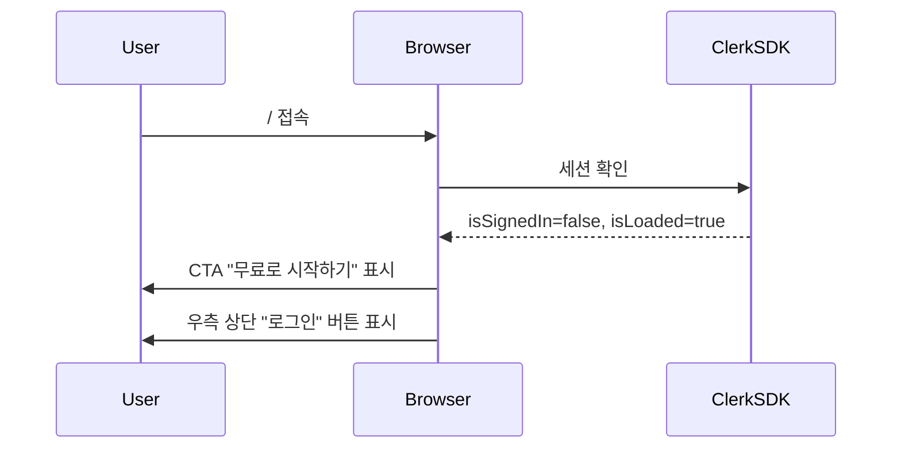
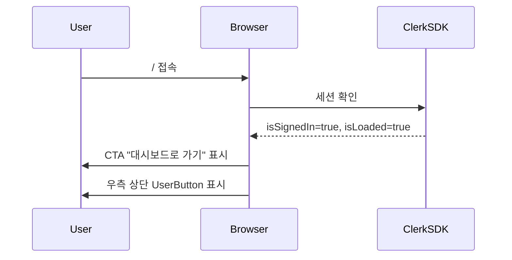
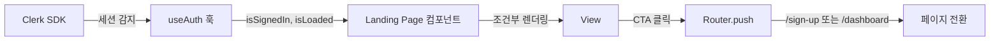
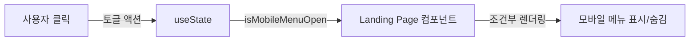
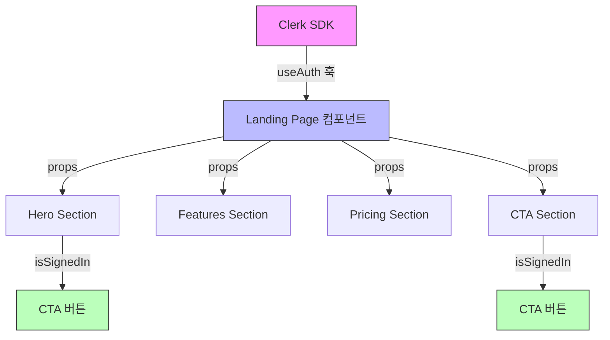

# 홈/랜딩 페이지 (/) 상태관리 설계

## 1. 페이지 개요

### 1.1 목적
- 서비스 소개 및 가치 제안
- 신규 가입 유도 (CTA: "무료로 시작하기")
- 인증 불필요 (공개 페이지)

### 1.2 주요 구성 요소 (PRD 3.2.1)
- 히어로 섹션: "AI가 풀어주는 당신의 사주팔자"
- 주요 특징 3개 카드 (AI 기반 분석, 합리적 가격, 영구 보관)
- 가격 안내 (무료 1회, Pro 월 3,900원/10회)
- CTA 버튼: "무료로 시작하기"

### 1.3 페이지 특성
- **정적 콘텐츠 중심**: 대부분의 콘텐츠는 하드코딩된 마케팅 메시지
- **동적 상태 최소**: 인증 상태 확인 및 버튼 분기만 필요
- **서버 상태 불필요**: API 호출 없음
- **클라이언트 상태 최소**: UI 인터랙션만 관리

---

## 2. 상태 데이터 분류

### 2.1 관리해야 할 상태 데이터

#### 2.1.1 인증 상태 (서버 상태 → Clerk)
```typescript
interface AuthState {
  isSignedIn: boolean;        // 로그인 여부
  isLoaded: boolean;          // Clerk SDK 로딩 완료 여부
}
```

**출처**: Clerk SDK (`useAuth()` 훅)
**변경 조건**:
- Clerk 세션 토큰 유무에 따라 자동 업데이트
- 로그인/로그아웃 시 자동 변경

**화면 변화**:
| 상태 | CTA 버튼 텍스트 | 버튼 동작 | 우측 상단 버튼 |
|------|---------------|---------|-------------|
| `isLoaded=false` | "무료로 시작하기" (비활성) | 없음 | "로그인" (비활성) |
| `isSignedIn=false` | "무료로 시작하기" | `/sign-up`으로 이동 | "로그인" |
| `isSignedIn=true` | "대시보드로 가기" | `/dashboard`로 이동 | UserButton (프로필) |

#### 2.1.2 UI 상태 (클라이언트 상태 → React 로컬 상태)
```typescript
interface UIState {
  isMobileMenuOpen: boolean;  // 모바일 햄버거 메뉴 열림/닫힘 (선택사항)
}
```

**출처**: 컴포넌트 로컬 상태 (`useState`)
**변경 조건**:
- 햄버거 버튼 클릭 시 토글
- 모바일 화면에서만 표시

**화면 변화**:
| 상태 | 모바일 메뉴 표시 |
|------|---------------|
| `isMobileMenuOpen=false` | 숨김 |
| `isMobileMenuOpen=true` | 표시 (오버레이) |

---

### 2.2 화면에 보이지만 상태가 아닌 데이터

#### 2.2.1 정적 마케팅 콘텐츠
```typescript
// 상수로 정의 (src/constants/landing.ts)
const LANDING_CONTENT = {
  hero: {
    title: 'AI가 풀어주는 당신의 사주팔자',
    subtitle: 'Google Gemini AI로 정확하고 체계적인 사주 분석을 경험하세요',
    ctaText: '무료로 시작하기',
  },
  features: [
    {
      icon: 'Sparkles',
      title: 'AI 기반 정확한 분석',
      description: 'Google Gemini 2.5 Pro 모델을 활용한 체계적이고 정밀한 사주 해석',
    },
    {
      icon: 'DollarSign',
      title: '합리적인 가격',
      description: '월 3,900원으로 10회 고품질 분석 제공, 무료 체험 1회 포함',
    },
    {
      icon: 'Archive',
      title: '영구 보관',
      description: '모든 분석 결과를 대시보드에서 언제든 다시 확인 가능',
    },
  ],
  pricing: [
    {
      tier: 'free',
      name: '무료 체험',
      price: 0,
      limit: 1,
      features: ['1회 무료 분석', 'Gemini Flash 모델', '분석 결과 영구 보관'],
    },
    {
      tier: 'pro',
      name: 'Pro',
      price: 3900,
      limit: 10,
      features: ['월 10회 분석', 'Gemini Pro 모델', '분석 결과 영구 보관', '우선 고객 지원'],
    },
  ],
} as const;
```

**이유**:
- 값이 변경되지 않음 (런타임 중 불변)
- 사용자 인터랙션과 무관
- 배포 시 빌드타임에 결정됨

---

## 3. 상태 변경 시나리오

### 3.1 페이지 진입

#### 시나리오 1: 비로그인 사용자 진입


#### 시나리오 2: 로그인 사용자 진입


### 3.2 CTA 버튼 클릭

#### 시나리오 1: 비로그인 상태에서 CTA 클릭
```mermaid
flowchart TD
    A[사용자가 '무료로 시작하기' 클릭] --> B{isSignedIn?}
    B -->|false| C[/sign-up 페이지로 이동]
    B -->|true| D[/dashboard 페이지로 이동]
```

#### 시나리오 2: 로그인 상태에서 CTA 클릭
```mermaid
flowchart TD
    A[사용자가 '대시보드로 가기' 클릭] --> B[/dashboard 페이지로 이동]
```

---

## 4. Flux 패턴 시각화

### 4.1 인증 상태 흐름



**설명**:
- **Action**: 없음 (Clerk SDK가 자동으로 상태 업데이트)
- **Store**: Clerk SDK 내부 상태 (React Context)
- **View**: 랜딩 페이지 컴포넌트

### 4.2 UI 상태 흐름 (모바일 메뉴)



**설명**:
- **Action**: 햄버거 버튼 클릭
- **Store**: React `useState` (로컬 상태)
- **View**: 모바일 메뉴 오버레이

---

## 5. Context 및 데이터 흐름

### 5.1 Context 사용 여부

**결론**: Context 사용 불필요

**이유**:
1. 랜딩 페이지는 단일 페이지 컴포넌트로 구성
2. Props drilling 문제 발생하지 않음 (컴포넌트 깊이 최대 2-3단계)
3. 인증 상태는 Clerk SDK의 `useAuth()` 훅으로 직접 접근
4. 글로벌 상태 공유 필요 없음

### 5.2 데이터 흐름



### 5.3 컴포넌트 계층 구조

```typescript
// 컴포넌트 트리 (예상)
<LandingPage>
  <Header>
    {isSignedIn ? <UserButton /> : <SignInButton />}
  </Header>

  <HeroSection>
    <CTAButton isSignedIn={isSignedIn} />
  </HeroSection>

  <FeaturesSection features={LANDING_CONTENT.features} />

  <PricingSection pricing={LANDING_CONTENT.pricing} />

  <CTASection>
    <CTAButton isSignedIn={isSignedIn} />
  </CTASection>

  <Footer />
</LandingPage>
```

---

## 6. 컴포넌트별 Props 및 함수

### 6.1 LandingPage (페이지 컴포넌트)

```typescript
'use client';

import { useAuth } from '@clerk/nextjs';

export default function LandingPage() {
  const { isSignedIn, isLoaded } = useAuth();

  // 로딩 중 처리
  if (!isLoaded) {
    return <LoadingSpinner />;
  }

  return (
    <div>
      <Header isSignedIn={isSignedIn} />
      <HeroSection isSignedIn={isSignedIn} />
      <FeaturesSection />
      <PricingSection />
      <CTASection isSignedIn={isSignedIn} />
      <Footer />
    </div>
  );
}
```

**사용 훅**:
- `useAuth()` (Clerk)

**Props**: 없음 (페이지 컴포넌트)

**내부 상태**: 없음

---

### 6.2 Header 컴포넌트

```typescript
interface HeaderProps {
  isSignedIn: boolean;
}

export function Header({ isSignedIn }: HeaderProps) {
  const [isMobileMenuOpen, setIsMobileMenuOpen] = useState(false);

  return (
    <header>
      <Logo />
      <nav className="hidden md:flex">
        {isSignedIn ? (
          <>
            <Link href="/dashboard">대시보드</Link>
            <UserButton />
          </>
        ) : (
          <>
            <Link href="/sign-in">로그인</Link>
            <Link href="/sign-up">회원가입</Link>
          </>
        )}
      </nav>

      {/* 모바일 햄버거 메뉴 */}
      <button
        className="md:hidden"
        onClick={() => setIsMobileMenuOpen(!isMobileMenuOpen)}
      >
        <MenuIcon />
      </button>

      {/* 모바일 메뉴 오버레이 */}
      {isMobileMenuOpen && (
        <MobileMenu
          isSignedIn={isSignedIn}
          onClose={() => setIsMobileMenuOpen(false)}
        />
      )}
    </header>
  );
}
```

**Props**:
- `isSignedIn: boolean` - 로그인 여부

**내부 상태**:
- `isMobileMenuOpen: boolean` - 모바일 메뉴 열림/닫힘

**함수**:
- `setIsMobileMenuOpen(value: boolean)` - 모바일 메뉴 토글

---

### 6.3 CTAButton 컴포넌트

```typescript
interface CTAButtonProps {
  isSignedIn: boolean;
  variant?: 'primary' | 'secondary';
  className?: string;
}

export function CTAButton({ isSignedIn, variant = 'primary', className }: CTAButtonProps) {
  const router = useRouter();

  const handleClick = () => {
    if (isSignedIn) {
      router.push('/dashboard');
    } else {
      router.push('/sign-up');
    }
  };

  return (
    <Button
      onClick={handleClick}
      variant={variant}
      className={className}
    >
      {isSignedIn ? '대시보드로 가기' : '무료로 시작하기'}
    </Button>
  );
}
```

**Props**:
- `isSignedIn: boolean` - 로그인 여부
- `variant?: 'primary' | 'secondary'` - 버튼 스타일
- `className?: string` - 추가 스타일

**내부 상태**: 없음

**함수**:
- `handleClick()` - 클릭 시 페이지 이동

---

### 6.4 FeaturesSection 컴포넌트

```typescript
export function FeaturesSection() {
  return (
    <section>
      <h2>주요 특징</h2>
      <div className="grid md:grid-cols-3 gap-6">
        {LANDING_CONTENT.features.map((feature) => (
          <FeatureCard key={feature.title} {...feature} />
        ))}
      </div>
    </section>
  );
}

interface FeatureCardProps {
  icon: string;
  title: string;
  description: string;
}

function FeatureCard({ icon, title, description }: FeatureCardProps) {
  const Icon = icons[icon]; // lucide-react 아이콘

  return (
    <Card>
      <CardHeader>
        <Icon className="w-12 h-12" />
        <CardTitle>{title}</CardTitle>
      </CardHeader>
      <CardDescription>{description}</CardDescription>
    </Card>
  );
}
```

**Props**: 없음 (정적 데이터 사용)

**내부 상태**: 없음

**의존성**:
- `LANDING_CONTENT.features` (상수)

---

### 6.5 PricingSection 컴포넌트

```typescript
export function PricingSection() {
  return (
    <section>
      <h2>가격 안내</h2>
      <div className="grid md:grid-cols-2 gap-6">
        {LANDING_CONTENT.pricing.map((plan) => (
          <PricingCard key={plan.tier} {...plan} />
        ))}
      </div>
    </section>
  );
}

interface PricingCardProps {
  tier: 'free' | 'pro';
  name: string;
  price: number;
  limit: number;
  features: string[];
}

function PricingCard({ tier, name, price, limit, features }: PricingCardProps) {
  return (
    <Card className={tier === 'pro' ? 'border-primary' : ''}>
      <CardHeader>
        <CardTitle>{name}</CardTitle>
        <div className="text-3xl font-bold">
          {price === 0 ? '무료' : `₩${price.toLocaleString()}`}
          {price > 0 && <span className="text-sm text-muted-foreground">/월</span>}
        </div>
      </CardHeader>
      <CardContent>
        <ul>
          {features.map((feature) => (
            <li key={feature}>
              <CheckIcon /> {feature}
            </li>
          ))}
        </ul>
      </CardContent>
    </Card>
  );
}
```

**Props**: 없음 (정적 데이터 사용)

**내부 상태**: 없음

**의존성**:
- `LANDING_CONTENT.pricing` (상수)

---

## 7. 상태관리 기술 스택

### 7.1 사용하는 상태관리 도구

| 상태 종류 | 도구 | 사용 위치 | 이유 |
|---------|------|---------|------|
| **인증 상태** | Clerk SDK (`useAuth`) | 전역 | Clerk 제공 훅 사용 |
| **UI 상태** | React `useState` | 로컬 (Header) | 단순 토글 상태 |
| **정적 데이터** | 상수 (`LANDING_CONTENT`) | 빌드타임 | 변경되지 않는 콘텐츠 |

### 7.2 사용하지 않는 도구

| 도구 | 사용 안 함 이유 |
|------|-------------|
| **React Query** | API 호출 없음 |
| **Zustand** | 글로벌 상태 불필요 |
| **Context API** | Props drilling 문제 없음 |
| **useReducer** | 복잡한 상태 로직 없음 |

---

## 8. 성능 최적화 전략

### 8.1 코드 스플리팅
```typescript
// 필요 시 동적 import (현재는 불필요)
// const HeroSection = dynamic(() => import('./hero-section'), { ssr: true });
```

### 8.2 이미지 최적화
```typescript
import Image from 'next/image';

// 히어로 이미지 최적화
<Image
  src="/hero-image.jpg"
  alt="AI 사주 분석"
  width={1200}
  height={600}
  priority // LCP 최적화
/>
```

### 8.3 폰트 최적화
```typescript
import { Inter } from 'next/font/google';

const inter = Inter({ subsets: ['latin'] });
```

---

## 9. 접근성 (Accessibility)

### 9.1 시맨틱 HTML
```tsx
<main>
  <section aria-labelledby="hero-title">
    <h1 id="hero-title">AI가 풀어주는 당신의 사주팔자</h1>
  </section>

  <section aria-labelledby="features-title">
    <h2 id="features-title">주요 특징</h2>
  </section>

  <section aria-labelledby="pricing-title">
    <h2 id="pricing-title">가격 안내</h2>
  </section>
</main>
```

### 9.2 키보드 네비게이션
- 모든 인터랙티브 요소는 `<button>` 또는 `<Link>` 사용
- `tabIndex` 기본값 유지
- Focus 스타일 명확히 표시

### 9.3 스크린 리더
```tsx
<button aria-label="모바일 메뉴 열기">
  <MenuIcon aria-hidden="true" />
</button>
```

---

## 10. 에러 처리

### 10.1 Clerk SDK 로딩 실패
```typescript
export default function LandingPage() {
  const { isSignedIn, isLoaded } = useAuth();

  if (!isLoaded) {
    return (
      <div className="flex items-center justify-center min-h-screen">
        <Spinner />
      </div>
    );
  }

  // 정상 렌더링...
}
```

### 10.2 네비게이션 실패
```typescript
const handleClick = async () => {
  try {
    await router.push(isSignedIn ? '/dashboard' : '/sign-up');
  } catch (error) {
    console.error('Navigation failed:', error);
    toast({
      title: '페이지 이동 실패',
      description: '잠시 후 다시 시도해주세요.',
      variant: 'destructive',
    });
  }
};
```

---

## 11. 테스트 전략

### 11.1 단위 테스트 (필요 시)
```typescript
describe('CTAButton', () => {
  it('비로그인 사용자에게 "무료로 시작하기" 표시', () => {
    render(<CTAButton isSignedIn={false} />);
    expect(screen.getByText('무료로 시작하기')).toBeInTheDocument();
  });

  it('로그인 사용자에게 "대시보드로 가기" 표시', () => {
    render(<CTAButton isSignedIn={true} />);
    expect(screen.getByText('대시보드로 가기')).toBeInTheDocument();
  });
});
```

### 11.2 통합 테스트
```typescript
describe('LandingPage', () => {
  it('비로그인 상태에서 CTA 클릭 시 /sign-up으로 이동', async () => {
    const { user } = render(<LandingPage />, {
      clerkMock: { isSignedIn: false, isLoaded: true }
    });

    const ctaButton = screen.getByText('무료로 시작하기');
    await user.click(ctaButton);

    expect(mockRouter).toHaveBeenCalledWith('/sign-up');
  });
});
```

---

## 12. 구현 체크리스트

### 12.1 상태관리
- [ ] Clerk SDK 설치 및 Provider 설정
- [ ] `useAuth()` 훅 사용하여 인증 상태 확인
- [ ] 로딩 상태 처리 (isLoaded)
- [ ] 모바일 메뉴 상태 관리 (useState)

### 12.2 컴포넌트
- [ ] LandingPage 페이지 컴포넌트
- [ ] Header (네비게이션)
- [ ] HeroSection
- [ ] FeaturesSection
- [ ] PricingSection
- [ ] CTAButton (재사용 가능)
- [ ] Footer

### 12.3 상수 정의
- [ ] `src/constants/landing.ts` 생성
- [ ] LANDING_CONTENT 정의 (히어로, 특징, 가격)

### 12.4 스타일링
- [ ] 반응형 디자인 (모바일, 태블릿, 데스크톱)
- [ ] shadcn-ui 컴포넌트 사용 (Card, Button)
- [ ] Tailwind CSS 유틸리티

### 12.5 접근성
- [ ] 시맨틱 HTML 사용
- [ ] aria-label 추가
- [ ] 키보드 네비게이션 테스트

### 12.6 성능
- [ ] 이미지 최적화 (next/image)
- [ ] 폰트 최적화 (next/font)
- [ ] Lighthouse 점수 확인 (FCP < 1.5초)

---

## 13. 향후 개선 사항 (Phase 2 이후)

### 13.1 애니메이션
- Framer Motion을 사용한 스크롤 애니메이션
- CTA 버튼 hover 효과

### 13.2 A/B 테스트
- CTA 버튼 문구 변경 테스트
- 가격 표시 방식 테스트

### 13.3 SEO 최적화
- 메타 태그 최적화
- Open Graph 설정
- 구조화된 데이터 (JSON-LD)

---

## 14. 변경 이력

| 버전 | 날짜 | 작성자 | 변경 내용 |
|------|------|--------|----------|
| 1.0 | 2025-10-27 | Claude Code | 초기 상태관리 설계 문서 작성 |

---

## 15. 참고 문서

- [PRD - 3.2.1 홈 페이지](/docs/prd.md#321-홈-랜딩페이지-)
- [Userflow - 신규 회원가입 및 첫 분석 플로우](/docs/userflow.md#1-신규-회원가입-및-첫-분석-플로우)
- [Clerk Documentation](https://clerk.com/docs/references/react/use-auth)
- [Next.js App Router](https://nextjs.org/docs/app)
