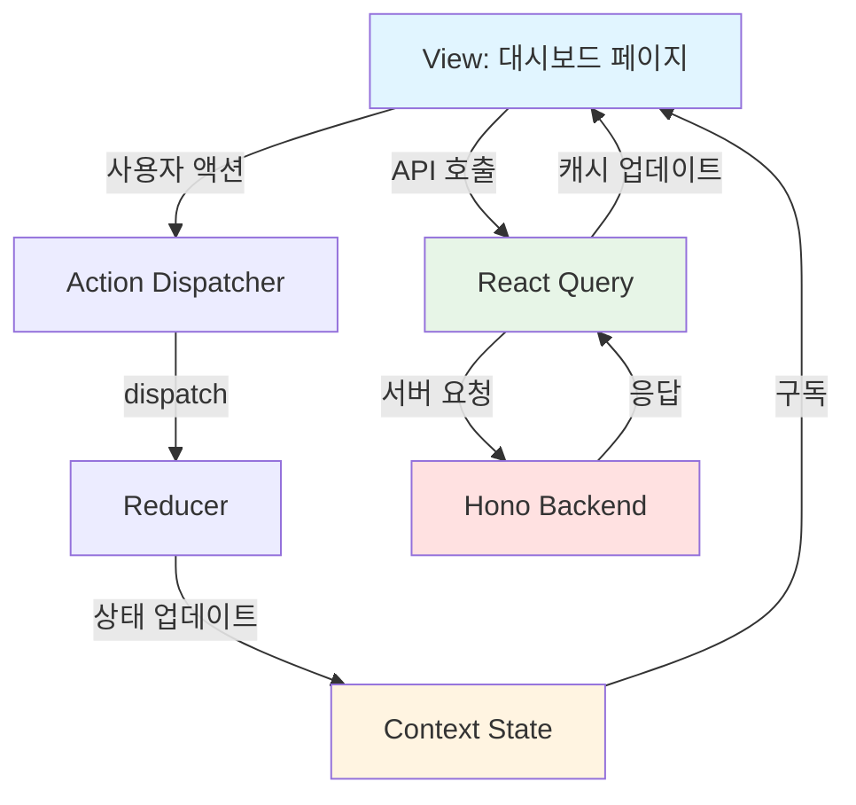
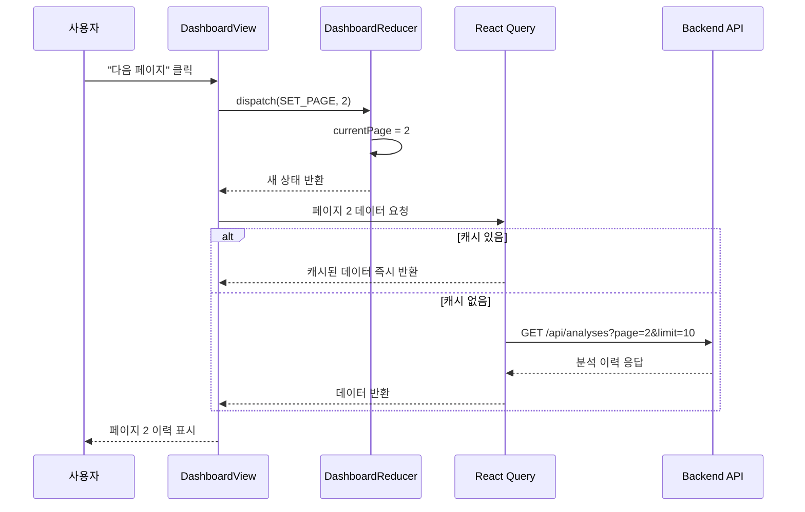
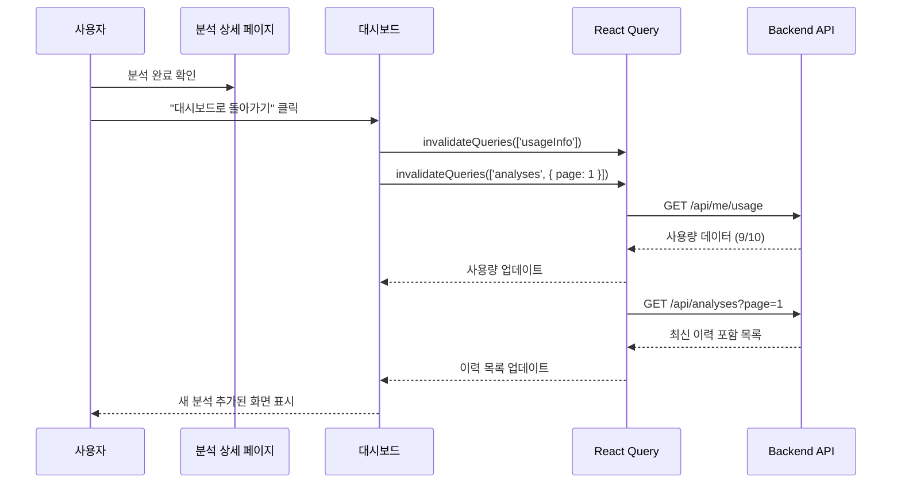
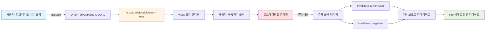

# 대시보드 페이지 상태관리 설계

## 개요

본 문서는 대시보드 페이지(`/dashboard`)의 상태관리 설계를 정의합니다. Context + useReducer 패턴을 사용하여 구독 상태, 사용량, 분석 이력 등의 복잡한 상태를 관리합니다.

**설계 원칙**:
- Context + useReducer를 통한 중앙 집중식 상태관리
- React Query를 통한 서버 상태 관리 및 캐싱
- 명확한 Flux 패턴 (Action → Reducer → State → View)
- 페이지네이션 상태는 로컬 상태로 관리

---

## 1. 관리해야 할 상태 데이터

### 1.1 서버 상태 (React Query)

| 상태 | 타입 | 설명 | 캐싱 전략 |
|------|------|------|----------|
| `currentUser` | `CurrentUser` | 사용자 정보 및 구독 상태 | staleTime: 5분, 페이지 진입 시 항상 재검증 |
| `usageInfo` | `UsageInfo` | 남은 분석 횟수 및 사용량 | staleTime: 1분, 분석 완료 시 무효화 |
| `analysisHistory` | `PaginationResult<Analysis>` | 분석 이력 목록 | staleTime: 5분, 페이지별 캐싱 |

### 1.2 로컬 상태 (Context + useReducer)

| 상태 | 타입 | 설명 | 기본값 |
|------|------|------|-------|
| `currentPage` | `number` | 현재 페이지 번호 | `1` |
| `pageSize` | `number` | 페이지당 항목 수 | `10` |
| `isUpgradeModalOpen` | `boolean` | Pro 업그레이드 모달 표시 여부 | `false` |

### 1.3 화면상에 보여지지만 상태가 아닌 데이터

이러한 데이터는 계산된 값(derived state)이므로 별도 상태로 관리하지 않습니다:

- **사용 가능 여부**: `usageInfo.remaining > 0`로 계산
- **다음 초기화 날짜 문자열**: `formatDate(usageInfo.nextResetDate)`로 계산
- **구독 상태 표시 문자열**: `currentUser.subscriptionTier` 기반으로 계산
- **분석 이력 카드 데이터**: `analysisHistory.data` 기반으로 변환

---

## 2. 상태 변경 조건 및 화면 반영

### 2.1 currentUser (사용자 정보)

| 상태 변경 조건 | 변경 후 화면 |
|---------------|------------|
| 페이지 진입 시 로딩 완료 | 환영 메시지 표시, 구독 상태 배지 렌더링 |
| 구독 변경 (무료 → Pro) | 배지 "Pro 구독 중"으로 변경, Pro 업그레이드 버튼 숨김 |
| 구독 취소 상태 변경 | 배지 "Pro (취소 예정)"으로 표시, 구독 관리 링크 강조 |
| 세션 만료 | 로그인 페이지로 리다이렉트 |

### 2.2 usageInfo (사용량 정보)

| 상태 변경 조건 | 변경 후 화면 |
|---------------|------------|
| 페이지 진입 시 로딩 완료 | "남은 분석: X/Y회" 표시 |
| 분석 완료 후 돌아옴 | 남은 횟수 감소 표시 (예: 10/10 → 9/10) |
| 사용량 초과 (remaining === 0) | "새 분석하기" 버튼 비활성화, 안내 메시지 표시 |
| 구독 갱신 (Pro 유저) | 사용량 초기화 (0/10 → 10/10), 다음 초기화 날짜 업데이트 |
| 무료 → Pro 업그레이드 | 사용량 한도 변경 (0/1 → 0/10) |

### 2.3 analysisHistory (분석 이력)

| 상태 변경 조건 | 변경 후 화면 |
|---------------|------------|
| 페이지 진입 시 로딩 완료 | 최신 분석 이력 목록 표시 (최대 10개) |
| 새 분석 완료 후 돌아옴 | 목록 최상단에 신규 분석 추가 |
| 페이지네이션: 다음 페이지 클릭 | 다음 10개 이력 표시 |
| 페이지네이션: 이전 페이지 클릭 | 이전 10개 이력 표시 |
| 분석 이력 없음 | Empty State UI 표시 ("아직 분석 이력이 없습니다") |

### 2.4 currentPage & pageSize (페이지네이션)

| 상태 변경 조건 | 변경 후 화면 |
|---------------|------------|
| "다음 페이지" 버튼 클릭 | `currentPage + 1`, 해당 페이지 이력 로딩 |
| "이전 페이지" 버튼 클릭 | `currentPage - 1`, 해당 페이지 이력 로딩 |
| 페이지 번호 직접 클릭 | 클릭한 페이지로 이동, 해당 페이지 이력 로딩 |
| 마지막 페이지 도달 | "다음 페이지" 버튼 비활성화 |
| 첫 페이지 | "이전 페이지" 버튼 비활성화 |

### 2.5 isUpgradeModalOpen (업그레이드 모달)

| 상태 변경 조건 | 변경 후 화면 |
|---------------|------------|
| "Pro로 업그레이드" 버튼 클릭 | 모달 표시, Pro 혜택 안내 |
| 모달 내 "구독하기" 클릭 | 토스페이먼츠 결제창으로 이동 |
| 모달 닫기 | 모달 숨김, 대시보드 그대로 유지 |

---

## 3. Flux 패턴 시각화

### 3.1 전체 데이터 흐름 (Mermaid)



### 3.2 페이지네이션 액션 플로우



### 3.3 분석 완료 후 돌아오는 플로우



### 3.4 Pro 업그레이드 플로우



---

## 4. Context 데이터 흐름 및 설계

### 4.1 Context 구조

```typescript
// src/features/dashboard/context/dashboard-context.tsx

import { createContext, useContext, useReducer, ReactNode } from 'react';

// ----- 상태 타입 정의 -----

interface DashboardState {
  // 페이지네이션
  currentPage: number;
  pageSize: number;

  // UI 상태
  isUpgradeModalOpen: boolean;
}

// ----- 액션 타입 정의 -----

type DashboardAction =
  | { type: 'SET_PAGE'; payload: number }
  | { type: 'SET_PAGE_SIZE'; payload: number }
  | { type: 'OPEN_UPGRADE_MODAL' }
  | { type: 'CLOSE_UPGRADE_MODAL' }
  | { type: 'RESET_PAGINATION' };

// ----- Reducer -----

const initialState: DashboardState = {
  currentPage: 1,
  pageSize: 10,
  isUpgradeModalOpen: false,
};

function dashboardReducer(state: DashboardState, action: DashboardAction): DashboardState {
  switch (action.type) {
    case 'SET_PAGE':
      return { ...state, currentPage: action.payload };

    case 'SET_PAGE_SIZE':
      return { ...state, pageSize: action.payload, currentPage: 1 };

    case 'OPEN_UPGRADE_MODAL':
      return { ...state, isUpgradeModalOpen: true };

    case 'CLOSE_UPGRADE_MODAL':
      return { ...state, isUpgradeModalOpen: false };

    case 'RESET_PAGINATION':
      return { ...state, currentPage: 1 };

    default:
      return state;
  }
}

// ----- Context 생성 -----

interface DashboardContextValue {
  state: DashboardState;
  dispatch: React.Dispatch<DashboardAction>;
}

const DashboardContext = createContext<DashboardContextValue | undefined>(undefined);

// ----- Provider 컴포넌트 -----

export function DashboardProvider({ children }: { children: ReactNode }) {
  const [state, dispatch] = useReducer(dashboardReducer, initialState);

  return (
    <DashboardContext.Provider value={{ state, dispatch }}>
      {children}
    </DashboardContext.Provider>
  );
}

// ----- Hook -----

export function useDashboard() {
  const context = useContext(DashboardContext);
  if (!context) {
    throw new Error('useDashboard must be used within DashboardProvider');
  }
  return context;
}
```

### 4.2 React Query 훅 설계

```typescript
// src/features/dashboard/hooks/use-dashboard-data.ts

import { useQuery } from '@tanstack/react-query';
import { apiClient } from '@/lib/remote/api-client';
import type { CurrentUser, UsageInfo, Analysis, PaginationResult } from '@/lib/remote/types';

// ----- 사용자 정보 조회 -----

export function useCurrentUser() {
  return useQuery({
    queryKey: ['currentUser'],
    queryFn: async () => {
      const response = await apiClient.get<CurrentUser>('/api/me');
      return response.data;
    },
    staleTime: 5 * 60 * 1000, // 5분
    refetchOnMount: true,
    refetchOnWindowFocus: false,
  });
}

// ----- 사용량 조회 -----

export function useUsageInfo() {
  return useQuery({
    queryKey: ['usageInfo'],
    queryFn: async () => {
      const response = await apiClient.get<UsageInfo>('/api/me/usage');
      return response.data;
    },
    staleTime: 1 * 60 * 1000, // 1분
    refetchOnMount: true,
    refetchOnWindowFocus: false,
  });
}

// ----- 분석 이력 조회 -----

export function useAnalysisHistory(page: number, limit: number) {
  return useQuery({
    queryKey: ['analyses', { page, limit }],
    queryFn: async () => {
      const response = await apiClient.get<PaginationResult<Analysis>>(
        `/api/analyses?page=${page}&limit=${limit}`
      );
      return response.data;
    },
    staleTime: 5 * 60 * 1000, // 5분
    keepPreviousData: true, // 페이지네이션 시 이전 데이터 유지
    refetchOnWindowFocus: false,
  });
}

// ----- 캐시 무효화 헬퍼 -----

import { useQueryClient } from '@tanstack/react-query';

export function useInvalidateDashboard() {
  const queryClient = useQueryClient();

  return {
    // 사용량 및 이력 모두 무효화 (분석 완료 후 호출)
    invalidateAll: () => {
      queryClient.invalidateQueries(['usageInfo']);
      queryClient.invalidateQueries(['analyses']);
    },

    // 사용자 정보만 무효화 (구독 변경 후 호출)
    invalidateUser: () => {
      queryClient.invalidateQueries(['currentUser']);
      queryClient.invalidateQueries(['usageInfo']);
    },

    // 특정 페이지 이력만 무효화
    invalidatePage: (page: number) => {
      queryClient.invalidateQueries(['analyses', { page }]);
    },
  };
}
```

### 4.3 Context가 노출하는 변수 및 함수

**상태 변수**:
- `state.currentPage`: 현재 페이지 번호
- `state.pageSize`: 페이지당 항목 수
- `state.isUpgradeModalOpen`: 업그레이드 모달 표시 여부

**액션 함수** (dispatch를 통해):
- `setPage(page: number)`: 페이지 변경
- `setPageSize(size: number)`: 페이지 크기 변경 (페이지는 1로 리셋)
- `openUpgradeModal()`: Pro 업그레이드 모달 열기
- `closeUpgradeModal()`: 모달 닫기
- `resetPagination()`: 페이지네이션 초기화 (1페이지로 이동)

**React Query 데이터**:
- `currentUser`: 사용자 정보 (이름, 이메일, 구독 상태)
- `usageInfo`: 사용량 정보 (used, limit, remaining, nextResetDate)
- `analysisHistory`: 분석 이력 목록 (data, total, page, totalPages)

**헬퍼 함수**:
- `invalidateAll()`: 모든 캐시 무효화
- `invalidateUser()`: 사용자 관련 캐시 무효화
- `invalidatePage(page)`: 특정 페이지 캐시 무효화

---

## 5. 컴포넌트 계층 및 상태 사용

### 5.1 컴포넌트 트리

```
DashboardPage
├── DashboardProvider (Context)
│   ├── DashboardHeader
│   │   ├── UserWelcome (currentUser)
│   │   ├── SubscriptionBadge (currentUser)
│   │   └── UsageIndicator (usageInfo)
│   ├── ActionSection
│   │   ├── NewAnalysisButton (usageInfo)
│   │   └── UpgradeButton (currentUser, dispatch)
│   ├── AnalysisHistoryList (analysisHistory, currentPage)
│   │   ├── AnalysisCard[] (map)
│   │   └── EmptyState (if no data)
│   ├── Pagination (currentPage, totalPages, dispatch)
│   └── UpgradeModal (isUpgradeModalOpen, dispatch)
```

### 5.2 각 컴포넌트의 상태 사용

| 컴포넌트 | 사용하는 상태/데이터 | 액션/함수 |
|---------|---------------------|----------|
| `DashboardHeader` | `currentUser`, `usageInfo` | - |
| `UserWelcome` | `currentUser.email` | - |
| `SubscriptionBadge` | `currentUser.subscriptionTier`, `currentUser.subscription?.status` | - |
| `UsageIndicator` | `usageInfo.used`, `usageInfo.limit`, `usageInfo.remaining` | - |
| `NewAnalysisButton` | `usageInfo.remaining` | navigate to `/analysis/new` |
| `UpgradeButton` | `currentUser.subscriptionTier` | `dispatch(OPEN_UPGRADE_MODAL)` |
| `AnalysisHistoryList` | `analysisHistory.data` | - |
| `AnalysisCard` | `analysis: Analysis` (props) | navigate to `/analysis/[id]` |
| `EmptyState` | `analysisHistory.data.length` | navigate to `/analysis/new` |
| `Pagination` | `state.currentPage`, `analysisHistory.totalPages` | `dispatch(SET_PAGE)` |
| `UpgradeModal` | `state.isUpgradeModalOpen` | `dispatch(CLOSE_UPGRADE_MODAL)`, requestTossPayment() |

---

## 6. React Query 캐싱 전략

### 6.1 캐싱 정책 요약

| 쿼리 키 | staleTime | gcTime | refetchOnMount | 무효화 시점 |
|---------|-----------|--------|----------------|------------|
| `['currentUser']` | 5분 | 10분 | true | 구독 변경 시 |
| `['usageInfo']` | 1분 | 5분 | true | 분석 완료 시, 구독 변경 시 |
| `['analyses', { page, limit }]` | 5분 | 10분 | false | 분석 완료 시 (page 1만) |

### 6.2 캐싱 이유 및 근거

**currentUser (staleTime: 5분)**:
- 구독 상태는 자주 변경되지 않으므로 5분간 캐싱
- 페이지 진입 시 항상 최신 정보 확인 (refetchOnMount: true)
- 구독 변경 시 명시적으로 무효화하여 즉시 반영

**usageInfo (staleTime: 1분)**:
- 분석 사용량은 사용자 액션에 따라 자주 변경될 수 있으므로 1분간만 캐싱
- 분석 완료 후 대시보드로 돌아올 때 반드시 무효화하여 최신 사용량 표시
- 구독 갱신 시에도 무효화하여 사용량 리셋 반영

**analyses (staleTime: 5분)**:
- 분석 이력은 변경 빈도가 낮으므로 5분간 캐싱
- 페이지별로 캐싱하여 빠른 페이지 이동 지원
- 새 분석 완료 시 첫 페이지만 무효화 (최신 이력 추가 반영)
- `keepPreviousData: true`로 페이지 전환 시 깜빡임 방지

### 6.3 무효화(Invalidation) 전략

**분석 완료 후 대시보드 복귀 시**:
```typescript
// 분석 상세 페이지에서 "대시보드로 돌아가기" 클릭 시
const { invalidateAll } = useInvalidateDashboard();

const handleBackToDashboard = () => {
  invalidateAll(); // usageInfo + analyses 모두 무효화
  router.push('/dashboard');
};
```

**Pro 구독 완료 후**:
```typescript
// 결제 콜백 페이지에서
const { invalidateUser } = useInvalidateDashboard();

useEffect(() => {
  if (paymentSuccess) {
    invalidateUser(); // currentUser + usageInfo 무효화
    router.push('/dashboard');
  }
}, [paymentSuccess]);
```

**구독 취소 후**:
```typescript
// 구독 관리 페이지에서
const { invalidateUser } = useInvalidateDashboard();

const handleCancelSubscription = async () => {
  await cancelSubscriptionMutation.mutateAsync();
  invalidateUser(); // 구독 상태 즉시 반영
};
```

### 6.4 최적화 기법

**Prefetching (선택적)**:
```typescript
// 대시보드 로딩 시 다음 페이지 미리 로드
const queryClient = useQueryClient();
const { state } = useDashboard();

useEffect(() => {
  if (state.currentPage < totalPages) {
    queryClient.prefetchQuery({
      queryKey: ['analyses', { page: state.currentPage + 1, limit: state.pageSize }],
      queryFn: () => fetchAnalyses(state.currentPage + 1, state.pageSize),
    });
  }
}, [state.currentPage, totalPages]);
```

**Background Refetch**:
- `refetchOnWindowFocus: false`로 설정하여 불필요한 재요청 방지
- 사용자가 명시적으로 액션을 취했을 때만 무효화 및 재요청

---

## 7. 에러 처리 및 로딩 상태

### 7.1 로딩 상태 관리

```typescript
// 대시보드 메인 컴포넌트
function DashboardPage() {
  const { data: currentUser, isLoading: isLoadingUser } = useCurrentUser();
  const { data: usageInfo, isLoading: isLoadingUsage } = useUsageInfo();
  const { state } = useDashboard();
  const { data: analysisHistory, isLoading: isLoadingHistory } = useAnalysisHistory(
    state.currentPage,
    state.pageSize
  );

  // 초기 로딩 상태
  if (isLoadingUser || isLoadingUsage) {
    return <DashboardSkeleton />;
  }

  // 이력 로딩 상태 (헤더는 표시)
  const isLoadingContent = isLoadingHistory;

  return (
    <DashboardProvider>
      <DashboardHeader user={currentUser} usage={usageInfo} />
      {isLoadingContent ? (
        <AnalysisHistorySkeleton />
      ) : (
        <AnalysisHistoryList history={analysisHistory} />
      )}
    </DashboardProvider>
  );
}
```

### 7.2 에러 처리

```typescript
// 에러 바운더리
function DashboardErrorBoundary({ children }: { children: ReactNode }) {
  const { data: currentUser, error: userError } = useCurrentUser();
  const { data: usageInfo, error: usageError } = useUsageInfo();

  if (userError) {
    return <ErrorDisplay message="사용자 정보를 불러올 수 없습니다." retry={() => window.location.reload()} />;
  }

  if (usageError) {
    return <ErrorDisplay message="사용량 정보를 불러올 수 없습니다." retry={() => window.location.reload()} />;
  }

  return <>{children}</>;
}
```

**에러 유형별 처리**:

| 에러 유형 | HTTP 코드 | 처리 방법 |
|----------|----------|----------|
| 인증 오류 | 401 | 로그인 페이지로 리다이렉트 |
| 권한 오류 | 403 | 에러 메시지 표시, 홈으로 이동 |
| 네트워크 오류 | - | React Query 자동 재시도 (3회), 실패 시 에러 UI |
| 서버 오류 | 500 | 에러 메시지 표시, "다시 시도" 버튼 |

---

## 8. 성능 최적화

### 8.1 메모이제이션

```typescript
// 분석 이력 목록 컴포넌트
import { memo } from 'react';

const AnalysisCard = memo(({ analysis }: { analysis: Analysis }) => {
  // 렌더링 로직
});

// 페이지네이션 컴포넌트
const Pagination = memo(({ currentPage, totalPages, onPageChange }: PaginationProps) => {
  // 렌더링 로직
});
```

### 8.2 Lazy Loading

```typescript
// 모달은 사용 시점에 로드
import { lazy, Suspense } from 'react';

const UpgradeModal = lazy(() => import('@/features/dashboard/components/upgrade-modal'));

function DashboardPage() {
  const { state } = useDashboard();

  return (
    <>
      {/* ... */}
      {state.isUpgradeModalOpen && (
        <Suspense fallback={<ModalSkeleton />}>
          <UpgradeModal />
        </Suspense>
      )}
    </>
  );
}
```

### 8.3 가상 스크롤 (선택적)

분석 이력이 매우 많은 경우 `react-window` 또는 `react-virtual` 사용 고려:

```typescript
import { useVirtualizer } from '@tanstack/react-virtual';

function AnalysisHistoryList({ analyses }: { analyses: Analysis[] }) {
  const parentRef = useRef<HTMLDivElement>(null);

  const rowVirtualizer = useVirtualizer({
    count: analyses.length,
    getScrollElement: () => parentRef.current,
    estimateSize: () => 120, // 카드 높이
  });

  // 가상화된 리스트 렌더링
}
```

---

## 9. 테스트 시나리오

### 9.1 상태 변경 테스트

| 테스트 케이스 | 초기 상태 | 액션 | 기대 상태 |
|-------------|---------|------|---------|
| TC-001 | `currentPage: 1` | `dispatch(SET_PAGE, 2)` | `currentPage: 2` |
| TC-002 | `isUpgradeModalOpen: false` | `dispatch(OPEN_UPGRADE_MODAL)` | `isUpgradeModalOpen: true` |
| TC-003 | `pageSize: 10, currentPage: 3` | `dispatch(SET_PAGE_SIZE, 20)` | `pageSize: 20, currentPage: 1` |
| TC-004 | `currentPage: 5` | `dispatch(RESET_PAGINATION)` | `currentPage: 1` |

### 9.2 통합 테스트 시나리오

**시나리오 1: 분석 완료 후 돌아오기**
1. 대시보드 진입 → `usageInfo: 10/10`
2. 새 분석 수행 → 분석 완료
3. 대시보드 복귀 → `invalidateAll()` 호출
4. 기대: `usageInfo: 9/10`, 분석 이력 최상단에 새 항목

**시나리오 2: Pro 업그레이드**
1. 무료 유저 대시보드 진입 → "Pro로 업그레이드" 버튼 표시
2. 버튼 클릭 → `OPEN_UPGRADE_MODAL`
3. 모달에서 구독하기 → 토스페이먼츠 결제
4. 결제 성공 → `invalidateUser()` 호출
5. 기대: 배지 "Pro 구독 중", 사용량 "0/10", 업그레이드 버튼 숨김

**시나리오 3: 페이지네이션**
1. 대시보드 진입 (15개 이력) → 1페이지 표시 (10개)
2. "다음 페이지" 클릭 → `SET_PAGE, 2`
3. 기대: 2페이지 표시 (5개), 캐시된 경우 즉시 표시
4. "이전 페이지" 클릭 → `SET_PAGE, 1`
5. 기대: 1페이지 표시 (10개), 캐시에서 즉시 표시

---

## 10. 타입 정의

```typescript
// src/features/dashboard/types.ts

export interface CurrentUser {
  id: string; // UUID
  clerkUserId: string;
  email: string;
  subscriptionTier: 'free' | 'pro';
  subscription?: {
    status: 'active' | 'canceled' | 'expired';
    nextBillingDate?: Date;
  };
}

export interface UsageInfo {
  used: number;
  limit: number;
  remaining: number;
  nextResetDate?: Date; // Pro 유저만
}

export interface Analysis {
  id: string;
  userId: string;
  birthDate: string; // ISO date
  birthTime?: string; // HH:mm
  isLunar: boolean;
  gender: 'male' | 'female';
  result: AnalysisResult;
  modelUsed: 'gemini-2.5-flash' | 'gemini-2.5-pro';
  createdAt: string; // ISO datetime
}

export interface AnalysisResult {
  basic: {
    천간지지: string;
    오행분석: string;
  };
  personality: {
    특성: string;
    장단점: string;
  };
  fortune: {
    대운: string;
    세운: string;
    직업운: string;
    재물운: string;
    건강운: string;
    연애운: string;
    대인관계운: string;
  };
  advice: {
    긍정적방향: string;
    주의점: string;
  };
}

export interface PaginationResult<T> {
  data: T[];
  total: number;
  page: number;
  totalPages: number;
}
```

---

## 11. 구현 체크리스트

### Phase 1: 기반 설정
- [ ] 타입 정의 (`types.ts`)
- [ ] API 클라이언트 엔드포인트 정의
- [ ] React Query 설정 확인

### Phase 2: Context 구현
- [ ] `DashboardContext` 생성
- [ ] `dashboardReducer` 구현
- [ ] `DashboardProvider` 컴포넌트
- [ ] `useDashboard` 훅

### Phase 3: React Query 훅
- [ ] `useCurrentUser` 훅
- [ ] `useUsageInfo` 훅
- [ ] `useAnalysisHistory` 훅
- [ ] `useInvalidateDashboard` 훅

### Phase 4: 컴포넌트 구현
- [ ] `DashboardHeader` (사용자 정보 + 사용량)
- [ ] `SubscriptionBadge` (구독 상태 표시)
- [ ] `UsageIndicator` (남은 분석 횟수)
- [ ] `NewAnalysisButton` (새 분석하기)
- [ ] `UpgradeButton` (Pro 업그레이드)
- [ ] `AnalysisHistoryList` (이력 목록)
- [ ] `AnalysisCard` (이력 카드)
- [ ] `EmptyState` (이력 없음)
- [ ] `Pagination` (페이지네이션)
- [ ] `UpgradeModal` (업그레이드 모달)

### Phase 5: 통합 및 최적화
- [ ] 에러 바운더리 적용
- [ ] 로딩 스켈레톤 구현
- [ ] 메모이제이션 적용
- [ ] 캐싱 전략 검증
- [ ] 무효화 시나리오 테스트

---

## 12. 참고 문서

- **PRD**: `/docs/prd.md` - 섹션 3.2.3 (대시보드)
- **Userflow**: `/docs/userflow.md` - 섹션 4 (분석 이력 조회)
- **Database**: `/docs/database.md` - 섹션 3 (테이블 스키마)
- **Usecase**: `/docs/usecases/4-analysis-history/spec.md`
- **Common Modules**: `/docs/common-modules.md` - React Query 설정

---

## 변경 이력

| 버전 | 날짜 | 작성자 | 변경 내용 |
|------|------|--------|----------|
| 1.0 | 2025-10-27 | Claude | 초기 작성 |

---

**작성자**: Claude Code
**검토자**: -
**승인자**: -
