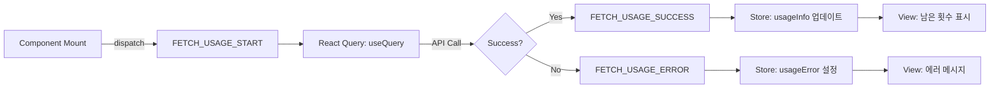
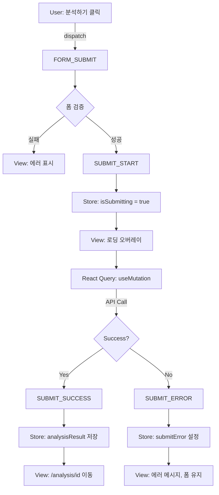
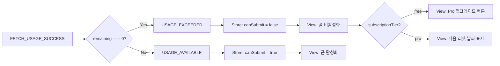

# 상태관리 설계: 새 분석하기 페이지 (`/analysis/new`)

## 개요

본 문서는 사주 분석 요청 페이지(`/analysis/new`)의 상태관리 설계를 정의합니다. Context + useReducer 패턴을 사용하여 복잡한 폼 상태, 사용량 정보, 로딩 및 에러 상태를 체계적으로 관리합니다.

**설계 원칙**:
- Context + useReducer를 사용한 로컬 상태 관리
- react-hook-form을 사용한 폼 검증 및 입력 관리
- React Query를 사용한 서버 상태 관리 (사용량 조회, 분석 요청)
- 단방향 데이터 흐름 (Flux 패턴)
- 명확한 상태 전이 및 에러 처리

---

## 1. 페이지 구성 요소

### 1.1 화면 구조

```
┌──────────────────────────────────────────────┐
│  [← 대시보드로]                             │
│                                              │
│  새 분석하기                                 │
│  AI가 당신의 사주를 분석합니다               │
│                                              │
│  ┌────────────────────────────────────────┐ │
│  │ 📊 남은 분석 횟수: 7/10회              │ │
│  │ 다음 초기화: 2025-11-15                │ │
│  └────────────────────────────────────────┘ │
│                                              │
│  생년월일 *                                  │
│  [DatePicker: YYYY-MM-DD]                   │
│                                              │
│  출생 시간                                   │
│  [TimePicker: HH:MM] [ ] 모름              │
│                                              │
│  양력/음력 *                                 │
│  ( ) 양력  ( ) 음력                         │
│                                              │
│  성별 *                                      │
│  ( ) 남성  ( ) 여성                         │
│                                              │
│  [분석하기]                                  │
│                                              │
└──────────────────────────────────────────────┘
```

### 1.2 주요 컴포넌트

1. **UsageDisplay**: 사용량 표시 컴포넌트 (Context 소비)
2. **AnalysisForm**: 폼 입력 컴포넌트 (react-hook-form)
3. **LoadingOverlay**: 로딩 상태 표시 (전역 또는 로컬)
4. **ErrorAlert**: 에러 메시지 표시

---

## 2. 관리 대상 상태 분류

### 2.1 상태 데이터 (State)

| 상태 | 타입 | 저장 위치 | 초기값 | 설명 |
|------|------|----------|--------|------|
| **usageInfo** | `UsageInfo` | Context (Reducer) | `null` | 사용량 정보 (남은 횟수, 제한, 다음 리셋 날짜) |
| **isLoadingUsage** | `boolean` | React Query | `false` | 사용량 로딩 상태 |
| **usageError** | `Error \| null` | React Query | `null` | 사용량 조회 에러 |
| **formData** | `AnalysisFormInput` | react-hook-form | 아래 참조 | 폼 입력 데이터 |
| **isSubmitting** | `boolean` | react-hook-form | `false` | 폼 제출 중 상태 |
| **submitError** | `string \| null` | Context (Reducer) | `null` | 분석 요청 에러 메시지 |
| **analysisResult** | `AnalysisResult \| null` | React Query | `null` | 분석 결과 (성공 시) |

**formData 초기값**:
```typescript
{
  birthDate: undefined,        // Date
  birthTime: undefined,        // string (HH:MM) | undefined
  birthTimeUnknown: false,     // boolean
  isLunar: false,              // boolean
  gender: undefined,           // 'male' | 'female'
}
```

### 2.2 파생 데이터 (Derived State, 상태 아님)

| 데이터 | 계산 방식 | 설명 |
|--------|----------|------|
| **canSubmit** | `usageInfo?.remaining > 0 && formValid` | 분석 요청 가능 여부 |
| **usageExceeded** | `usageInfo?.remaining === 0` | 사용량 초과 여부 |
| **isLoading** | `isLoadingUsage \|\| isSubmitting` | 전체 로딩 상태 |

---

## 3. 상태 전이 테이블

### 3.1 사용량 정보 상태

| 현재 상태 | 이벤트 | 조건 | 다음 상태 | 화면 변화 |
|----------|--------|------|----------|----------|
| `null` | `FETCH_USAGE_START` | - | `isLoadingUsage: true` | 스켈레톤 로딩 표시 |
| `isLoadingUsage: true` | `FETCH_USAGE_SUCCESS` | API 성공 | `usageInfo` 설정 | 남은 횟수 표시, 폼 활성화 |
| `isLoadingUsage: true` | `FETCH_USAGE_ERROR` | API 실패 | `usageError` 설정 | 에러 메시지 표시, 재시도 버튼 |
| `usageInfo` | `USAGE_REFRESH` | 분석 성공 후 | `usageInfo.remaining--` | 남은 횟수 감소 |

### 3.2 폼 상태

| 현재 상태 | 이벤트 | 조건 | 다음 상태 | 화면 변화 |
|----------|--------|------|----------|----------|
| 초기 | `INPUT_CHANGE` | 사용자 입력 | `formData` 업데이트 | 실시간 입력 반영 |
| 유효 | `TOGGLE_BIRTH_TIME_UNKNOWN` | 모름 체크 | `birthTime: undefined` | 시간 입력 비활성화 |
| 유효 | `FORM_SUBMIT` | 검증 통과 | `isSubmitting: true` | 로딩 오버레이 표시 |
| `isSubmitting` | `SUBMIT_SUCCESS` | API 성공 | - | `/analysis/[id]` 페이지로 이동 |
| `isSubmitting` | `SUBMIT_ERROR` | API 실패 | `submitError` 설정, `isSubmitting: false` | 에러 메시지 표시, 폼 유지 |

### 3.3 사용량 초과 상태

| 상태 | 조건 | 화면 변화 |
|------|------|----------|
| **사용 가능** | `remaining > 0` | 폼 활성화, 제출 버튼 활성화 |
| **사용량 초과** | `remaining === 0` | 폼 비활성화, 경고 메시지 표시, Pro 업그레이드 버튼 (무료 유저) |
| **구독 만료** | `SUBSCRIPTION_EXPIRED` 에러 | 만료 메시지, 재구독 버튼 |

---

## 4. Flux 패턴 흐름도

### 4.1 사용량 조회 흐름



### 4.2 분석 요청 흐름



### 4.3 사용량 초과 흐름



---

## 5. Context 설계

### 5.1 State 인터페이스

```typescript
// src/features/analysis/context/analysis-new-context.tsx

export interface UsageInfo {
  remaining: number;
  limit: number;
  subscriptionTier: 'free' | 'pro';
  nextResetDate?: Date; // Pro 유저만
}

export interface AnalysisFormInput {
  birthDate: Date | undefined;
  birthTime: string | undefined; // HH:MM
  birthTimeUnknown: boolean;
  isLunar: boolean;
  gender: 'male' | 'female' | undefined;
}

export interface AnalysisNewState {
  // 사용량 정보
  usageInfo: UsageInfo | null;
  isLoadingUsage: boolean;
  usageError: Error | null;

  // 폼 제출 상태
  isSubmitting: boolean;
  submitError: string | null;
}

export type AnalysisNewAction =
  | { type: 'FETCH_USAGE_START' }
  | { type: 'FETCH_USAGE_SUCCESS'; payload: UsageInfo }
  | { type: 'FETCH_USAGE_ERROR'; payload: Error }
  | { type: 'SUBMIT_START' }
  | { type: 'SUBMIT_SUCCESS' }
  | { type: 'SUBMIT_ERROR'; payload: string }
  | { type: 'RESET_ERROR' }
  | { type: 'USAGE_REFRESH'; payload: UsageInfo }; // 분석 성공 후 사용량 갱신

export interface AnalysisNewContextValue {
  state: AnalysisNewState;
  dispatch: React.Dispatch<AnalysisNewAction>;

  // 파생 데이터
  canSubmit: boolean;
  usageExceeded: boolean;
  isLoading: boolean;

  // 액션 함수
  fetchUsage: () => Promise<void>;
  submitAnalysis: (data: AnalysisFormInput) => Promise<string>; // returns analysis ID
  resetError: () => void;
}
```

### 5.2 Reducer 구현

```typescript
const initialState: AnalysisNewState = {
  usageInfo: null,
  isLoadingUsage: false,
  usageError: null,
  isSubmitting: false,
  submitError: null,
};

function analysisNewReducer(
  state: AnalysisNewState,
  action: AnalysisNewAction
): AnalysisNewState {
  switch (action.type) {
    case 'FETCH_USAGE_START':
      return {
        ...state,
        isLoadingUsage: true,
        usageError: null,
      };

    case 'FETCH_USAGE_SUCCESS':
      return {
        ...state,
        isLoadingUsage: false,
        usageInfo: action.payload,
        usageError: null,
      };

    case 'FETCH_USAGE_ERROR':
      return {
        ...state,
        isLoadingUsage: false,
        usageError: action.payload,
      };

    case 'SUBMIT_START':
      return {
        ...state,
        isSubmitting: true,
        submitError: null,
      };

    case 'SUBMIT_SUCCESS':
      return {
        ...state,
        isSubmitting: false,
        submitError: null,
      };

    case 'SUBMIT_ERROR':
      return {
        ...state,
        isSubmitting: false,
        submitError: action.payload,
      };

    case 'RESET_ERROR':
      return {
        ...state,
        submitError: null,
        usageError: null,
      };

    case 'USAGE_REFRESH':
      return {
        ...state,
        usageInfo: action.payload,
      };

    default:
      return state;
  }
}
```

### 5.3 Context Provider 구현

```typescript
export function AnalysisNewProvider({ children }: { children: React.ReactNode }) {
  const [state, dispatch] = useReducer(analysisNewReducer, initialState);
  const router = useRouter();

  // React Query: 사용량 조회
  const { refetch: refetchUsage } = useQuery({
    queryKey: ['usage'],
    queryFn: async () => {
      const response = await apiClient.get<UsageInfo>('/api/usage');
      return response.data;
    },
    onSuccess: (data) => {
      dispatch({ type: 'FETCH_USAGE_SUCCESS', payload: data });
    },
    onError: (error) => {
      dispatch({ type: 'FETCH_USAGE_ERROR', payload: error as Error });
    },
  });

  // React Query: 분석 요청
  const analysisMutation = useMutation({
    mutationFn: async (data: AnalysisFormInput) => {
      const response = await apiClient.post<{ id: string }>('/api/analyses', {
        birthDate: data.birthDate?.toISOString().split('T')[0],
        birthTime: data.birthTimeUnknown ? null : data.birthTime,
        isLunar: data.isLunar,
        gender: data.gender,
      });
      return response.data;
    },
  });

  // 액션 함수
  const fetchUsage = async () => {
    dispatch({ type: 'FETCH_USAGE_START' });
    await refetchUsage();
  };

  const submitAnalysis = async (data: AnalysisFormInput): Promise<string> => {
    dispatch({ type: 'SUBMIT_START' });
    try {
      const result = await analysisMutation.mutateAsync(data);
      dispatch({ type: 'SUBMIT_SUCCESS' });

      // 사용량 갱신
      await refetchUsage();

      return result.id;
    } catch (error) {
      const message = extractApiErrorMessage(error);
      dispatch({ type: 'SUBMIT_ERROR', payload: message });
      throw error;
    }
  };

  const resetError = () => {
    dispatch({ type: 'RESET_ERROR' });
  };

  // 파생 데이터
  const canSubmit = Boolean(
    state.usageInfo && state.usageInfo.remaining > 0 && !state.isSubmitting
  );
  const usageExceeded = state.usageInfo?.remaining === 0;
  const isLoading = state.isLoadingUsage || state.isSubmitting;

  const value: AnalysisNewContextValue = {
    state,
    dispatch,
    canSubmit,
    usageExceeded,
    isLoading,
    fetchUsage,
    submitAnalysis,
    resetError,
  };

  return (
    <AnalysisNewContext.Provider value={value}>
      {children}
    </AnalysisNewContext.Provider>
  );
}

export const useAnalysisNew = () => {
  const context = useContext(AnalysisNewContext);
  if (!context) {
    throw new Error('useAnalysisNew must be used within AnalysisNewProvider');
  }
  return context;
};
```

---

## 6. 컴포넌트 계층 구조

```
AnalysisNewProvider (Context)
  └─ AnalysisNewPage
       ├─ UsageDisplay (사용량 표시)
       │    ├─ 남은 횟수 배지
       │    └─ 다음 리셋 날짜 (Pro만)
       │
       ├─ AnalysisForm (react-hook-form)
       │    ├─ DatePicker (생년월일)
       │    ├─ TimePicker (출생 시간)
       │    ├─ Checkbox (모름)
       │    ├─ RadioGroup (양력/음력)
       │    ├─ RadioGroup (성별)
       │    └─ SubmitButton
       │
       ├─ LoadingOverlay (로딩 시)
       └─ ErrorAlert (에러 시)
```

---

## 7. 노출 인터페이스

### 7.1 Context에서 하위 컴포넌트에 노출되는 데이터

| 변수/함수 | 타입 | 설명 |
|----------|------|------|
| `state.usageInfo` | `UsageInfo \| null` | 사용량 정보 |
| `state.isLoadingUsage` | `boolean` | 사용량 로딩 중 |
| `state.usageError` | `Error \| null` | 사용량 조회 에러 |
| `state.isSubmitting` | `boolean` | 분석 요청 중 |
| `state.submitError` | `string \| null` | 분석 요청 에러 |
| `canSubmit` | `boolean` | 제출 가능 여부 |
| `usageExceeded` | `boolean` | 사용량 초과 여부 |
| `isLoading` | `boolean` | 전체 로딩 상태 |
| `fetchUsage()` | `() => Promise<void>` | 사용량 재조회 |
| `submitAnalysis(data)` | `(data) => Promise<string>` | 분석 요청 (분석 ID 반환) |
| `resetError()` | `() => void` | 에러 초기화 |

### 7.2 react-hook-form 폼 데이터

| 필드 | 타입 | 검증 규칙 |
|------|------|----------|
| `birthDate` | `Date` | 필수, 1900-01-01 ~ 오늘 |
| `birthTime` | `string \| undefined` | 선택, HH:MM 형식 |
| `birthTimeUnknown` | `boolean` | 선택, true면 birthTime 무시 |
| `isLunar` | `boolean` | 필수, 기본값 false |
| `gender` | `'male' \| 'female'` | 필수 |

---

## 8. 주요 시나리오별 상태 흐름

### 8.1 정상 플로우 (Pro 유저, 남은 횟수 있음)

```
1. 페이지 마운트
   → FETCH_USAGE_START
   → React Query: GET /api/usage
   → FETCH_USAGE_SUCCESS
   → usageInfo = { remaining: 7, limit: 10, tier: 'pro', nextResetDate }
   → View: "남은 분석: 7/10회" 표시

2. 폼 입력
   → react-hook-form: formData 업데이트
   → 실시간 검증

3. 분석하기 클릭
   → SUBMIT_START
   → isSubmitting = true
   → View: LoadingOverlay 표시 ("AI가 사주를 분석하고 있습니다...")
   → React Query: POST /api/analyses
   → SUBMIT_SUCCESS
   → router.push(`/analysis/${analysisId}`)
```

### 8.2 사용량 초과 (무료 유저, 1회 사용 완료)

```
1. 페이지 마운트
   → FETCH_USAGE_START
   → React Query: GET /api/usage
   → FETCH_USAGE_SUCCESS
   → usageInfo = { remaining: 0, limit: 1, tier: 'free' }
   → usageExceeded = true
   → View: 폼 비활성화, "무료 체험 1회를 모두 사용하였습니다" 메시지
   → View: "Pro로 업그레이드" 버튼 표시
```

### 8.3 분석 요청 실패 (Gemini API 오류)

```
1. 분석하기 클릭
   → SUBMIT_START
   → React Query: POST /api/analyses
   → API 에러 (503 Service Unavailable)
   → SUBMIT_ERROR
   → submitError = "일시적인 서비스 장애가 발생했습니다"
   → isSubmitting = false
   → View: ErrorAlert 표시, "재시도" 버튼
   → 사용자가 재시도 버튼 클릭
   → 다시 SUBMIT_START...
```

### 8.4 구독 만료

```
1. 분석하기 클릭
   → SUBMIT_START
   → React Query: POST /api/analyses
   → API 에러 (403 SUBSCRIPTION_EXPIRED)
   → SUBMIT_ERROR
   → submitError = "Pro 구독이 만료되었습니다"
   → View: "Pro 재구독하기" 버튼
   → 버튼 클릭 → router.push('/subscription')
```

---

## 9. 에러 처리 전략

### 9.1 에러 타입별 처리

| 에러 코드 | HTTP 상태 | 메시지 | 액션 |
|----------|----------|--------|------|
| `USAGE_LIMIT_EXCEEDED` | 400 | "이번 달 분석 횟수를 모두 사용하였습니다" | Pro 업그레이드 버튼 (무료) / 다음 리셋 날짜 표시 (Pro) |
| `SUBSCRIPTION_EXPIRED` | 403 | "Pro 구독이 만료되었습니다" | 재구독 버튼 |
| `AI_SERVICE_ERROR` | 503 | "일시적인 서비스 장애가 발생했습니다" | 재시도 버튼, 고객 지원 링크 |
| `VALIDATION_ERROR` | 400 | 필드별 에러 메시지 | 인라인 표시, 해당 필드 포커스 |
| `UNAUTHORIZED` | 401 | "로그인이 필요합니다" | 로그인 페이지로 리다이렉트 |
| `NETWORK_ERROR` | - | "네트워크 연결을 확인해주세요" | 재시도 버튼 |

### 9.2 에러 표시 위치

- **전역 에러** (인증, 네트워크): Toast 또는 상단 배너
- **사용량 에러**: UsageDisplay 컴포넌트 내 Alert
- **폼 검증 에러**: 각 필드 하단 인라인 메시지
- **제출 에러**: 폼 상단 Alert

---

## 10. 성능 최적화

### 10.1 React Query 캐싱

```typescript
useQuery({
  queryKey: ['usage'],
  staleTime: 5 * 60 * 1000, // 5분간 신선
  cacheTime: 10 * 60 * 1000, // 10분간 캐시
  refetchOnWindowFocus: true, // 윈도우 포커스 시 재조회
});
```

### 10.2 불필요한 리렌더링 방지

- `useCallback`으로 액션 함수 메모이제이션
- `useMemo`로 파생 데이터 계산 최적화
- react-hook-form의 `watch`를 최소화

### 10.3 낙관적 업데이트

분석 요청 성공 시 즉시 `/analysis/[id]`로 이동하고, 백그라운드에서 사용량 갱신

---

## 11. 접근성 (a11y)

- 모든 폼 필드에 `<label>` 연결 (`htmlFor`)
- 필수 필드는 `aria-required="true"`
- 에러 메시지는 `aria-live="polite"` 영역에 표시
- 로딩 상태는 `aria-busy="true"` 설정
- 제출 버튼은 비활성화 시 `aria-disabled="true"` 및 설명 추가

---

## 12. 테스트 케이스

### 12.1 단위 테스트 (Reducer)

- [ ] `FETCH_USAGE_SUCCESS` 시 `usageInfo` 업데이트
- [ ] `SUBMIT_START` 시 `isSubmitting = true`
- [ ] `SUBMIT_ERROR` 시 `submitError` 설정, `isSubmitting = false`
- [ ] `RESET_ERROR` 시 에러 초기화

### 12.2 통합 테스트 (Context + API)

- [ ] 페이지 마운트 시 사용량 자동 조회
- [ ] 사용량 초과 시 폼 비활성화
- [ ] 분석 요청 성공 시 상세 페이지로 이동
- [ ] API 에러 시 에러 메시지 표시 및 재시도 가능

### 12.3 E2E 테스트

- [ ] 무료 유저: 1회 사용 후 Pro 업그레이드 유도
- [ ] Pro 유저: 10회 사용 후 사용량 초과 메시지
- [ ] 구독 만료 유저: 재구독 안내

---

## 13. 파일 구조

```
src/features/analysis/
├── context/
│   └── analysis-new-context.tsx        # Context + Reducer + Provider
├── components/
│   ├── analysis-form.tsx               # 폼 컴포넌트 (react-hook-form)
│   ├── usage-display.tsx               # 사용량 표시 컴포넌트
│   ├── loading-overlay.tsx             # 로딩 오버레이
│   └── error-alert.tsx                 # 에러 메시지
├── hooks/
│   ├── use-analysis-new.ts             # Context 훅 재노출
│   └── use-analysis-form.ts            # react-hook-form 설정 훅
└── lib/
    └── validation.ts                   # 폼 검증 스키마 (Zod)

src/app/analysis/new/
└── page.tsx                            # 페이지 엔트리 (Provider 래핑)
```

---

## 14. 관련 문서

- **PRD**: `/docs/prd.md` - 섹션 3.2.4 (새 분석하기), 6.3 (사주 분석 시스템), 6.4 (사용량 관리)
- **Userflow**: `/docs/userflow.md` - 섹션 1.2 (첫 분석 수행), 3 (사주 분석 요청)
- **Database**: `/docs/database.md` - 섹션 3.3 (analyses)
- **Usecase 1**: `/docs/usecases/1-signup-and-first-analysis/spec.md` - 무료 유저 첫 분석
- **Usecase 3**: `/docs/usecases/3-analysis-request/spec.md` - Pro 유저 분석 요청
- **Common Modules**: `/docs/common-modules.md` - 섹션 2.5 (폼 검증 스키마), 1.4 (사용량 관리)

---

## 15. 변경 이력

| 버전 | 날짜 | 작성자 | 변경 내용 |
|------|------|--------|----------|
| 1.0 | 2025-10-27 | Claude Code | 초기 작성 |

---

## 16. 승인

- [ ] 프론트엔드 리드
- [ ] UX 디자이너
- [ ] 제품 관리자
