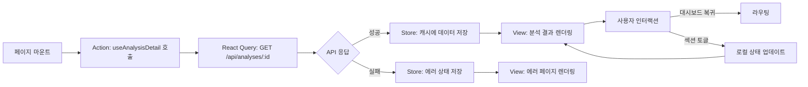
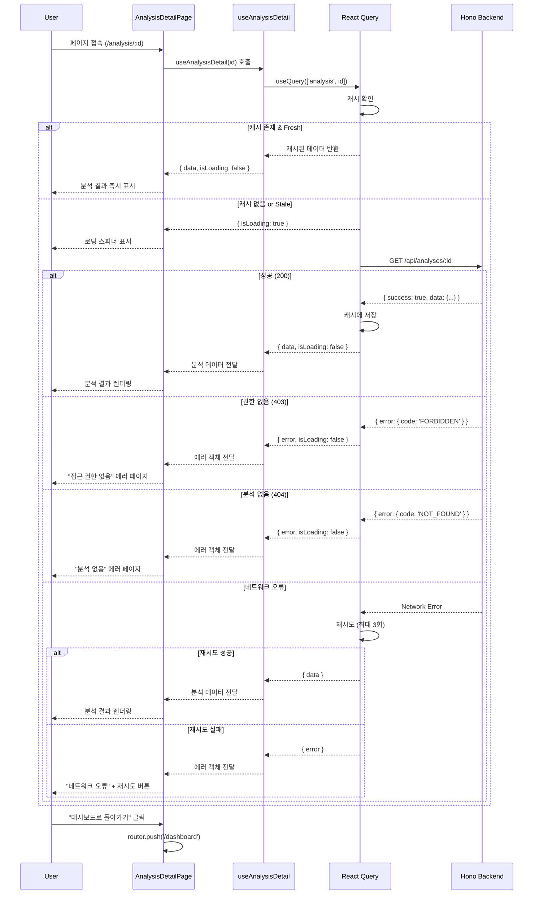

# 분석 상세보기 페이지 상태관리 설계

## 페이지 정보

- **경로**: `/analysis/[id]`
- **접근 권한**: 인증 필요 (본인 분석만 조회 가능)
- **목적**: 생성된 사주 분석 결과 전체 확인
- **상태관리 방식**: React Query 기반 (Context + useReducer 불필요)

---

## 1. 설계 개요

### 1.1 핵심 특징

분석 상세보기 페이지는 **읽기 전용(Read-only)** 페이지로, 복잡한 로컬 상태 관리가 불필요합니다.

**설계 근거**:
- 데이터는 서버에서만 관리 (수정/삭제 기능 없음)
- 사용자 인터랙션은 단순 조회 및 페이지 이동만 존재
- React Query의 캐싱 및 에러 핸들링으로 충분히 처리 가능
- Context + useReducer는 복잡한 상태 전환이 필요할 때 사용하는 패턴이므로 이 페이지에는 과도한 설계

**따라서, Context + useReducer 대신 React Query를 주요 상태관리 도구로 사용합니다.**

### 1.2 상태관리 전략

```
React Query (서버 상태)
  └─ 분석 데이터 조회, 캐싱, 에러 처리

로컬 상태 (useState)
  └─ UI 인터랙션 (모달, 토글 등)
```

---

## 2. 관리해야 할 데이터

### 2.1 서버 상태 (React Query)

#### 2.1.1 분석 결과 데이터

**출처**: `GET /api/analyses/[id]`

**타입 정의**:
```typescript
export interface AnalysisDetail {
  id: string;
  userId: string;
  birthDate: string;           // ISO 8601 date string
  birthTime?: string;          // HH:MM format or null
  isLunar: boolean;
  gender: 'male' | 'female';
  modelUsed: 'gemini-2.5-flash' | 'gemini-2.5-pro';
  result: {
    basic: {
      천간지지: string;
      오행분석: string;
    };
    personality: {
      특성: string;
      장단점: string;
    };
    fortune: {
      대운: string;
      세운: string;
      직업운: string;
      재물운: string;
      건강운: string;
      연애운: string;
      대인관계운: string;
    };
    advice: {
      긍정적방향: string;
      주의점: string;
    };
  };
  createdAt: string;           // ISO 8601 datetime string
}
```

**캐싱 전략**:
- `staleTime`: 5분 (한 번 조회한 분석은 5분간 재조회 불필요)
- `gcTime`: 10분 (메모리에서 제거되기까지 시간)
- `refetchOnWindowFocus`: false (포커스 복귀 시 재조회 불필요)

**변경 조건**: 없음 (읽기 전용 데이터)

---

### 2.2 로컬 UI 상태 (useState)

분석 상세보기 페이지는 기본적으로 정적 표시만 하므로, 추가적인 UI 상태가 거의 필요하지 않습니다. 향후 확장 시 필요할 수 있는 상태는 다음과 같습니다:

#### 2.2.1 섹션 접기/펼치기 (선택사항)

```typescript
const [collapsedSections, setCollapsedSections] = useState<Set<string>>(new Set());
```

**변경 조건**: 사용자가 섹션 헤더 클릭 시 토글

**화면 변화**: 해당 섹션의 내용이 숨김/표시됨

#### 2.2.2 공유 모달 상태 (선택사항, Phase 2)

```typescript
const [isShareModalOpen, setIsShareModalOpen] = useState(false);
```

**변경 조건**: "공유하기" 버튼 클릭 시 열림, 모달 닫기 버튼 클릭 시 닫힘

**화면 변화**: 공유 옵션 모달 표시/숨김

---

### 2.3 화면에 보여지지만 상태가 아닌 것

다음 데이터는 서버 데이터를 기반으로 계산되거나 변환된 값이므로, 별도 상태로 관리하지 않습니다:

| 항목 | 설명 | 계산 방법 |
|------|------|----------|
| 포맷된 날짜 | "2025년 10월 27일 오후 3:24" | `formatDate(analysis.createdAt)` |
| 양력/음력 라벨 | "양력" / "음력" | `analysis.isLunar ? '음력' : '양력'` |
| 성별 라벨 | "남성" / "여성" | `GENDER_LABELS[analysis.gender]` |
| 모델 배지 | "Flash" / "Pro" | `analysis.modelUsed` 기반 조건부 렌더링 |
| 출생시간 표시 | "14:30" / "모름" | `analysis.birthTime ?? '모름'` |

---

## 3. 상태 변경 조건 및 화면 변화

### 3.1 서버 상태 변경 테이블

| 상태 | 변경 조건 | 변경 후 값 | 화면 변화 |
|------|----------|----------|----------|
| 분석 데이터 | 페이지 마운트 시 API 호출 성공 | AnalysisDetail 객체 | 로딩 상태 → 분석 결과 표시 |
| 분석 데이터 | API 호출 실패 (403) | Error 객체 | 로딩 상태 → 권한 없음 에러 페이지 |
| 분석 데이터 | API 호출 실패 (404) | Error 객체 | 로딩 상태 → 분석 없음 에러 페이지 |
| 분석 데이터 | 네트워크 오류 | Error 객체 | 로딩 상태 → 에러 메시지 + 재시도 버튼 |

### 3.2 로컬 UI 상태 변경 테이블

| 상태 | 변경 조건 | 변경 후 값 | 화면 변화 |
|------|----------|----------|----------|
| collapsedSections | 섹션 헤더 클릭 | Set에 섹션 ID 추가/제거 | 해당 섹션 내용 숨김/표시 |
| isShareModalOpen | "공유하기" 버튼 클릭 | true | 공유 모달 표시 |
| isShareModalOpen | 모달 닫기 버튼 클릭 | false | 공유 모달 숨김 |

---

## 4. React Query 기반 데이터 흐름

### 4.1 Flux 패턴 시각화

분석 상세보기 페이지는 단방향 데이터 흐름을 따릅니다:



### 4.2 상세 흐름도



---

## 5. React Query 훅 설계

### 5.1 커스텀 훅: useAnalysisDetail

**파일 위치**: `src/features/analysis/hooks/use-analysis-detail.ts`

**구현**:

```typescript
import { useQuery } from '@tanstack/react-query';
import { apiClient } from '@/lib/remote/api-client';
import { AnalysisDetail } from '@/features/analysis/lib/dto';

export function useAnalysisDetail(analysisId: string) {
  return useQuery({
    queryKey: ['analysis', analysisId],
    queryFn: async () => {
      const response = await apiClient.get<AnalysisDetail>(
        `/analyses/${analysisId}`
      );
      return response.data;
    },
    staleTime: 5 * 60 * 1000,      // 5분
    gcTime: 10 * 60 * 1000,         // 10분
    refetchOnWindowFocus: false,
    retry: 3,                        // 네트워크 오류 시 최대 3회 재시도
    retryDelay: (attemptIndex) => Math.min(1000 * 2 ** attemptIndex, 3000),
  });
}
```

**반환값**:

```typescript
{
  data?: AnalysisDetail;
  isLoading: boolean;
  isError: boolean;
  error?: Error;
  refetch: () => void;
}
```

### 5.2 에러 타입별 처리

**프론트엔드 에러 분류**:

```typescript
export function getAnalysisErrorType(error: unknown): 'forbidden' | 'not-found' | 'network' | 'unknown' {
  if (!error) return 'unknown';

  if (isApiError(error)) {
    const code = error.error.code;
    if (code === 'FORBIDDEN' || code === 'ANALYSIS_FORBIDDEN') {
      return 'forbidden';
    }
    if (code === 'NOT_FOUND' || code === 'ANALYSIS_NOT_FOUND') {
      return 'not-found';
    }
  }

  if (error instanceof Error && error.message.includes('Network')) {
    return 'network';
  }

  return 'unknown';
}
```

---

## 6. 페이지 컴포넌트 구조

### 6.1 컴포넌트 계층

```
AnalysisDetailPage (page.tsx)
├─ useAnalysisDetail(id) → React Query
├─ if (isLoading) → LoadingSpinner
├─ if (error) → ErrorDisplay
│   ├─ ForbiddenError (403)
│   ├─ NotFoundError (404)
│   └─ NetworkError (재시도 버튼)
└─ AnalysisContent (data가 있을 때)
    ├─ AnalysisHeader (날짜, 생년월일시, 모델 배지)
    ├─ ResultSection x 5 (기본구성, 성격, 대운세운, 운세, 조언)
    └─ ActionButtons (대시보드 복귀)
```

### 6.2 페이지 컴포넌트 의사코드

```typescript
'use client';

import { useParams, useRouter } from 'next/navigation';
import { useAnalysisDetail } from '@/features/analysis/hooks/use-analysis-detail';
import { getAnalysisErrorType } from '@/features/analysis/lib/error';

export default function AnalysisDetailPage() {
  const params = useParams();
  const router = useRouter();
  const analysisId = params.id as string;

  const { data, isLoading, isError, error, refetch } = useAnalysisDetail(analysisId);

  // 로딩 상태
  if (isLoading) {
    return <LoadingSpinner message="분석 결과를 불러오는 중..." />;
  }

  // 에러 상태
  if (isError) {
    const errorType = getAnalysisErrorType(error);

    switch (errorType) {
      case 'forbidden':
        return (
          <ErrorPage
            title="접근 권한 없음"
            message="본인의 분석 결과만 조회할 수 있습니다."
            action={{ label: '대시보드로', onClick: () => router.push('/dashboard') }}
          />
        );

      case 'not-found':
        return (
          <ErrorPage
            title="분석을 찾을 수 없습니다"
            message="요청하신 분석 결과가 존재하지 않습니다."
            action={{ label: '대시보드로', onClick: () => router.push('/dashboard') }}
          />
        );

      case 'network':
        return (
          <ErrorPage
            title="네트워크 오류"
            message="분석 결과를 불러오는 중 오류가 발생했습니다."
            action={{ label: '다시 시도', onClick: () => refetch() }}
          />
        );

      default:
        return (
          <ErrorPage
            title="오류 발생"
            message="분석 결과를 불러올 수 없습니다. 잠시 후 다시 시도해주세요."
            action={{ label: '대시보드로', onClick: () => router.push('/dashboard') }}
          />
        );
    }
  }

  // 정상 상태: 분석 결과 표시
  return (
    <div className="container mx-auto py-8">
      <AnalysisHeader analysis={data} />

      <div className="space-y-8 mt-8">
        <ResultSection title="사주팔자 기본 구성" data={data.result.basic} />
        <ResultSection title="성격 및 기질" data={data.result.personality} />
        <ResultSection title="대운·세운 분석" data={data.result.fortune} />
        <ResultSection title="운세 종합" data={data.result.fortune} />
        <ResultSection title="조언 및 제안" data={data.result.advice} />
      </div>

      <ActionButtons onBackToDashboard={() => router.push('/dashboard')} />
    </div>
  );
}
```

---

## 7. 하위 컴포넌트 인터페이스

페이지에서 하위 컴포넌트로 전달하는 props:

### 7.1 AnalysisHeader

```typescript
interface AnalysisHeaderProps {
  analysis: AnalysisDetail;
}

// 표시 항목:
// - 분석 날짜 (formatDate)
// - 생년월일 (전체)
// - 출생시간 (있으면 표시, 없으면 "모름")
// - 양력/음력 배지
// - 성별 라벨
// - 사용 모델 배지 (Flash/Pro)
```

### 7.2 ResultSection

```typescript
interface ResultSectionProps {
  title: string;
  data: Record<string, string> | string;
  collapsible?: boolean; // 선택사항, Phase 2
}

// 표시 항목:
// - 섹션 제목
// - 데이터 (객체인 경우 키-값 쌍으로 표시, 문자열인 경우 그대로 표시)
// - (선택) 접기/펼치기 버튼
```

### 7.3 ActionButtons

```typescript
interface ActionButtonsProps {
  onBackToDashboard: () => void;
  onShare?: () => void;       // Phase 2
  onPrint?: () => void;        // Phase 2
}

// 표시 항목:
// - "대시보드로 돌아가기" 버튼 (Primary)
// - (Phase 2) "공유하기" 버튼 (Secondary)
// - (Phase 2) "인쇄/PDF 저장" 버튼 (Secondary)
```

### 7.4 ErrorPage

```typescript
interface ErrorPageProps {
  title: string;
  message: string;
  action: {
    label: string;
    onClick: () => void;
  };
}

// 표시 항목:
// - 에러 아이콘
// - 에러 제목
// - 에러 메시지
// - 액션 버튼
```

---

## 8. API 엔드포인트 명세

### 8.1 분석 상세 조회

**엔드포인트**: `GET /api/analyses/:id`

**요청 헤더**:
```
Authorization: Bearer {Clerk 세션 토큰}
```

**응답 (성공)**:
```json
{
  "success": true,
  "data": {
    "id": "uuid",
    "userId": "uuid",
    "birthDate": "1990-01-01",
    "birthTime": "14:30",
    "isLunar": false,
    "gender": "male",
    "modelUsed": "gemini-2.5-pro",
    "result": {
      "basic": {
        "천간지지": "...",
        "오행분석": "..."
      },
      "personality": {
        "특성": "...",
        "장단점": "..."
      },
      "fortune": {
        "대운": "...",
        "세운": "...",
        "직업운": "...",
        "재물운": "...",
        "건강운": "...",
        "연애운": "...",
        "대인관계운": "..."
      },
      "advice": {
        "긍정적방향": "...",
        "주의점": "..."
      }
    },
    "createdAt": "2025-10-27T14:30:00Z"
  }
}
```

**응답 (실패 - 403)**:
```json
{
  "error": {
    "code": "ANALYSIS_FORBIDDEN",
    "message": "본인의 분석 결과만 조회할 수 있습니다."
  }
}
```

**응답 (실패 - 404)**:
```json
{
  "error": {
    "code": "ANALYSIS_NOT_FOUND",
    "message": "요청하신 분석 결과를 찾을 수 없습니다."
  }
}
```

---

## 9. 보안 및 권한 확인

### 9.1 백엔드 권한 검증 로직

```typescript
// src/features/analysis/backend/service.ts

export async function getAnalysisById(
  supabase: SupabaseClient,
  analysisId: string,
  userId: string,
): Promise<AnalysisDetail> {
  // 1. 분석 조회
  const { data, error } = await supabase
    .from('analyses')
    .select('*')
    .eq('id', analysisId)
    .single();

  // 2. 존재 여부 확인
  if (error || !data) {
    throw new NotFoundError('ANALYSIS_NOT_FOUND', '분석을 찾을 수 없습니다');
  }

  // 3. 소유권 확인
  if (data.user_id !== userId) {
    throw new ForbiddenError('ANALYSIS_FORBIDDEN', '접근 권한이 없습니다');
  }

  // 4. 데이터 반환
  return mapAnalysisToDto(data);
}
```

### 9.2 프론트엔드 권한 확인

프론트엔드에서는 권한 확인을 하지 않으며, 백엔드 응답에 따라 에러 페이지를 표시합니다.

**이유**:
- 클라이언트는 신뢰할 수 없는 환경이므로, 보안 로직은 백엔드에서만 처리
- 프론트엔드는 백엔드 응답을 기반으로 UI만 렌더링

---

## 10. 테스트 시나리오

### 10.1 정상 시나리오

| 시나리오 | 입력 | 기대 결과 |
|---------|------|----------|
| 본인 분석 조회 | 유효한 분석 ID | 전체 분석 결과 표시 |
| 캐시된 분석 재조회 | 5분 이내 동일 분석 재방문 | 즉시 캐시 데이터 표시 (API 호출 없음) |
| 대시보드 복귀 | "대시보드로" 버튼 클릭 | `/dashboard`로 라우팅 |

### 10.2 에러 시나리오

| 시나리오 | 입력 | 기대 결과 |
|---------|------|----------|
| 타인 분석 조회 시도 | 다른 사용자의 분석 ID | 403 에러 페이지 ("접근 권한 없음") |
| 존재하지 않는 분석 | 잘못된 분석 ID | 404 에러 페이지 ("분석 없음") |
| 네트워크 오류 | API 연결 실패 | 에러 메시지 + "다시 시도" 버튼 표시 |
| 세션 만료 | 만료된 토큰 | 로그인 페이지로 리다이렉트 (미들웨어 처리) |

### 10.3 성능 시나리오

| 시나리오 | 입력 | 기대 결과 |
|---------|------|----------|
| 초기 로딩 시간 | 페이지 첫 방문 | 300ms 이내 API 응답 + 렌더링 |
| 캐시 히트 | 5분 이내 재방문 | 즉시 표시 (0ms) |
| 재시도 성공 | 1차 실패 후 재시도 | 3회 재시도 후 성공 시 결과 표시 |

---

## 11. 향후 확장 가능성 (Phase 2)

Context + useReducer가 필요해질 수 있는 경우:

### 11.1 분석 비교 기능

여러 분석 결과를 동시에 비교하는 기능이 추가될 경우, 복잡한 상태 관리가 필요할 수 있습니다.

```typescript
type CompareState = {
  selectedAnalyses: string[];      // 비교 대상 분석 ID 목록
  compareMode: 'side-by-side' | 'overlay';
  highlightDifferences: boolean;
};

type CompareAction =
  | { type: 'ADD_ANALYSIS'; analysisId: string }
  | { type: 'REMOVE_ANALYSIS'; analysisId: string }
  | { type: 'SET_COMPARE_MODE'; mode: 'side-by-side' | 'overlay' }
  | { type: 'TOGGLE_HIGHLIGHT' };
```

### 11.2 인터랙티브 주석 기능

사용자가 분석 결과에 메모를 추가하거나 하이라이트를 적용하는 기능:

```typescript
type AnnotationState = {
  notes: Record<string, string>;        // 섹션 ID → 메모
  highlights: Record<string, string[]>; // 섹션 ID → 하이라이트된 텍스트 배열
};

type AnnotationAction =
  | { type: 'ADD_NOTE'; sectionId: string; note: string }
  | { type: 'REMOVE_NOTE'; sectionId: string }
  | { type: 'ADD_HIGHLIGHT'; sectionId: string; text: string }
  | { type: 'REMOVE_HIGHLIGHT'; sectionId: string; text: string };
```

**현재 MVP에서는 이러한 기능이 없으므로, Context + useReducer는 불필요합니다.**

---

## 12. 설계 결정 요약

### 12.1 왜 Context + useReducer를 사용하지 않는가?

| 기준 | Context + useReducer | React Query | 선택 |
|------|---------------------|-------------|------|
| 상태 출처 | 클라이언트 (복잡한 로컬 상태) | 서버 (API 응답) | ✅ React Query |
| 상태 변경 | 복잡한 상태 전환 로직 | 단순 조회 및 캐싱 | ✅ React Query |
| 코드 복잡도 | 높음 (Reducer, Actions, Context) | 낮음 (useQuery 한 줄) | ✅ React Query |
| 에러 처리 | 수동 구현 필요 | 자동 재시도 및 에러 핸들링 | ✅ React Query |
| 캐싱 | 수동 구현 필요 | 자동 캐싱 및 무효화 | ✅ React Query |
| 사용 사례 | 복잡한 폼, 마법사, 장바구니 | API 조회, 서버 상태 | ✅ React Query |

**결론**: 분석 상세보기 페이지는 **읽기 전용 서버 데이터 조회**가 주 목적이므로, React Query만으로 충분하며 더 간결하고 유지보수하기 쉬운 코드를 작성할 수 있습니다.

### 12.2 설계 원칙 준수

✅ **DRY**: React Query의 캐싱으로 중복 API 호출 방지
✅ **YAGNI**: 현재 필요하지 않은 Context/Reducer 제거
✅ **단순성**: 최소한의 상태로 최대 기능 구현
✅ **타입 안전성**: TypeScript + Zod로 API 응답 검증

---

## 13. 변경 이력

| 버전 | 날짜       | 작성자      | 변경 내용 |
| ---- | ---------- | ----------- | --------- |
| 1.0  | 2025-10-27 | Claude Code | 초기 작성 (React Query 기반 설계) |

---

## 14. 참고 문서

- `/docs/prd.md` - 섹션 3.2.5: 분석 상세보기 페이지
- `/docs/userflow.md` - 섹션 4.2: 특정 분석 상세 보기
- `/docs/usecases/4-analysis-history/spec.md` - 분석 이력 조회 유스케이스
- `/docs/database.md` - 섹션 3.3: analyses 테이블
- `/docs/common-modules.md` - 섹션 2.3: React Query 설정
