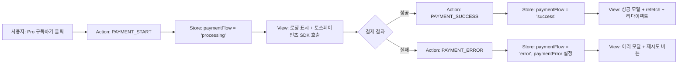
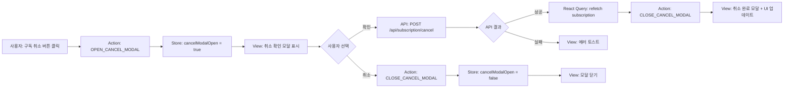
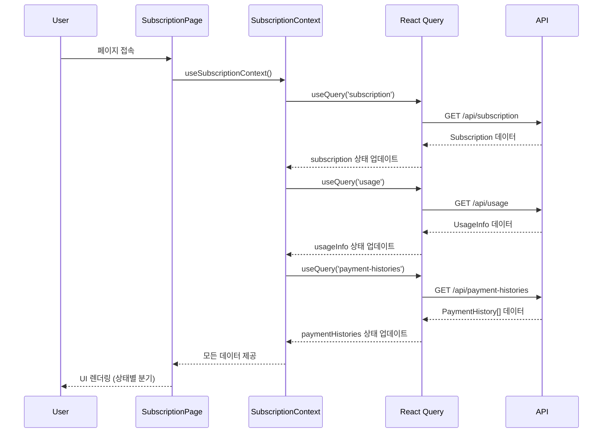

# 구독 관리 페이지 상태 관리 설계

## 페이지 정보

- **경로**: `/subscription`
- **접근 권한**: 인증 필요
- **목적**: 구독 상태 확인 및 결제 관리 (구독/취소/재개)

---

## 1. 상태 관리 전략

### 1.1 선택 배경

본 페이지는 **Context + useReducer** 패턴을 사용하여 상태를 관리합니다.

**이유**:
1. **복잡한 상태 분기**: 무료/Pro/취소예정 3가지 상태에 따라 UI가 완전히 달라짐
2. **결제 플로우 관리**: 토스페이먼츠 SDK 초기화 → 결제창 표시 → 성공/실패 처리의 복잡한 흐름
3. **서버 상태 + 로컬 상태 조합**: 구독 정보(서버) + 결제 진행 상태(로컬)
4. **여러 컴포넌트 간 상태 공유**: 구독 정보 카드, 사용 현황 카드, 결제 이력 등이 동일 상태를 참조

### 1.2 대안 분석

| 방식 | 장점 | 단점 | 선택 여부 |
|------|------|------|----------|
| **Context + useReducer** | 복잡한 상태 분기 명확화, 타입 안전성 | 보일러플레이트 증가 | ✅ 채택 |
| Zustand | 간단한 API, 보일러플레이트 적음 | 상태 분기 로직 분산 | ❌ |
| React Query only | 서버 상태 자동 관리 | 로컬 UI 상태 관리 불편 | ❌ |

---

## 2. 관리 대상 데이터

### 2.1 서버 상태 (React Query)

React Query로 관리하며, Context에서 참조만 함.

| 데이터 | 타입 | 출처 | 설명 |
|--------|------|------|------|
| `subscription` | `Subscription \| null` | `GET /api/subscription` | 구독 정보 (plan, status, nextBillingDate 등) |
| `usageInfo` | `UsageInfo` | `GET /api/usage` | 사용량 정보 (used, limit, remaining) |
| `paymentHistories` | `PaymentHistory[]` | `GET /api/payment-histories` | 결제 이력 목록 |

**Subscription 타입**:
```typescript
interface Subscription {
  id: string;
  plan: 'free' | 'pro';
  status: 'active' | 'canceled' | 'expired';
  billingKey?: string;
  customerKey?: string;
  startedAt?: Date;
  nextBillingDate?: Date;
  canceledAt?: Date;
}
```

**UsageInfo 타입**:
```typescript
interface UsageInfo {
  used: number;
  limit: number;
  remaining: number;
  nextResetDate?: Date;  // Pro 유저만
}
```

**PaymentHistory 타입**:
```typescript
interface PaymentHistory {
  id: string;
  paymentKey: string;
  orderId: string;
  amount: number;
  status: 'DONE' | 'ABORTED' | 'CANCELED';
  paidAt: Date;
}
```

---

### 2.2 로컬 UI 상태 (useReducer)

Context + useReducer로 관리하며, 결제 플로우 및 UI 제어에 사용.

| 상태 | 타입 | 초기값 | 설명 |
|------|------|--------|------|
| `paymentFlow` | `'idle' \| 'processing' \| 'success' \| 'error'` | `'idle'` | 결제 프로세스 진행 상태 |
| `paymentError` | `string \| null` | `null` | 결제 실패 에러 메시지 |
| `cancelModalOpen` | `boolean` | `false` | 구독 취소 확인 모달 표시 여부 |
| `resumeModalOpen` | `boolean` | `false` | 구독 재개 확인 모달 표시 여부 |
| `selectedReason` | `string \| null` | `null` | 구독 취소 사유 (선택사항) |

---

### 2.3 파생 데이터 (Computed)

상태로 저장하지 않고 계산하여 사용하는 데이터.

| 데이터 | 계산 로직 | 설명 |
|--------|----------|------|
| `subscriptionTier` | `subscription?.plan ?? 'free'` | 현재 구독 등급 |
| `isProActive` | `subscription?.plan === 'pro' && subscription?.status === 'active'` | Pro 활성 여부 |
| `isCanceled` | `subscription?.status === 'canceled'` | 취소 예정 상태 여부 |
| `isExpired` | `subscription?.status === 'expired'` | 만료 상태 여부 |
| `canCancel` | `isProActive` | 구독 취소 가능 여부 |
| `canResume` | `isCanceled && nextBillingDate > now` | 구독 재개 가능 여부 |
| `daysUntilExpiry` | `differenceInDays(nextBillingDate, now)` | 만료까지 남은 일수 |

---

## 3. 상태 변경 시나리오

### 3.1 구독 상태별 화면 변화

| 구독 상태 | 조건 | 표시되는 UI 요소 |
|----------|------|-----------------|
| **무료 유저** | `plan === 'free'` | - 현재 상태 카드 (무료 체험, 사용 1/1회)<br>- Pro 요금제 안내 카드<br>- "Pro 구독하기" 버튼 |
| **Pro 활성** | `plan === 'pro' && status === 'active'` | - 구독 정보 카드 (시작일, 다음 결제일)<br>- 사용 현황 카드 (X/10회)<br>- 결제 수단 정보<br>- 결제 이력 리스트<br>- "구독 취소" 버튼 |
| **취소 예정** | `plan === 'pro' && status === 'canceled'` | - 구독 정보 카드 (혜택 만료일 강조)<br>- 사용 현황 카드 (남은 사용, 만료 안내)<br>- "구독 재개" 버튼 |
| **만료됨** | `status === 'expired'` | - 만료 안내 메시지<br>- Pro 재구독 안내<br>- "Pro 구독하기" 버튼 |

---

### 3.2 결제 플로우 상태 변화

| 액션 | 조건 | 상태 변경 | 화면 변화 |
|------|------|----------|----------|
| **Pro 구독하기 클릭** | `plan === 'free'` | `paymentFlow: 'processing'` | 로딩 오버레이 표시<br>토스페이먼츠 결제창 표시 |
| **결제 성공** | authKey 수신 | `paymentFlow: 'success'` | 성공 모달 표시<br>구독 정보 refetch<br>대시보드 리다이렉트 |
| **결제 실패** | 카드 인증 실패 등 | `paymentFlow: 'error'`<br>`paymentError: 메시지` | 에러 모달 표시<br>재시도 버튼 제공 |
| **결제창 닫기** | 사용자 취소 | `paymentFlow: 'idle'` | 구독 관리 페이지 유지<br>안내 메시지 표시 |

---

### 3.3 구독 취소 플로우 상태 변화

| 액션 | 조건 | 상태 변경 | 화면 변화 |
|------|------|----------|----------|
| **구독 취소 버튼 클릭** | `isProActive` | `cancelModalOpen: true` | 취소 확인 모달 표시<br>취소 사유 선택 옵션 |
| **취소 확인** | 모달에서 확인 | API 호출 → 성공 시 refetch | 취소 완료 모달 표시<br>구독 정보 업데이트<br>"구독 재개" 버튼 표시 |
| **취소 취소** | 모달에서 취소 | `cancelModalOpen: false` | 모달 닫기<br>상태 변경 없음 |

---

### 3.4 구독 재개 플로우 상태 변화

| 액션 | 조건 | 상태 변경 | 화면 변화 |
|------|------|----------|----------|
| **구독 재개 버튼 클릭** | `isCanceled && canResume` | `resumeModalOpen: true` | 재개 확인 모달 표시<br>다음 결제 안내 |
| **재개 확인** | 모달에서 확인 | API 호출 → 성공 시 refetch | 재개 완료 모달 표시<br>구독 정보 업데이트<br>"구독 취소" 버튼 표시 |
| **재개 취소** | 모달에서 취소 | `resumeModalOpen: false` | 모달 닫기<br>상태 변경 없음 |

---

## 4. Reducer 설계

### 4.1 State 타입 정의

```typescript
interface SubscriptionPageState {
  paymentFlow: 'idle' | 'processing' | 'success' | 'error';
  paymentError: string | null;
  cancelModalOpen: boolean;
  resumeModalOpen: boolean;
  selectedReason: string | null;
}

const initialState: SubscriptionPageState = {
  paymentFlow: 'idle',
  paymentError: null,
  cancelModalOpen: false,
  resumeModalOpen: false,
  selectedReason: null,
};
```

---

### 4.2 Action 타입 정의

```typescript
type SubscriptionPageAction =
  | { type: 'PAYMENT_START' }
  | { type: 'PAYMENT_SUCCESS' }
  | { type: 'PAYMENT_ERROR'; payload: { error: string } }
  | { type: 'PAYMENT_RESET' }
  | { type: 'OPEN_CANCEL_MODAL' }
  | { type: 'CLOSE_CANCEL_MODAL' }
  | { type: 'SET_CANCEL_REASON'; payload: { reason: string | null } }
  | { type: 'OPEN_RESUME_MODAL' }
  | { type: 'CLOSE_RESUME_MODAL' };
```

---

### 4.3 Reducer 구현

```typescript
function subscriptionPageReducer(
  state: SubscriptionPageState,
  action: SubscriptionPageAction
): SubscriptionPageState {
  switch (action.type) {
    case 'PAYMENT_START':
      return {
        ...state,
        paymentFlow: 'processing',
        paymentError: null,
      };

    case 'PAYMENT_SUCCESS':
      return {
        ...state,
        paymentFlow: 'success',
        paymentError: null,
      };

    case 'PAYMENT_ERROR':
      return {
        ...state,
        paymentFlow: 'error',
        paymentError: action.payload.error,
      };

    case 'PAYMENT_RESET':
      return {
        ...state,
        paymentFlow: 'idle',
        paymentError: null,
      };

    case 'OPEN_CANCEL_MODAL':
      return {
        ...state,
        cancelModalOpen: true,
        selectedReason: null,
      };

    case 'CLOSE_CANCEL_MODAL':
      return {
        ...state,
        cancelModalOpen: false,
        selectedReason: null,
      };

    case 'SET_CANCEL_REASON':
      return {
        ...state,
        selectedReason: action.payload.reason,
      };

    case 'OPEN_RESUME_MODAL':
      return {
        ...state,
        resumeModalOpen: true,
      };

    case 'CLOSE_RESUME_MODAL':
      return {
        ...state,
        resumeModalOpen: false,
      };

    default:
      return state;
  }
}
```

---

## 5. Flux 패턴 시각화

### 5.1 Pro 구독 결제 플로우



---

### 5.2 구독 취소 플로우



---

### 5.3 구독 재개 플로우


---

## 6. Context 구조 및 흐름

### 6.1 Context Provider 구조

```typescript
interface SubscriptionContextValue {
  // 서버 상태 (React Query)
  subscription: Subscription | null;
  usageInfo: UsageInfo | null;
  paymentHistories: PaymentHistory[];
  isLoadingSubscription: boolean;
  isLoadingUsage: boolean;
  isLoadingHistories: boolean;

  // 로컬 상태 (useReducer)
  state: SubscriptionPageState;
  dispatch: React.Dispatch<SubscriptionPageAction>;

  // 파생 데이터
  subscriptionTier: 'free' | 'pro';
  isProActive: boolean;
  isCanceled: boolean;
  isExpired: boolean;
  canCancel: boolean;
  canResume: boolean;
  daysUntilExpiry: number | null;

  // 액션 핸들러
  handleSubscribe: () => Promise<void>;
  handleCancel: () => Promise<void>;
  handleResume: () => Promise<void>;
  openCancelModal: () => void;
  closeCancelModal: () => void;
  openResumeModal: () => void;
  closeResumeModal: () => void;
  setCancelReason: (reason: string | null) => void;
}
```

---

### 6.2 데이터 로딩 흐름



---

### 6.3 하위 컴포넌트에 노출할 변수 및 함수

#### 변수 (읽기 전용)

| 변수명 | 타입 | 설명 | 사용 컴포넌트 예시 |
|--------|------|------|-------------------|
| `subscription` | `Subscription \| null` | 구독 정보 | `SubscriptionInfoCard` |
| `usageInfo` | `UsageInfo \| null` | 사용량 정보 | `UsageCard` |
| `paymentHistories` | `PaymentHistory[]` | 결제 이력 | `PaymentHistoryList` |
| `subscriptionTier` | `'free' \| 'pro'` | 구독 등급 | 모든 컴포넌트 (조건 렌더링) |
| `isProActive` | `boolean` | Pro 활성 여부 | `CancelButton` |
| `isCanceled` | `boolean` | 취소 예정 여부 | `ResumeButton` |
| `daysUntilExpiry` | `number \| null` | 만료까지 남은 일수 | `ExpiryBadge` |
| `paymentFlow` | `'idle' \| 'processing' \| 'success' \| 'error'` | 결제 진행 상태 | `PaymentModal` |
| `paymentError` | `string \| null` | 결제 에러 메시지 | `ErrorModal` |

---

#### 함수 (액션 트리거)

| 함수명 | 시그니처 | 설명 | 사용 컴포넌트 예시 |
|--------|----------|------|-------------------|
| `handleSubscribe` | `() => Promise<void>` | Pro 구독 시작 | `SubscribeButton` |
| `handleCancel` | `() => Promise<void>` | 구독 취소 실행 | `CancelConfirmModal` |
| `handleResume` | `() => Promise<void>` | 구독 재개 실행 | `ResumeConfirmModal` |
| `openCancelModal` | `() => void` | 취소 모달 열기 | `CancelButton` |
| `closeCancelModal` | `() => void` | 취소 모달 닫기 | `CancelConfirmModal` |
| `openResumeModal` | `() => void` | 재개 모달 열기 | `ResumeButton` |
| `closeResumeModal` | `() => void` | 재개 모달 닫기 | `ResumeConfirmModal` |
| `setCancelReason` | `(reason: string \| null) => void` | 취소 사유 설정 | `CancelReasonSelect` |

---

## 7. 컴포넌트 트리 및 상태 접근

```
SubscriptionPage
├── SubscriptionProvider (Context)
│   ├── [무료 유저 뷰]
│   │   ├── CurrentStatusCard
│   │   │   └── 사용: usageInfo
│   │   └── ProPlanCard
│   │       ├── 사용: subscriptionTier, APP_CONFIG.subscription.pro
│   │       └── SubscribeButton
│   │           └── 함수: handleSubscribe
│   │
│   ├── [Pro 활성 뷰]
│   │   ├── SubscriptionInfoCard
│   │   │   └── 사용: subscription (startedAt, nextBillingDate)
│   │   ├── UsageCard
│   │   │   └── 사용: usageInfo (used, limit, nextResetDate)
│   │   ├── PaymentMethodCard
│   │   │   └── 사용: subscription (billingKey 기반 정보)
│   │   ├── PaymentHistoryList
│   │   │   └── 사용: paymentHistories
│   │   └── CancelButton
│   │       └── 함수: openCancelModal
│   │
│   ├── [취소 예정 뷰]
│   │   ├── SubscriptionInfoCard (강조)
│   │   │   └── 사용: subscription (nextBillingDate, daysUntilExpiry)
│   │   ├── UsageCard (만료 안내)
│   │   │   └── 사용: usageInfo, daysUntilExpiry
│   │   └── ResumeButton
│   │       └── 함수: openResumeModal
│   │
│   └── [공통 모달]
│       ├── CancelConfirmModal
│       │   ├── 사용: cancelModalOpen, selectedReason
│       │   └── 함수: closeCancelModal, handleCancel, setCancelReason
│       ├── ResumeConfirmModal
│       │   ├── 사용: resumeModalOpen
│       │   └── 함수: closeResumeModal, handleResume
│       ├── PaymentSuccessModal
│       │   └── 사용: paymentFlow === 'success'
│       └── PaymentErrorModal
│           └── 사용: paymentFlow === 'error', paymentError
```

---

## 8. 구현 가이드

### 8.1 Context Provider 구현 위치

- **파일**: `src/features/subscription/context/subscription-context.tsx`

### 8.2 주요 구현 포인트

#### 8.2.1 React Query 키 정의

```typescript
const QUERY_KEYS = {
  subscription: ['subscription'] as const,
  usage: ['usage'] as const,
  paymentHistories: ['payment-histories'] as const,
};
```

#### 8.2.2 토스페이먼츠 SDK 초기화

```typescript
const handleSubscribe = async () => {
  dispatch({ type: 'PAYMENT_START' });

  try {
    const customerKey = user.id;
    const orderId = generateOrderId();

    await requestTossPayment({
      amount: APP_CONFIG.subscription.pro.price,
      orderId,
      orderName: APP_CONFIG.subscription.pro.name,
      customerKey,
      successUrl: `${window.location.origin}/api/billing/success`,
      failUrl: `${window.location.origin}/api/billing/fail`,
    });

    // 성공 시 토스페이먼츠가 successUrl로 리다이렉트
  } catch (error) {
    dispatch({
      type: 'PAYMENT_ERROR',
      payload: { error: extractApiErrorMessage(error) },
    });
  }
};
```

#### 8.2.3 구독 취소 Mutation

```typescript
const cancelMutation = useMutation({
  mutationFn: async (reason?: string) => {
    return apiClient.post('/api/subscription/cancel', { reason });
  },
  onSuccess: () => {
    queryClient.invalidateQueries({ queryKey: QUERY_KEYS.subscription });
    toast({ title: '구독이 취소되었습니다' });
  },
  onError: (error) => {
    toast({
      title: '구독 취소에 실패했습니다',
      description: extractApiErrorMessage(error),
      variant: 'destructive',
    });
  },
});

const handleCancel = async () => {
  await cancelMutation.mutateAsync(state.selectedReason ?? undefined);
  dispatch({ type: 'CLOSE_CANCEL_MODAL' });
};
```

#### 8.2.4 파생 데이터 계산

```typescript
const subscriptionTier = subscription?.plan ?? 'free';
const isProActive = subscription?.plan === 'pro' && subscription?.status === 'active';
const isCanceled = subscription?.status === 'canceled';
const isExpired = subscription?.status === 'expired';
const canCancel = isProActive;
const canResume = isCanceled && subscription?.nextBillingDate ?
  new Date(subscription.nextBillingDate) > new Date() : false;
const daysUntilExpiry = subscription?.nextBillingDate ?
  differenceInDays(new Date(subscription.nextBillingDate), new Date()) : null;
```

---

### 8.3 페이지 컴포넌트 구조

```typescript
// src/app/subscription/page.tsx
'use client';

import { SubscriptionProvider } from '@/features/subscription/context/subscription-context';
import { SubscriptionContent } from '@/features/subscription/components/subscription-content';

export default function SubscriptionPage() {
  return (
    <SubscriptionProvider>
      <SubscriptionContent />
    </SubscriptionProvider>
  );
}
```

---

### 8.4 조건부 렌더링 로직

```typescript
// src/features/subscription/components/subscription-content.tsx
function SubscriptionContent() {
  const { subscriptionTier, isCanceled, isExpired } = useSubscriptionContext();

  if (isExpired) {
    return <ExpiredView />;
  }

  if (subscriptionTier === 'free') {
    return <FreeUserView />;
  }

  if (isCanceled) {
    return <CanceledView />;
  }

  return <ProActiveView />;
}
```

---

## 9. 엣지케이스 처리

### 9.1 결제 실패 (카드 인증 실패)

| 상황 | 처리 | 상태 변화 |
|------|------|----------|
| 카드 한도 초과 | 에러 메시지 표시, 재시도 버튼 제공 | `paymentFlow: 'error'`<br>`paymentError: '카드 한도 초과'` |
| 정지된 카드 | 에러 메시지 표시, 다른 카드 사용 안내 | `paymentFlow: 'error'`<br>`paymentError: '정지된 카드'` |
| 네트워크 오류 | 재시도 버튼 제공 | `paymentFlow: 'error'`<br>`paymentError: '네트워크 오류'` |

**UI**: `PaymentErrorModal` 컴포넌트에서 `paymentError` 메시지 표시, "재시도" 버튼 클릭 시 `dispatch({ type: 'PAYMENT_RESET' })` 후 `handleSubscribe` 재호출

---

### 9.2 구독 취소 실패 (API 오류)

| 상황 | 처리 | 상태 변화 |
|------|------|----------|
| 이미 취소된 구독 | 에러 토스트 표시, 모달 닫기 | `cancelModalOpen: false` |
| 네트워크 오류 | 재시도 안내 토스트, 모달 유지 | 모달 유지 (재시도 가능) |
| 빌링키 삭제 실패 | 백엔드에서 처리, 사용자에게는 정상 취소로 안내 | `cancelModalOpen: false` + refetch |

**UI**: React Query의 `onError`에서 처리, toast로 에러 메시지 표시

---

### 9.3 만료된 구독 재개 시도

| 상황 | 처리 | 상태 변화 |
|------|------|----------|
| `nextBillingDate < now` | 에러 모달 표시, "새로운 구독 시작" 버튼 제공 | `resumeModalOpen: false` |
| 빌링키 이미 삭제됨 | 백엔드에서 400 에러 반환 | 에러 토스트 표시 |

**UI**: `canResume` 파생 데이터가 `false`일 경우 "구독 재개" 버튼을 "Pro 구독하기"로 변경

---

### 9.4 동시 요청 방지

| 상황 | 처리 | 상태 변화 |
|------|------|----------|
| 구독 버튼 연타 | `paymentFlow === 'processing'` 시 버튼 비활성화 | 상태 변경 없음 (무시) |
| 취소 버튼 연타 | React Query Mutation의 `isLoading` 상태로 버튼 비활성화 | 상태 변경 없음 (무시) |

**UI**: 버튼 컴포넌트에서 `disabled={paymentFlow === 'processing' || cancelMutation.isLoading}` 처리

---

### 9.5 결제 성공 후 리다이렉트 실패

| 상황 | 처리 | 상태 변화 |
|------|------|----------|
| `successUrl` 콜백 누락 | 백엔드에서 결제는 성공, 사용자는 토스페이먼츠 화면에 머무름 | - |
| 사용자가 브라우저 닫기 | 다음 로그인 시 구독 상태 확인 및 refetch | React Query가 자동 refetch |

**처리**: 대시보드 접속 시 구독 상태 확인 후 "Pro 구독이 완료되었습니다" 배너 표시 (1회)

---

## 10. 테스트 시나리오

### 10.1 단위 테스트 (Reducer)

| 테스트 케이스 | 입력 | 기대 출력 |
|--------------|------|----------|
| PAYMENT_START | `{ type: 'PAYMENT_START' }` | `paymentFlow: 'processing', paymentError: null` |
| PAYMENT_SUCCESS | `{ type: 'PAYMENT_SUCCESS' }` | `paymentFlow: 'success', paymentError: null` |
| PAYMENT_ERROR | `{ type: 'PAYMENT_ERROR', payload: { error: '에러 메시지' } }` | `paymentFlow: 'error', paymentError: '에러 메시지'` |
| OPEN_CANCEL_MODAL | `{ type: 'OPEN_CANCEL_MODAL' }` | `cancelModalOpen: true, selectedReason: null` |

---

### 10.2 통합 테스트 (Context)

| 테스트 케이스 | 시나리오 | 검증 항목 |
|--------------|----------|----------|
| 무료 유저 렌더링 | `subscription = null` | "Pro 구독하기" 버튼 표시 |
| Pro 활성 유저 렌더링 | `subscription.plan = 'pro', status = 'active'` | "구독 취소" 버튼 표시 |
| 취소 예정 유저 렌더링 | `subscription.status = 'canceled'` | "구독 재개" 버튼 표시 |
| 구독 취소 API 성공 | `handleCancel()` 호출 | `subscription` refetch, 모달 닫기 |
| 구독 재개 API 성공 | `handleResume()` 호출 | `subscription` refetch, 모달 닫기 |

---

### 10.3 E2E 테스트

| 테스트 케이스 | 사용자 액션 | 기대 결과 |
|--------------|------------|----------|
| Pro 구독 완료 플로우 | 1. "Pro 구독하기" 클릭<br>2. 카드 정보 입력<br>3. 결제 승인 | 대시보드 리다이렉트, Pro 배지 표시 |
| 구독 취소 플로우 | 1. "구독 취소" 클릭<br>2. 확인 모달에서 "확인" | "Pro (취소 예정)" 배지, "구독 재개" 버튼 표시 |
| 구독 재개 플로우 | 1. "구독 재개" 클릭<br>2. 확인 모달에서 "확인" | "Pro 구독 중" 배지, "구독 취소" 버튼 표시 |
| 결제 실패 플로우 | 1. "Pro 구독하기" 클릭<br>2. 잘못된 카드 정보 입력 | 에러 모달 표시, 재시도 버튼 제공 |

---

## 11. 성능 최적화

### 11.1 React Query 캐싱 전략

| 쿼리 키 | `staleTime` | `gcTime` | 설명 |
|---------|-------------|----------|------|
| `subscription` | 5분 | 10분 | 구독 정보는 자주 변경되지 않음 |
| `usage` | 1분 | 5분 | 사용량은 분석 시마다 변경 가능 |
| `payment-histories` | 10분 | 30분 | 결제 이력은 불변 데이터 |

---

### 11.2 컴포넌트 최적화

| 최적화 기법 | 적용 컴포넌트 | 효과 |
|------------|--------------|------|
| `React.memo` | `PaymentHistoryList`, `UsageCard` | props 변경 시에만 리렌더링 |
| `useMemo` | 파생 데이터 계산 (daysUntilExpiry 등) | 불필요한 재계산 방지 |
| `useCallback` | 액션 핸들러 (`handleCancel`, `handleResume`) | 자식 컴포넌트 리렌더링 방지 |

---

### 11.3 번들 크기 최적화

- **토스페이먼츠 SDK**: Dynamic import로 필요 시에만 로드
  ```typescript
  const handleSubscribe = async () => {
    const { requestTossPayment } = await import('@/lib/payment/toss');
    await requestTossPayment(...);
  };
  ```

---

## 12. 접근성 고려사항

| 항목 | 구현 방법 |
|------|----------|
| 키보드 네비게이션 | 모달 및 버튼에 Tab 순서 지정, Enter/Esc 키 처리 |
| 스크린 리더 | ARIA 라벨 추가 (`aria-label`, `aria-describedby`) |
| 포커스 관리 | 모달 열릴 때 포커스 이동, 닫힐 때 원래 위치로 복귀 |
| 색상 대비 | 취소 예정 배지, 에러 메시지에 충분한 대비 확보 |

---

## 13. 보안 고려사항

| 항목 | 구현 방법 |
|------|----------|
| 인증 검증 | Context 초기화 시 `requireAuth()` 미들웨어 적용 |
| CSRF 방지 | 토스페이먼츠 Webhook 서명 검증 (백엔드) |
| 결제 정보 보호 | 카드 정보는 토스페이먼츠에서 관리, 빌링키만 저장 |
| API 키 보호 | `NEXT_PUBLIC_TOSS_CLIENT_KEY`만 클라이언트 노출 |

---

## 14. 향후 확장 가능성

### 14.1 추가 가능한 기능

| 기능 | 상태 추가 필요 여부 | 구현 방법 |
|------|-------------------|----------|
| 결제 수단 변경 | ✅ Yes | `paymentMethodModalOpen: boolean` 추가 |
| 구독 플랜 변경 | ✅ Yes | `selectedPlan: 'free' \| 'pro' \| 'premium'` 추가 |
| 쿠폰 적용 | ✅ Yes | `appliedCoupon: Coupon \| null` 추가 |
| 알림 설정 | ❌ No | 별도 Context 분리 권장 |

---

### 14.2 확장 시 고려사항

1. **Context 분리**: 결제 플로우와 구독 정보를 별도 Context로 분리 검토
2. **Reducer 확장**: 플랜 변경 등 복잡한 상태 추가 시 Reducer Action 타입 확장
3. **React Query 최적화**: 페이지네이션이 필요한 결제 이력은 Infinite Query 고려

---

## 15. 변경 이력

| 버전 | 날짜 | 작성자 | 변경 내용 |
|------|------|--------|----------|
| 1.0 | 2025-10-27 | Claude Code | 초기 설계 작성 |

---

## 16. 참고 문서

- [PRD 섹션 3.2.6](/docs/prd.md#3.2.6)
- [Userflow 섹션 2, 5](/docs/userflow.md)
- [Usecase UC-002](/docs/usecases/2-pro-subscription/spec.md)
- [Usecase UC-005](/docs/usecases/5-subscription-management/spec.md)
- [Database 설계](/docs/database.md)
- [공통 모듈 (토스페이먼츠 SDK)](/docs/common-modules.md#1.5.2)
