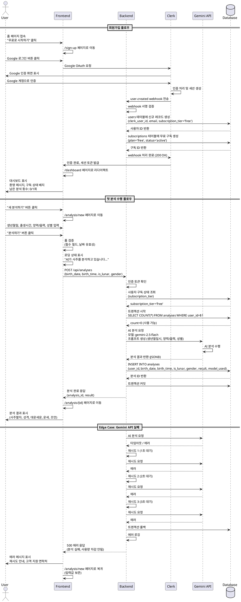

# Usecase 1: 신규 회원가입 및 첫 분석

## 개요

신규 사용자가 Google 로그인으로 회원가입하고, 무료 1회 분석을 수행하는 전체 플로우를 정의합니다.

---

## Primary Actor

- **신규 사용자**: 아직 서비스에 가입하지 않은 사용자

---

## Precondition

- 사용자가 인터넷에 연결되어 있음
- 사용자가 Google 계정을 보유하고 있음
- 웹 브라우저가 정상 동작함

---

## Trigger

사용자가 홈 페이지에서 "무료로 시작하기" CTA 버튼을 클릭

---

## Main Scenario

### 1. 회원가입 플로우

**1.1 사용자 인증**
1. 사용자가 홈 페이지에서 CTA 버튼 클릭
2. 회원가입 페이지로 리다이렉트 (`/sign-up`)
3. Google 로그인 버튼 선택
4. Google OAuth 인증 화면 표시
5. 사용자가 Google 계정으로 인증 완료

**1.2 사용자 데이터 생성**
1. Clerk가 인증 성공 후 `user.created` webhook 발송
2. 백엔드가 webhook 수신 및 서명 검증
3. `users` 테이블에 신규 레코드 생성
   - `clerk_user_id`: Clerk에서 제공한 사용자 ID
   - `email`: 사용자 이메일
   - `subscription_tier`: 'free' (기본값)
4. `subscriptions` 테이블에 무료 구독 레코드 생성
   - `plan`: 'free'
   - `status`: 'active'
   - `started_at`: 현재 시각
5. 세션 토큰 발급 및 쿠키 설정

**1.3 대시보드 리다이렉트**
1. 대시보드 페이지로 자동 이동 (`/dashboard`)
2. 환영 메시지 표시
3. 구독 상태 배지: "무료 체험" 표시
4. 남은 분석 횟수: "0/1회 사용" 표시
5. "새 분석하기" 버튼 활성화 상태

---

### 2. 첫 분석 수행 플로우

**2.1 분석 입력**
1. 사용자가 "새 분석하기" 버튼 클릭
2. 분석 입력 페이지로 이동 (`/analysis/new`)
3. 생년월일 입력 (DatePicker)
4. 출생 시간 입력 (TimePicker 또는 "모름" 선택)
5. 양력/음력 선택 (라디오 버튼)
6. 성별 선택 (라디오 버튼)
7. "분석하기" 버튼 클릭

**2.2 검증 및 사용량 체크**
1. 프론트엔드 폼 검증
   - 필수 필드 입력 확인 (생년월일, 양력/음력, 성별)
   - 날짜 유효성 검증 (미래 날짜 불가, 1900년 이후)
2. API 요청 전송 (`POST /api/analyses`)
3. 백엔드 인증 토큰 확인
4. 사용자 구독 상태 확인 (`users.subscription_tier`)
5. 사용 가능 횟수 확인 (트랜잭션 시작)
   - `analyses` 테이블에서 사용자 분석 카운트 조회
   - 무료 유저는 1회 제한 확인

**2.3 AI 분석 수행**
1. Gemini API 호출
   - 모델 선택: `gemini-2.5-flash` (무료 유저)
   - 구조화된 프롬프트 생성 (생년월일시, 양력/음력, 성별 포함)
   - API 호출 (최대 3회 재시도, 지수 백오프)
2. 분석 결과 수신 및 파싱

**2.4 결과 저장**
1. `analyses` 테이블에 분석 결과 저장
   - `user_id`: 현재 사용자 ID
   - `birth_date`, `birth_time`, `is_lunar`, `gender`: 입력값
   - `result`: JSONB 형태로 전체 분석 저장
   - `model_used`: 'gemini-2.5-flash'
   - `created_at`: 현재 시각
2. 트랜잭션 커밋
3. 분석 ID 반환

**2.5 결과 표시**
1. 로딩 상태 표시 (스피너 + 메시지)
2. 분석 완료 시 상세보기 페이지로 자동 이동 (`/analysis/[id]`)
3. 분석 결과 렌더링
   - 분석 정보 헤더 (날짜, 생년월일시, 양력/음력, 성별)
   - 사주팔자 기본 구성
   - 성격 및 기질
   - 대운·세운 분석
   - 운세 종합 (직업운, 재물운, 건강운, 연애운, 대인관계운)
   - 조언 및 제안
4. "대시보드로 돌아가기" 버튼 표시

---

## Edge Cases

### E1. Google 로그인 실패
- **상황**: 사용자가 Google 인증 중 취소 또는 권한 거부
- **처리**: 로그인 페이지로 리다이렉트, 에러 메시지 표시, 재시도 옵션 제공

### E2. Webhook 처리 실패
- **상황**: Clerk webhook 전송 실패 또는 네트워크 오류
- **처리**: Clerk 자동 재시도 메커니즘 동작, 백엔드 로깅, 관리자 알림

### E3. 유효하지 않은 날짜 입력
- **상황**: 미래 날짜, 1900년 이전 날짜, 존재하지 않는 날짜 입력
- **처리**: 프론트엔드 폼 검증 단계에서 차단, 인라인 에러 메시지 표시, 제출 버튼 비활성화

### E4. Gemini API 호출 실패
- **상황**: API 타임아웃, 할당량 초과, 네트워크 오류
- **처리**:
  - 최대 3회 재시도 (1초, 2초, 3초 대기)
  - 모두 실패 시 에러 메시지 표시
  - 분석 입력 페이지로 복귀 (입력값 보존)
  - 고객 지원 연락처 제공

### E5. 동시 요청으로 인한 초과 사용
- **상황**: 사용자가 빠르게 여러 번 분석 요청
- **처리**:
  - 데이터베이스 트랜잭션 사용
  - 낙관적 잠금으로 첫 번째 요청만 처리
  - 이후 요청은 사용 횟수 부족 에러 반환

### E6. 분석 결과 저장 실패
- **상황**: 데이터베이스 연결 오류, 디스크 용량 부족
- **처리**:
  - 트랜잭션 롤백
  - 에러 로깅 및 관리자 알림
  - 사용자에게 에러 메시지 표시 및 재시도 안내
  - 사용 횟수는 차감되지 않음 확인 메시지

---

## Business Rules

### BR1. 무료 체험 제한
- 신규 가입 사용자는 1회 무료 분석 제공
- 무료 분석 소진 후 Pro 업그레이드 유도

### BR2. AI 모델 분기
- 무료 유저: `gemini-2.5-flash` 모델 사용
- Pro 유저: `gemini-2.5-pro` 모델 사용 (더 정확한 분석)

### BR3. 사용량 차감 조건
- 분석 요청이 **성공적으로 완료된 경우에만** 사용량 차감
- API 호출 실패 시 사용량 차감하지 않음

### BR4. 분석 결과 영구 보관
- 모든 분석 결과는 `analyses` 테이블에 영구 보관
- 사용자는 대시보드에서 언제든 과거 분석 재조회 가능

### BR5. 본인 분석만 조회 가능
- 분석 상세보기는 본인의 분석만 접근 가능
- URL 직접 입력으로 타인 분석 조회 시도 시 403 에러 반환

### BR6. 데이터 일관성
- 사용량 체크 및 분석 저장은 트랜잭션으로 처리
- 동시 요청으로 인한 초과 사용 방지

---

## PlantUML Sequence Diagram



---

## 연관 문서

- PRD: `/docs/prd.md` - 섹션 6.1 (인증 시스템), 6.3 (사주 분석 시스템)
- Userflow: `/docs/userflow.md` - 섹션 1 (신규 회원가입 및 첫 분석 플로우)
- Database: `/docs/database.md` - 섹션 3.1 (users), 3.3 (analyses)

---

## API Endpoints

### POST /api/analyses
신규 사주 분석 요청

**Request Body:**
```json
{
  "birth_date": "1990-01-01",
  "birth_time": "14:30:00", // nullable
  "is_lunar": false,
  "gender": "male"
}
```

**Response (Success):**
```json
{
  "id": "uuid",
  "user_id": "uuid",
  "birth_date": "1990-01-01",
  "birth_time": "14:30:00",
  "is_lunar": false,
  "gender": "male",
  "result": {
    "basic": { "천간지지": "...", "오행분석": "..." },
    "personality": { "특성": "...", "장단점": "..." },
    "fortune": { "대운": "...", "세운": "...", "직업운": "...", "재물운": "...", "건강운": "...", "연애운": "...", "대인관계운": "..." },
    "advice": { "긍정적방향": "...", "주의점": "..." }
  },
  "model_used": "gemini-2.5-flash",
  "created_at": "2025-10-27T10:00:00Z"
}
```

**Response (Error - 사용량 초과):**
```json
{
  "error": "USAGE_LIMIT_EXCEEDED",
  "message": "무료 체험 1회를 모두 사용하였습니다. Pro 구독을 통해 월 10회 분석을 이용하세요.",
  "used": 1,
  "limit": 1
}
```

**Response (Error - API 실패):**
```json
{
  "error": "AI_ANALYSIS_FAILED",
  "message": "AI 분석 중 오류가 발생했습니다. 잠시 후 다시 시도해주세요.",
  "retry_available": true
}
```

---

## 페이지 경로

- `/` - 홈 (랜딩페이지)
- `/sign-up` - 회원가입 (Clerk)
- `/dashboard` - 대시보드 (분석 이력)
- `/analysis/new` - 새 분석하기
- `/analysis/[id]` - 분석 상세보기

---

## 외부 서비스 연동

### Clerk (인증)
- **Webhook**: `user.created` 이벤트
- **Endpoint**: `POST /api/webhooks/clerk`
- **검증**: webhook 서명 검증 필수

### Gemini API (AI 분석)
- **Model**: `gemini-2.5-flash` (무료 유저)
- **Retry**: 최대 3회 재시도 (지수 백오프: 1초, 2초, 3초)
- **Timeout**: 요청당 10초
