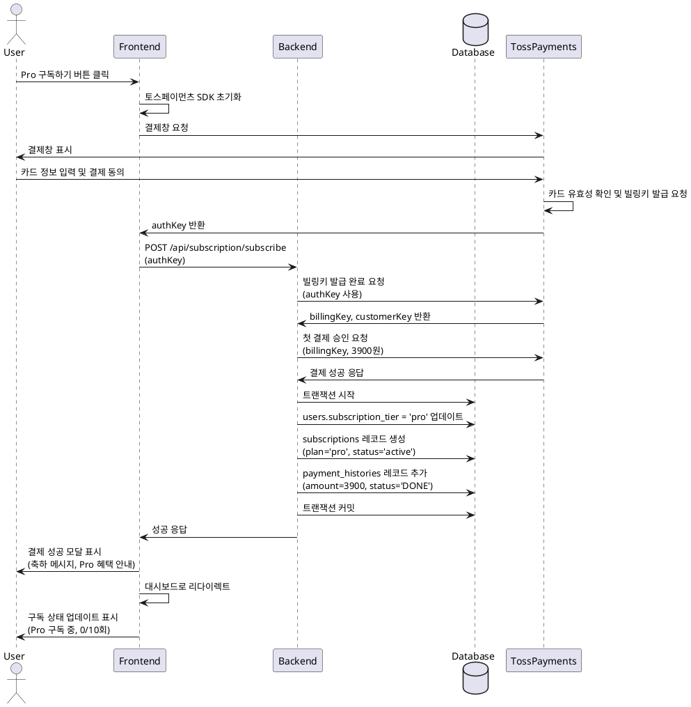

# 유스케이스 명세: Pro 구독 결제

## 유스케이스 ID: UC-002

---

## 1. 개요

### 1.1 Primary Actor
무료 사용자

### 1.2 목적
무료 체험 사용자를 Pro 구독자로 전환하여, 월 10회 분석 혜택을 제공하고 정기 결제를 시작한다.

### 1.3 범위
- 토스페이먼츠 빌링키 발급
- 첫 결제 승인 (3,900원)
- 구독 정보 생성 및 사용량 갱신
- 결제 이력 기록

---

## 2. Precondition

- 사용자가 회원가입을 완료하고 로그인한 상태
- 사용자가 현재 무료 플랜(free tier) 상태

---

## 3. Trigger

사용자가 대시보드 또는 구독 관리 페이지에서 **"Pro 구독하기"** 버튼을 클릭

---

## 4. Main Scenario

### 4.1 단계별 흐름

1. **사용자**: Pro 구독하기 버튼 클릭
   - 토스페이먼츠 결제창이 모달 또는 팝업으로 표시됨

2. **프론트엔드**: 토스페이먼츠 SDK 초기화
   - 클라이언트 키 사용
   - 구독 결제 모드 설정

3. **사용자**: 카드 정보 입력
   - 카드번호, 유효기간, 비밀번호 앞 2자리, 생년월일/사업자번호
   - 결제 동의 체크

4. **토스페이먼츠**: 카드사 인증 진행
   - 카드 유효성 확인
   - 빌링키 발급 요청

5. **토스페이먼츠**: authKey를 프론트엔드로 전달

6. **프론트엔드**: authKey를 백엔드로 전송
   - `POST /api/subscription/subscribe`

7. **백엔드**: 토스페이먼츠 API 호출
   - authKey를 사용해 빌링키 발급 완료
   - billingKey 및 customerKey 수신

8. **백엔드**: 첫 결제 승인 요청
   - 금액: 3,900원
   - 주문명: "Pro 구독 (월 3,900원)"
   - orderId 생성 (UUID)

9. **백엔드**: 데이터베이스 업데이트 (트랜잭션)
   - `users` 테이블: subscription_tier='pro' 업데이트
   - `subscriptions` 테이블: 신규 레코드 생성
     - plan='pro'
     - status='active'
     - billing_key, customer_key 저장
     - started_at=현재 시각
     - next_billing_date=현재 시각 + 1개월
   - `payment_histories` 테이블: 첫 결제 기록 추가
     - amount=3900
     - status='DONE'
     - paid_at=현재 시각

10. **백엔드**: 성공 응답 반환

11. **프론트엔드**: 결제 성공 페이지 또는 모달 표시
    - 축하 메시지
    - Pro 혜택 안내 (월 10회 분석, Gemini 2.5 Pro 사용)
    - 다음 결제일 표시

12. **프론트엔드**: 대시보드로 자동 리다이렉트
    - 구독 상태 배지 업데이트: "Pro 구독 중"
    - 남은 분석 횟수 업데이트: 0/10회
    - Pro 업그레이드 버튼 숨김

---

## 5. Edge Cases

### 5.1 카드 인증 실패
- **발생 조건**: 잘못된 카드 정보, 한도 초과, 정지된 카드
- **처리**:
  - 토스페이먼츠가 에러 코드 반환
  - 프론트엔드가 결제 실패 페이지로 이동
  - 에러 메시지 표시 (카드사 응답 메시지)
  - 재시도 버튼 제공

### 5.2 빌링키 발급 실패
- **발생 조건**: 토스페이먼츠 API 오류, 네트워크 타임아웃
- **처리**:
  - 백엔드에서 최대 3회 재시도
  - 모두 실패 시 에러 로깅 및 사용자에게 에러 메시지 표시
  - 데이터베이스는 변경되지 않음
  - 고객 지원 연락처 제공

### 5.3 첫 결제 승인 실패
- **발생 조건**: 빌링키 발급 성공했으나 첫 결제 승인 실패
- **처리**:
  - 백엔드에서 발급된 빌링키 삭제 요청
  - 트랜잭션 롤백
  - 에러 로깅
  - 사용자에게 결제 실패 페이지 표시
  - Pro 구독 미활성화 유지

### 5.4 사용자가 결제창 닫기
- **발생 조건**: 결제창에서 취소 버튼 클릭 또는 브라우저 닫기
- **처리**:
  - 토스페이먼츠가 취소 이벤트 발생
  - 백엔드 호출 없음
  - 구독 관리 페이지로 복귀
  - 안내 메시지 표시: "결제가 취소되었습니다"

### 5.5 이미 Pro 구독 중인 사용자가 재구독 시도
- **발생 조건**: Pro 구독 중인 사용자가 직접 API 호출 시도
- **처리**:
  - 백엔드에서 구독 상태 확인
  - 이미 활성 구독 존재 시 400 에러 반환
  - 에러 메시지: "이미 Pro 구독 중입니다"

### 5.6 동시 요청으로 인한 중복 구독 시도
- **발생 조건**: 사용자가 빠르게 여러 번 구독 버튼 클릭
- **처리**:
  - 데이터베이스 트랜잭션 사용
  - 첫 번째 요청만 처리
  - 이후 요청은 "이미 처리 중" 에러 반환

---

## 6. Business Rules

### 6.1 가격 정책
- Pro 구독 가격: 월 3,900원 (고정)
- 첫 결제는 구독 시점에 즉시 승인
- 정기결제는 매월 구독 시작일 기준으로 자동 청구

### 6.2 구독 혜택
- 월 10회 분석 가능
- Gemini 2.5 Pro 모델 사용
- 모든 분석 결과 영구 보관

### 6.3 사용량 초기화
- 구독 시작일 기준으로 월 단위 초기화
- 예: 1월 15일 구독 → 매월 15일 초기화

### 6.4 결제 실패 처리
- 정기결제 실패 시 재시도 로직:
  - 1일 후 1차 재시도
  - 3일 후 2차 재시도
  - 7일 후 3차 재시도
- 모두 실패 시 구독 자동 만료 (status='expired')
- 사용자에게 이메일 알림 발송

### 6.5 보안
- 결제 관련 API는 서버 사이드에서만 처리
- 토스페이먼츠 Webhook 검증 필수
- 시크릿 키는 환경 변수로 관리, 클라이언트 노출 금지

---

## 7. Sequence Diagram

---

## 8. Post-conditions

### 8.1 성공 시
- users 테이블의 subscription_tier가 'pro'로 업데이트됨
- subscriptions 테이블에 새로운 활성 구독 레코드가 생성됨
- payment_histories 테이블에 첫 결제 기록이 추가됨
- 사용자는 월 10회 분석 혜택을 즉시 사용 가능
- 다음 결제일이 1개월 후로 설정됨

### 8.2 실패 시
- 모든 데이터베이스 변경사항 롤백
- 발급된 빌링키 삭제 (첫 결제 실패 시)
- 사용자는 무료 플랜 상태 유지
- 에러 로그 기록

---

## 9. 비기능 요구사항

### 9.1 성능
- 결제 프로세스 전체 완료 시간: 평균 5초 이내
- 토스페이먼츠 API 응답 시간: 평균 2초 이내
- 데이터베이스 트랜잭션 처리 시간: 200ms 이하

### 9.2 보안
- HTTPS 필수
- 토스페이먼츠 시크릿 키는 환경 변수로 관리
- 결제 정보는 토스페이먼츠에서 관리 (PCI-DSS 준수)
- Webhook 서명 검증 필수

### 9.3 가용성
- 결제 시스템 가동률: 99.5% 이상
- 결제 실패 시 자동 재시도 메커니즘 구현
- 에러 발생 시 사용자에게 명확한 메시지 제공

---

## 10. 관련 유스케이스

- **선행 유스케이스**: UC-001 (신규 회원가입 및 첫 분석)
- **후행 유스케이스**: UC-003 (사주 분석 요청 - Pro 유저)
- **연관 유스케이스**: UC-005 (구독 관리 - 취소 및 재개)

---

## 11. 변경 이력

| 버전 | 날짜       | 작성자 | 변경 내용 |
| ---- | ---------- | ------ | --------- |
| 1.0  | 2025-10-27 | Claude | 초기 작성 |

---

## 부록

### A. 용어 정의

- **빌링키 (Billing Key)**: 토스페이먼츠에서 발급하는 정기결제용 고유 식별자
- **authKey**: 카드 인증 후 프론트엔드로 전달되는 임시 인증 키
- **customerKey**: 토스페이먼츠에서 고객을 식별하는 고유 키
- **orderId**: 각 결제 건을 식별하는 고유 주문 ID

### B. 참고 자료

- [토스페이먼츠 빌링키 발급 API](https://docs.tosspayments.com/reference/billing#빌링키-발급)
- [토스페이먼츠 정기결제 승인 API](https://docs.tosspayments.com/reference/billing#빌링키로-결제-승인)
- [토스페이먼츠 Webhook 가이드](https://docs.tosspayments.com/guides/webhook)
