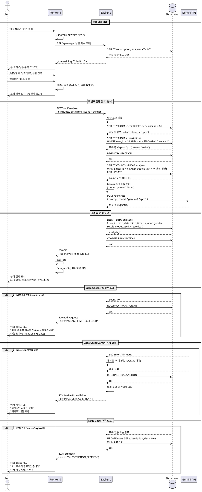

# Use Case 3: 사주 분석 요청 (Pro 유저)

## Primary Actor
Pro 구독 사용자

## Precondition
- 사용자가 Pro 구독 상태임 (status: 'active' 또는 'canceled'이나 next_billing_date가 미래)
- 사용자가 로그인되어 있음
- 브라우저에 유효한 인증 세션이 존재함

## Trigger
대시보드 또는 분석 입력 페이지에서 "새 분석하기" 버튼 클릭

## Main Scenario

### 1. 분석 입력 단계
1. 사용자가 "새 분석하기" 버튼을 클릭
2. FE가 분석 입력 페이지(`/analysis/new`)로 이동
3. FE가 사용자의 남은 분석 횟수를 상단에 표시 (예: "이번 달 남은 분석: 7/10회")
4. 사용자가 폼에 정보를 입력:
   - 생년월일 (DatePicker)
   - 출생 시간 (TimePicker 또는 "모름" 선택)
   - 양력/음력 선택 (라디오 버튼)
   - 성별 선택 (라디오 버튼)
5. 사용자가 "분석하기" 버튼 클릭

### 2. 프론트엔드 검증
6. FE가 입력값 검증:
   - 필수 필드 확인 (생년월일, 양력/음력, 성별)
   - 날짜 유효성 검증 (미래 날짜 불가, 1900년 이전 불가)
7. 검증 통과 시 로딩 상태 표시 ("AI가 사주를 분석하고 있습니다...")
8. FE가 BE API 호출: `POST /api/analyses` (with auth token)

### 3. 백엔드 검증 및 사용량 체크
9. BE가 인증 토큰 검증
10. BE가 사용자 정보 조회 (users 테이블)
11. BE가 구독 상태 확인 (subscriptions 테이블):
    - plan: 'pro'
    - status: 'active' 또는 ('canceled'이면서 next_billing_date가 미래)
12. BE가 트랜잭션 시작
13. BE가 이번 달 사용량 조회 (analyses 테이블에서 구독 시작일 기준 월별 COUNT):
    ```sql
    SELECT COUNT(*) FROM analyses
    WHERE user_id = $1
    AND created_at >= (구독 시작일 기준 이번 달 첫날)
    AND created_at < (구독 시작일 기준 다음 달 첫날)
    ```
14. BE가 사용 가능 여부 확인 (count < 10)

### 4. AI 분석 수행
15. BE가 Gemini API 호출:
    - 모델: `gemini-2.5-pro` (Pro 유저용)
    - 프롬프트: 구조화된 사주 분석 프롬프트 (생년월일시, 양력/음력, 성별 포함)
    - 최대 3회 재시도 (실패 시 1초, 2초, 3초 대기)
16. Gemini API가 분석 결과 반환 (JSONB 형태)

### 5. 결과 저장 및 응답
17. BE가 analyses 테이블에 결과 저장:
    - user_id, birth_date, birth_time, is_lunar, gender
    - result (JSONB)
    - model_used: 'gemini-2.5-pro'
    - created_at: now()
18. BE가 트랜잭션 커밋
19. BE가 FE에 성공 응답 반환 (분석 ID 포함)
20. FE가 로딩 상태 종료
21. FE가 분석 상세보기 페이지로 자동 이동 (`/analysis/[id]`)
22. FE가 분석 결과 렌더링:
    - 분석 정보 헤더 (날짜, 생년월일시, 양력/음력, 성별)
    - 사주팔자 기본 구성
    - 성격 및 기질
    - 대운·세운 분석
    - 운세 종합
    - 조언 및 제안

## Edge Cases

### E1. 사용 횟수 초과 (월 10회 모두 사용)
**발생 조건**: 이미 10회 분석 완료한 Pro 유저가 추가 분석 시도

**처리**:
1. BE가 사용량 체크 단계에서 count >= 10 감지
2. BE가 에러 응답 반환: `{ error: "USAGE_LIMIT_EXCEEDED", message: "이번 달 분석 횟수를 모두 사용하였습니다" }`
3. FE가 에러 메시지 표시:
   - "이번 달 분석 횟수를 모두 사용하였습니다"
   - 다음 초기화 날짜 표시 (next_billing_date 기준)
4. 분석 입력 폼 비활성화
5. "대시보드로 돌아가기" 버튼 제공

### E2. Gemini API 호출 실패
**발생 조건**: API 타임아웃, 네트워크 오류, 서버 오류

**처리**:
1. BE가 최대 3회 재시도 (1초, 2초, 3초 대기)
2. 모두 실패 시:
   - 트랜잭션 롤백 (사용량 차감 안 함)
   - 에러 로깅
   - 에러 응답 반환: `{ error: "AI_SERVICE_ERROR" }`
3. FE가 에러 메시지 표시:
   - "일시적인 서비스 장애가 발생했습니다"
   - "잠시 후 다시 시도해주세요"
   - 고객 지원 연락처 제공
4. 사용자를 분석 입력 페이지에 유지 (입력값 보존)
5. "재시도" 버튼 제공

### E3. Gemini API 할당량 초과
**발생 조건**: Gemini API의 일일 할당량 초과 (429 에러)

**처리**:
1. BE가 429 에러 감지
2. 트랜잭션 롤백 (사용량 차감 안 함)
3. 관리자에게 알림 발송 (할당량 초과 알림)
4. 에러 응답 반환: `{ error: "API_QUOTA_EXCEEDED" }`
5. FE가 에러 메시지 표시:
   - "일시적인 서비스 장애가 발생했습니다"
   - "잠시 후 재시도해주세요"
   - 고객 지원 연락처 제공

### E4. 구독 취소 예정 상태에서 분석 시도
**발생 조건**: status='canceled'이나 next_billing_date가 아직 미래인 상태

**처리**:
1. BE가 구독 상태 확인 시 허용 (만료일까지 혜택 유지)
2. 정상 분석 진행
3. FE가 분석 입력 페이지 상단에 알림 배너 표시:
   - "구독이 취소 예정입니다. {만료일}까지 Pro 혜택을 사용할 수 있습니다"

### E5. 구독 만료 후 분석 시도
**발생 조건**: status='expired' 또는 next_billing_date가 과거인 상태

**처리**:
1. BE가 구독 상태 확인 시 만료 감지
2. BE가 users 테이블 subscription_tier를 'free'로 업데이트
3. 에러 응답 반환: `{ error: "SUBSCRIPTION_EXPIRED" }`
4. FE가 에러 메시지 표시:
   - "Pro 구독이 만료되었습니다"
   - "무료 플랜으로 전환되었습니다 (월 1회 제공)"
5. "Pro 재구독하기" 버튼 제공 → 구독 관리 페이지로 이동

### E6. 분석 결과 저장 실패
**발생 조건**: 데이터베이스 연결 오류, 디스크 용량 부족

**처리**:
1. BE가 저장 단계에서 에러 감지
2. 트랜잭션 롤백 (사용량 차감 취소)
3. 에러 로깅 및 관리자 알림
4. 에러 응답 반환: `{ error: "DATABASE_ERROR" }`
5. FE가 에러 메시지 표시:
   - "분석 결과를 저장하는 중 오류가 발생했습니다"
   - "사용 횟수는 차감되지 않았습니다"
   - "재시도" 버튼 제공

### E7. 월 초기화 시점 경계 케이스
**발생 조건**: 다음 결제일이 오늘인 상태에서 분석 시도

**처리**:
1. BE가 next_billing_date 확인
2. 오늘 날짜가 next_billing_date 이상인 경우:
   - 정기결제 자동 처리 트리거 확인
   - subscriptions 테이블 next_billing_date 업데이트 (+1개월)
   - 사용량 카운트는 자동으로 새로운 월 기준으로 계산됨
3. 정상 분석 진행
4. FE가 "사용량이 초기화되었습니다" 안내 메시지 표시

### E8. 동시 요청으로 인한 초과 사용
**발생 조건**: 사용자가 빠르게 여러 번 분석 요청

**처리**:
1. BE가 트랜잭션 및 낙관적 잠금 사용
2. 사용량 체크 시 FOR UPDATE 쿼리 사용
3. 첫 번째 요청만 처리
4. 이후 요청은 사용 횟수 부족 에러 반환
5. FE가 에러 메시지 표시: "이미 분석이 진행 중입니다"

### E9. 유효하지 않은 날짜 입력
**발생 조건**: 미래 날짜, 1900년 이전 날짜, 존재하지 않는 날짜 (예: 2월 30일)

**처리**:
1. FE 폼 검증 단계에서 차단
2. 인라인 에러 메시지 표시 (해당 필드 하단)
3. 해당 필드에 포커스
4. 제출 버튼 비활성화 유지

## Business Rules

### BR1. 구독 상태 및 모델 선택
- Pro 구독자(status='active' 또는 취소 예정이나 만료 전)는 `gemini-2.5-pro` 모델 사용
- 무료 유저는 `gemini-2.5-flash` 모델 사용

### BR2. 사용량 제한
- Pro 구독자: 월 10회 제한
- 구독 시작일 기준으로 월 단위로 카운팅
  - 예: 1월 15일 구독 시작 → 매월 15일에 사용량 리셋
- 사용량 카운트는 analyses 테이블에서 동적으로 조회

### BR3. 사용량 차감 조건
- 분석 요청이 성공적으로 완료되어 analyses 테이블에 저장된 경우에만 차감
- Gemini API 호출 실패, 데이터베이스 저장 실패 시 차감하지 않음

### BR4. 구독 취소 정책
- 구독 취소 시에도 next_billing_date까지 Pro 혜택 유지
- status='canceled'이나 next_billing_date가 미래인 경우 분석 가능

### BR5. 트랜잭션 처리
- 사용량 체크부터 결과 저장까지 단일 트랜잭션으로 처리
- 중간 단계 실패 시 전체 롤백

### BR6. 재시도 로직
- Gemini API 호출 실패 시 최대 3회 재시도
- 재시도 간격: 1초, 2초, 3초 (exponential backoff)

### BR7. 분석 결과 보관
- 모든 분석 결과는 영구 보관 (DELETE 작업 없음)
- 사용자는 언제든 과거 분석 결과 조회 가능

### BR8. 에러 처리
- 모든 에러는 명확한 에러 코드와 메시지로 반환
- 사용자 친화적인 에러 메시지 표시
- 재시도 옵션 제공

## Sequence Diagram



## Related Use Cases
- **UC-1**: 신규 회원가입 및 첫 분석 (무료 유저) - 무료 모델 사용
- **UC-2**: Pro 구독 결제 플로우 - 구독 상태 전환
- **UC-4**: 분석 이력 조회 - 저장된 분석 결과 조회
- **UC-5**: 구독 관리 (취소/재개) - 구독 상태 변경

## API Endpoints

### POST /api/analyses
**Request**:
```json
{
  "birthDate": "1990-01-15",
  "birthTime": "14:30",
  "isLunar": false,
  "gender": "male"
}
```

**Response (Success)**:
```json
{
  "id": "uuid",
  "result": {
    "basic": { "천간지지": "...", "오행분석": "..." },
    "personality": { "특성": "...", "장단점": "..." },
    "fortune": { "대운": "...", "세운": "...", "직업운": "...", "재물운": "...", "건강운": "...", "연애운": "...", "대인관계운": "..." },
    "advice": { "긍정적방향": "...", "주의점": "..." }
  },
  "modelUsed": "gemini-2.5-pro",
  "createdAt": "2025-10-27T12:34:56Z"
}
```

**Response (Error - Usage Limit Exceeded)**:
```json
{
  "error": "USAGE_LIMIT_EXCEEDED",
  "message": "이번 달 분석 횟수를 모두 사용하였습니다",
  "nextResetDate": "2025-11-15"
}
```

**Response (Error - Subscription Expired)**:
```json
{
  "error": "SUBSCRIPTION_EXPIRED",
  "message": "Pro 구독이 만료되었습니다"
}
```

**Response (Error - AI Service Error)**:
```json
{
  "error": "AI_SERVICE_ERROR",
  "message": "일시적인 서비스 장애가 발생했습니다"
}
```

### GET /api/usage
**Response**:
```json
{
  "subscriptionTier": "pro",
  "remaining": 7,
  "limit": 10,
  "nextResetDate": "2025-11-15"
}
```

## Notes
- Pro 유저는 무료 유저보다 더 정확한 AI 모델(gemini-2.5-pro)을 사용하여 고품질 분석 제공
- 사용량 카운팅은 별도 테이블 없이 analyses 테이블에서 동적으로 조회
- 구독 시작일 기준으로 월 단위 리셋되므로 매월 정확히 10회 보장
- 모든 중요 작업은 트랜잭션으로 보호되어 데이터 일관성 보장
