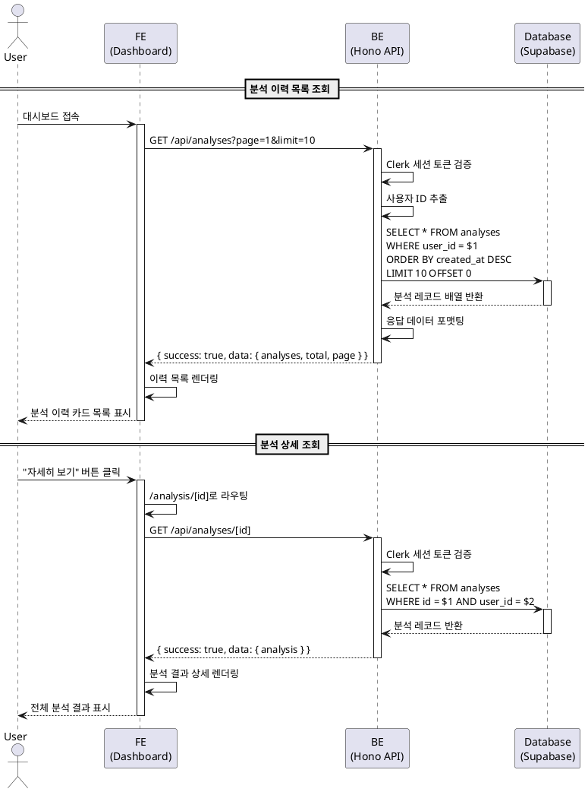

# 유스케이스 명세: 분석 이력 조회

## 유스케이스 ID: UC-004

### 제목

사용자가 과거 사주 분석 결과를 조회하고 상세 내용을 확인한다

---

## 1. 개요

### 1.1 목적

사용자가 과거에 수행한 사주 분석 결과를 언제든지 다시 열람할 수 있도록 하여, 분석 결과의 지속적인 활용 가치를 제공하고 서비스 만족도를 높인다.

### 1.2 범위

- **포함**:
  - 대시보드에서 분석 이력 목록 조회
  - 특정 분석 결과 상세 보기
  - 페이지네이션을 통한 목록 탐색
  - 본인 분석 결과만 조회 가능

- **제외**:
  - 분석 결과 수정 기능
  - 분석 결과 삭제 기능 (영구 보관 정책)
  - 다른 사용자의 분석 결과 조회

### 1.3 액터

- **주요 액터**: 로그인한 사용자 (무료 또는 Pro)
- **부 액터**:
  - Hono 백엔드 API
  - Supabase 데이터베이스
  - Clerk 인증 시스템

---

## 2. 선행 조건

- 사용자가 Clerk를 통해 로그인된 상태여야 한다
- 사용자가 최소 1회 이상의 사주 분석을 완료한 상태여야 한다 (이력이 없는 경우는 별도 엣지 케이스로 처리)
- 유효한 세션 토큰이 존재해야 한다

---

## 3. 참여 컴포넌트

- **프론트엔드 (FE)**:
  - `/dashboard` 페이지: 분석 이력 목록 표시
  - `/analysis/[id]` 페이지: 분석 결과 상세 표시
  - React Query: 서버 상태 관리 및 캐싱

- **백엔드 (BE)**:
  - `src/features/analysis/backend/route.ts`: 분석 조회 API 라우터
  - `src/features/analysis/backend/service.ts`: 분석 조회 비즈니스 로직
  - Clerk 미들웨어: 사용자 인증 확인

- **데이터베이스 (DB)**:
  - `analyses` 테이블: 분석 결과 영구 보관
  - `users` 테이블: 사용자 정보 및 소유권 확인

---

## 4. 기본 플로우 (Basic Flow)

### 4.1 단계별 흐름

#### 시나리오 A: 대시보드에서 이력 목록 조회

1. **사용자**: 대시보드 페이지(`/dashboard`)에 접속한다

   - 입력: 없음 (페이지 로드)
   - 처리: 프론트엔드가 분석 이력 목록 API 호출
   - 출력: 로딩 스피너 표시

2. **프론트엔드**: `GET /api/analyses?page=1&limit=10` API 요청

   - 입력: 페이지 번호, 페이지당 항목 수
   - 처리: React Query를 통한 API 호출
   - 출력: 로딩 상태 전환

3. **백엔드**: 인증 확인 및 사용자 ID 추출

   - 입력: 요청 헤더의 Clerk 세션 토큰
   - 처리: Clerk 미들웨어가 토큰 검증 및 사용자 ID 추출
   - 출력: 인증된 사용자 컨텍스트

4. **백엔드**: 분석 이력 조회 쿼리 실행

   - 입력: 사용자 ID, 페이지 정보
   - 처리: Supabase에서 `SELECT * FROM analyses WHERE user_id = $1 ORDER BY created_at DESC LIMIT 10 OFFSET 0`
   - 출력: 분석 목록 데이터 배열

5. **데이터베이스**: 분석 결과 레코드 반환

   - 입력: SQL 쿼리
   - 처리: 인덱스(`idx_analyses_user_id_created_at`)를 활용한 최신순 조회
   - 출력: 분석 레코드 배열

6. **백엔드**: 응답 데이터 포맷팅

   - 입력: 분석 레코드 배열
   - 처리: 민감 정보 필터링, 응답 형식 정규화
   - 출력: JSON 응답 `{ success: true, data: { analyses: [...], total: N, page: 1 } }`

7. **프론트엔드**: 분석 이력 목록 렌더링

   - 입력: API 응답 데이터
   - 처리: 목록 컴포넌트 렌더링
   - 출력: 분석 항목 카드 표시 (분석 날짜, 생년월일 일부 마스킹, 미리보기 텍스트, 자세히 보기 버튼)

#### 시나리오 B: 특정 분석 상세 보기

8. **사용자**: 목록에서 특정 분석 항목의 "자세히 보기" 버튼 클릭

   - 입력: 분석 ID
   - 처리: 클라이언트 사이드 라우팅
   - 출력: `/analysis/[id]` 페이지로 이동

9. **프론트엔드**: `GET /api/analyses/[id]` API 요청

   - 입력: 분석 ID
   - 처리: React Query를 통한 API 호출
   - 출력: 로딩 상태 표시

10. **백엔드**: 인증 확인 및 소유권 검증

    - 입력: 세션 토큰, 분석 ID
    - 처리:
      1. Clerk 미들웨어가 사용자 인증 확인
      2. `SELECT user_id FROM analyses WHERE id = $1`로 분석 소유자 조회
      3. 현재 사용자 ID와 분석 소유자 ID 비교
    - 출력: 권한 확인 결과

11. **데이터베이스**: 분석 결과 전체 데이터 반환

    - 입력: 분석 ID
    - 처리: `SELECT * FROM analyses WHERE id = $1 AND user_id = $2`
    - 출력: 분석 레코드 (JSONB result 포함)

12. **백엔드**: 분석 결과 응답

    - 입력: 분석 레코드
    - 처리: 전체 분석 결과 포함 응답 생성
    - 출력: JSON 응답 `{ success: true, data: { id, birth_date, birth_time, is_lunar, gender, result, model_used, created_at } }`

13. **프론트엔드**: 분석 결과 상세 렌더링

    - 입력: API 응답 데이터
    - 처리: 섹션별 분석 결과 컴포넌트 렌더링
    - 출력:
      - 분석 정보 헤더 (날짜, 생년월일시, 양력/음력, 성별, 사용 모델)
      - 사주팔자 기본 구성
      - 성격 및 기질
      - 대운·세운 분석
      - 운세 종합
      - 조언 및 제안
      - 대시보드 복귀 버튼

### 4.2 시퀀스 다이어그램

---

## 5. 대안 플로우 (Alternative Flows)

### 5.1 대안 플로우 1: 페이지네이션을 통한 추가 이력 조회

**시작 조건**: 기본 플로우 7단계 완료 후, 사용자가 다음 페이지 버튼 클릭

**단계**:

1. 사용자가 "다음 페이지" 버튼 클릭
2. 프론트엔드가 `GET /api/analyses?page=2&limit=10` 호출
3. 백엔드가 `OFFSET 10`으로 다음 10개 분석 조회
4. 프론트엔드가 새로운 목록 렌더링

**결과**: 다음 페이지의 분석 이력 표시

### 5.2 대안 플로우 2: URL 직접 입력을 통한 분석 상세 페이지 접근

**시작 조건**: 사용자가 브라우저 주소창에 `/analysis/[id]` URL 직접 입력

**단계**:

1. Next.js 라우터가 페이지 로드
2. 프론트엔드가 `GET /api/analyses/[id]` API 호출 (기본 플로우 9-13단계 동일)
3. 정상 응답 시 분석 결과 표시

**결과**: 특정 분석 결과 직접 조회 성공

---

## 6. 예외 플로우 (Exception Flows)

### 6.1 예외 상황 1: 분석 이력 없음

**발생 조건**: 신규 가입 사용자가 아직 분석을 수행하지 않은 상태에서 대시보드 접속

**처리 방법**:

1. 백엔드가 빈 배열 `{ success: true, data: { analyses: [], total: 0, page: 1 } }` 반환
2. 프론트엔드가 빈 상태(Empty State) UI 렌더링
3. "아직 분석 이력이 없습니다" 메시지 표시
4. "새 분석하기" 버튼 강조 표시

**에러 코드**: 없음 (정상 응답)

**사용자 메시지**: "아직 분석 이력이 없습니다. 첫 번째 사주 분석을 시작해보세요!"

### 6.2 예외 상황 2: 타인의 분석 조회 시도

**발생 조건**: 사용자가 URL을 직접 입력하여 다른 사용자의 분석 ID로 접근

**처리 방법**:

1. 백엔드가 `SELECT user_id FROM analyses WHERE id = $1` 실행
2. 조회된 user_id와 현재 사용자 ID 비교
3. 불일치 시 403 에러 반환

**에러 코드**: `ANALYSIS_FORBIDDEN` (HTTP 403)

**사용자 메시지**: "접근 권한이 없는 분석 결과입니다."

**화면 전환**: 에러 페이지 또는 대시보드로 리다이렉트

### 6.3 예외 상황 3: 존재하지 않는 분석 ID 조회

**발생 조건**: 잘못된 ID 또는 삭제된 분석 ID로 접근

**처리 방법**:

1. 백엔드가 `SELECT * FROM analyses WHERE id = $1` 실행
2. 결과가 없을 경우 404 에러 반환

**에러 코드**: `ANALYSIS_NOT_FOUND` (HTTP 404)

**사용자 메시지**: "요청하신 분석 결과를 찾을 수 없습니다."

**화면 전환**: 404 에러 페이지 표시, "대시보드로 돌아가기" 버튼 제공

### 6.4 예외 상황 4: 페이지네이션 범위 초과

**발생 조건**: 존재하지 않는 페이지 번호로 요청 (예: 전체 2페이지인데 5페이지 요청)

**처리 방법**:

1. 백엔드가 정상적으로 빈 배열 반환
2. 프론트엔드가 "더 이상 불러올 분석이 없습니다" 메시지 표시
3. 이전 페이지, 첫 페이지로 이동 버튼 제공

**에러 코드**: 없음 (정상 응답)

**사용자 메시지**: "더 이상 불러올 분석이 없습니다."

### 6.5 예외 상황 5: 분석 데이터 손상 (JSONB 파싱 실패)

**발생 조건**: 데이터베이스의 result 필드가 손상되어 JSON 파싱 실패

**처리 방법**:

1. 백엔드가 JSON 파싱 에러 감지
2. 에러 로깅 및 관리자 알림 발송
3. 500 에러 반환

**에러 코드**: `ANALYSIS_DATA_CORRUPTED` (HTTP 500)

**사용자 메시지**: "분석 결과를 불러오는 중 오류가 발생했습니다. 고객 지원팀에 문의해주세요."

**추가 처리**: 해당 분석 ID 및 사용자 정보를 로그에 기록하여 수동 복구 가능하도록 함

### 6.6 예외 상황 6: 세션 만료

**발생 조건**: 사용자가 오랜 시간 비활성 상태로 세션 토큰 만료

**처리 방법**:

1. Clerk 미들웨어가 만료된 세션 감지
2. 401 에러 반환
3. 프론트엔드가 로그인 페이지로 리다이렉트
4. 원래 페이지 URL을 저장하여 로그인 후 복귀 가능

**에러 코드**: `UNAUTHORIZED` (HTTP 401)

**사용자 메시지**: "세션이 만료되었습니다. 다시 로그인해주세요."

### 6.7 예외 상황 7: 네트워크 오류

**발생 조건**: API 요청 중 네트워크 연결 끊김 또는 타임아웃

**처리 방법**:

1. React Query가 자동 재시도 (최대 3회)
2. 모두 실패 시 에러 UI 표시
3. "다시 시도" 버튼 제공

**에러 코드**: `NETWORK_ERROR` (프론트엔드 레벨)

**사용자 메시지**: "네트워크 오류가 발생했습니다. 다시 시도해주세요."

---

## 7. 후행 조건 (Post-conditions)

### 7.1 성공 시

- **데이터베이스 변경**: 없음 (읽기 전용 작업)
- **시스템 상태**:
  - React Query 캐시에 조회 결과 저장 (5분간 유효)
  - 사용자 세션 유지
- **외부 시스템**: Clerk 세션 활성 상태 유지

### 7.2 실패 시

- **데이터 롤백**: 없음 (읽기 작업)
- **시스템 상태**:
  - 에러 상태 표시
  - 이전 캐시 데이터 유지 (있는 경우)
  - 사용자 세션은 유지 (인증 오류 제외)

---

## 8. 비기능 요구사항

### 8.1 성능

- **응답 시간**:
  - 분석 목록 조회: 평균 200ms 이하 (10개 항목 기준)
  - 분석 상세 조회: 평균 300ms 이하 (JSONB 파싱 포함)
- **동시 사용자**: 최대 1,000명 동시 조회 지원
- **캐싱**:
  - React Query 클라이언트 캐싱 (staleTime: 5분)
  - 동일 분석 재조회 시 캐시 활용으로 즉시 표시
- **데이터베이스 최적화**: `idx_analyses_user_id_created_at` 인덱스 활용

### 8.2 보안

- **인증**: Clerk 세션 토큰 필수
- **권한**: 본인 분석만 조회 가능 (user_id 검증)
- **데이터 보호**:
  - HTTPS 통신 필수
  - 생년월일 일부 마스킹 표시 (목록 뷰)
  - SQL Injection 방지 (Prepared Statement 사용)
- **세션 관리**: Clerk의 자동 세션 갱신 활용

### 8.3 가용성

- **업타임**: 99.5% 이상
- **에러 복구**:
  - 네트워크 오류 시 자동 재시도 (최대 3회)
  - 데이터베이스 연결 실패 시 에러 로깅 및 알림
- **장애 대응**: Supabase 자동 백업을 통한 데이터 복구 가능

---

## 9. UI/UX 요구사항

### 9.1 화면 구성

#### 대시보드 - 분석 이력 목록

- **이력 카드 컴포넌트** (각 분석별):
  - 분석 날짜 및 시간 (예: "2025년 10월 27일 오후 3:24")
  - 생년월일 일부 마스킹 (예: "1990년 **월 **일")
  - 사용 모델 배지 (Flash/Pro)
  - 미리보기 텍스트 (성격 첫 줄 또는 요약)
  - "자세히 보기" 버튼

- **페이지네이션**:
  - 이전/다음 페이지 버튼
  - 현재 페이지 번호 표시
  - 전체 페이지 수 표시

- **빈 상태 (Empty State)**:
  - 일러스트레이션 또는 아이콘
  - "아직 분석 이력이 없습니다" 메시지
  - "새 분석하기" 버튼 (Primary CTA)

#### 분석 상세 페이지

- **헤더 영역**:
  - 분석 날짜 및 시간
  - 생년월일시 (전체 표시)
  - 양력/음력 구분
  - 성별
  - 사용 모델 배지

- **결과 섹션** (스크롤 가능):
  1. 사주팔자 기본 구성
  2. 성격 및 기질
  3. 대운·세운 분석
  4. 운세 종합
  5. 조언 및 제안

- **액션 버튼 영역**:
  - "대시보드로 돌아가기" 버튼
  - (선택사항) 인쇄/PDF 저장, 공유 버튼

### 9.2 사용자 경험

- **로딩 상태**:
  - 목록 조회 시 스켈레톤 UI 표시
  - 상세 조회 시 스피너 표시
- **반응형 디자인**:
  - 모바일: 카드를 세로로 쌓기
  - 태블릿/데스크톱: 2-3열 그리드
- **인터랙션**:
  - 카드 호버 시 그림자 효과
  - 버튼 클릭 시 명확한 피드백
- **접근성**:
  - 키보드 네비게이션 지원
  - 스크린 리더 호환 (ARIA 속성)
- **에러 표시**:
  - 인라인 에러 메시지
  - 명확한 재시도 옵션

---

## 10. 비즈니스 규칙

### 10.1 데이터 관리

- **영구 보관**: 모든 분석 결과는 삭제하지 않고 영구 보관
- **소유권**: 분석 결과는 생성한 사용자만 조회 가능
- **정렬 순서**: 항상 최신순 (created_at DESC)

### 10.2 접근 제어

- **인증 필수**: 모든 조회 API는 로그인 필수
- **본인 확인**: user_id 일치 여부 백엔드에서 검증
- **공유 불가**: 타인에게 분석 결과 공유 기능 미제공 (현재 버전)

### 10.3 성능 정책

- **페이지네이션**: 한 번에 최대 20개 항목 조회 (권장: 10개)
- **캐싱**: 클라이언트 캐싱으로 중복 요청 최소화
- **인덱스**: 데이터베이스 인덱스를 통한 빠른 조회 보장

---

## 10. 테스트 시나리오

### 10.1 성공 케이스

| 테스트 케이스 ID | 입력값 | 기대 결과 |
| ---------------- | ------ | --------- |
| TC-004-01 | 분석 이력이 5개 있는 사용자가 대시보드 접속 | 5개의 분석 카드가 최신순으로 표시됨 |
| TC-004-02 | 목록에서 첫 번째 분석의 "자세히 보기" 클릭 | 해당 분석 결과 상세 페이지로 이동 및 전체 결과 표시 |
| TC-004-03 | 분석 이력 15개, 페이지당 10개 설정 → 2페이지 요청 | 11-15번째 분석 5개 표시 |
| TC-004-04 | URL에 직접 `/analysis/[valid_id]` 입력 | 해당 분석 결과 정상 표시 |

### 10.2 실패 케이스

| 테스트 케이스 ID | 입력값 | 기대 결과 |
| ---------------- | ------ | --------- |
| TC-004-05 | 신규 가입 사용자 (분석 이력 0개) | "아직 분석 이력이 없습니다" 메시지 및 새 분석하기 버튼 표시 |
| TC-004-06 | 다른 사용자의 분석 ID로 직접 URL 접근 | 403 에러 페이지 및 "접근 권한이 없습니다" 메시지 |
| TC-004-07 | 존재하지 않는 분석 ID로 접근 | 404 에러 페이지 및 "분석을 찾을 수 없습니다" 메시지 |
| TC-004-08 | 전체 2페이지인데 5페이지 요청 | 빈 목록 및 "더 이상 불러올 분석이 없습니다" 메시지 |
| TC-004-09 | 세션 토큰 만료 상태에서 API 호출 | 로그인 페이지로 리다이렉트 및 "세션이 만료되었습니다" 메시지 |

---

## 11. 관련 유스케이스

- **선행 유스케이스**:
  - UC-001: 신규 회원가입 및 첫 분석 (분석 결과 생성)
  - UC-003: 사주 분석 요청 (Pro 유저)

- **후행 유스케이스**:
  - (Phase 2) 분석 결과 PDF 저장
  - (Phase 2) 분석 결과 공유

- **연관 유스케이스**:
  - UC-002: Pro 구독 결제 (구독 상태에 따라 사용 모델 달라짐)

---

## 12. 변경 이력

| 버전 | 날짜       | 작성자 | 변경 내용 |
| ---- | ---------- | ------ | --------- |
| 1.0  | 2025-10-27 | Claude | 초기 작성 |

---

## 부록

### A. 용어 정의

- **분석 이력**: 사용자가 과거에 수행한 사주 분석 결과 목록
- **페이지네이션**: 많은 데이터를 여러 페이지로 나누어 표시하는 기법
- **React Query**: 서버 상태 관리 및 캐싱 라이브러리
- **세션 토큰**: Clerk가 발급한 사용자 인증 토큰
- **마스킹**: 개인정보 보호를 위해 일부 정보를 가리는 것

### B. 참고 자료

- `/docs/userflow.md` - 섹션 4: 분석 이력 조회 플로우
- `/docs/prd.md` - 섹션 3.2.3: 대시보드 페이지, 섹션 3.2.5: 분석 상세보기 페이지
- `/docs/database.md` - 섹션 3.3: analyses 테이블 스키마
- [Clerk Documentation](https://clerk.com/docs) - 인증 및 세션 관리
- [Supabase Documentation](https://supabase.com/docs) - 데이터베이스 쿼리
- [React Query Documentation](https://tanstack.com/query/latest) - 서버 상태 관리
