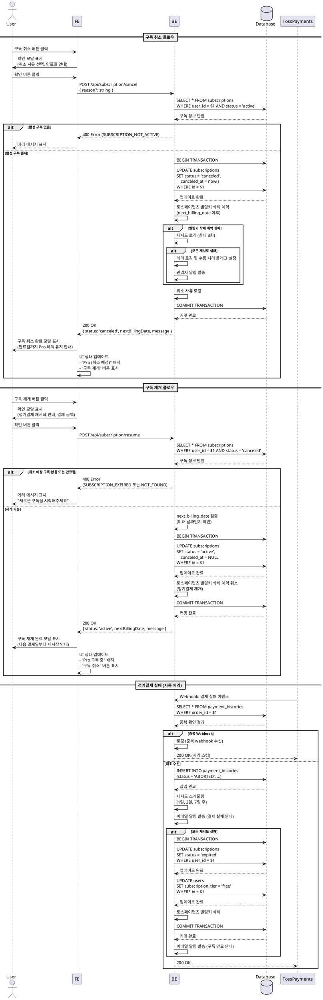

# 유스케이스: UC-005 - 구독 관리

## 개요

### 목적
Pro 구독자가 구독을 취소하거나 취소 예정 상태에서 재개할 수 있도록 하여, 사용자가 자신의 구독 상태를 자유롭게 관리할 수 있도록 한다.

### 범위
- 구독 취소 요청 처리
- 구독 재개 요청 처리
- 취소 예정 상태에서 만료일까지 Pro 혜택 유지
- 빌링키 관리 (취소 시 삭제 예약, 재개 시 유지)

**제외 사항**:
- 결제 수단 변경 (별도 유스케이스)
- 정기결제 자동 처리 (토스페이먼츠 자동 처리)

---

## Primary Actor
- Pro 구독 사용자 (활성 구독 또는 취소 예정 상태)

---

## Preconditions

**사용자 관점**:
1. 사용자가 로그인되어 있어야 함
2. 사용자가 Pro 구독 상태여야 함 (status: 'active' 또는 'canceled')
3. 구독 관리 페이지(/subscription)에 접근 가능해야 함

---

## Trigger

### 구독 취소 플로우
- 구독 관리 페이지에서 "구독 취소" 버튼 클릭

### 구독 재개 플로우
- 구독 관리 페이지(취소 예정 상태)에서 "구독 재개" 버튼 클릭

---

## Main Scenario

### 시나리오 1: 구독 취소

1. **User**: 구독 관리 페이지에서 "구독 취소" 버튼 클릭
   - 입력: 버튼 클릭 이벤트

2. **FE**: 확인 모달 표시
   - 취소 사유 선택 옵션 표시 (선택사항)
   - 만료일까지 Pro 혜택 유지 안내
   - 만료일 명시
   - "확인" 및 "취소" 버튼 제공

3. **User**: 확인 모달에서 "확인" 버튼 클릭
   - 입력: 취소 사유 (선택사항)

4. **FE**: API 호출 (POST /api/subscription/cancel)
   - 요청 본문: `{ reason?: string }`

5. **BE**: 인증 및 구독 상태 검증
   - 사용자 인증 확인
   - subscriptions 테이블 조회 (status = 'active')
   - 활성 구독이 아니면 에러 반환

6. **BE**: subscriptions 테이블 업데이트
   - status: 'canceled'
   - canceled_at: 현재 시각
   - next_billing_date 유지 (만료일까지 혜택 유지)

7. **BE**: 토스페이먼츠 빌링키 삭제 예약
   - 다음 결제일 이후로 예약 (즉시 삭제하지 않음)
   - 만료일 전까지는 재개 가능

8. **BE**: 취소 사유 로깅 (분석용)
   - 별도 로그 테이블 또는 로깅 시스템에 기록

9. **BE**: 성공 응답 반환
   - 응답: `{ status: 'canceled', nextBillingDate: Date, message: '구독이 취소되었습니다' }`

10. **FE**: 구독 취소 완료 모달 표시
    - 만료일까지 Pro 혜택 유지 안내
    - 만료일 명시
    - 재개 가능 안내

11. **FE**: 구독 관리 페이지 상태 업데이트
    - "Pro (취소 예정)" 배지 표시
    - "구독 재개" 버튼 표시
    - "구독 취소" 버튼 숨김
    - 만료일 표시

### 시나리오 2: 구독 재개

1. **User**: 구독 관리 페이지(취소 예정 상태)에서 "구독 재개" 버튼 클릭
   - 입력: 버튼 클릭 이벤트

2. **FE**: 확인 모달 표시
   - 다음 결제일부터 정기결제 재시작 안내
   - 결제 금액 및 일정 명시
   - "확인" 및 "취소" 버튼 제공

3. **User**: 확인 모달에서 "확인" 버튼 클릭

4. **FE**: API 호출 (POST /api/subscription/resume)

5. **BE**: 인증 및 구독 상태 검증
   - 사용자 인증 확인
   - subscriptions 테이블 조회 (status = 'canceled')
   - next_billing_date가 미래인지 확인 (만료 전인지 검증)
   - 조건 불충족 시 에러 반환

6. **BE**: subscriptions 테이블 업데이트
   - status: 'active'
   - canceled_at: NULL

7. **BE**: 토스페이먼츠 빌링키 삭제 예약 취소
   - 기존 빌링키로 정기결제 재개
   - 다음 결제일부터 자동 결제 재시작

8. **BE**: 성공 응답 반환
   - 응답: `{ status: 'active', nextBillingDate: Date, message: '구독이 재개되었습니다' }`

9. **FE**: 구독 재개 완료 모달 표시
   - 다음 결제일부터 정기결제 재시작 안내
   - 결제 금액 및 일정 명시

10. **FE**: 구독 관리 페이지 상태 업데이트
    - "Pro 구독 중" 배지 표시
    - "구독 취소" 버튼 표시
    - "구독 재개" 버튼 숨김
    - 다음 결제일 표시

---

## Edge Cases

### 1. 이미 취소된 구독 재취소 시도
- **발생 조건**: 취소 예정 상태에서 구독 취소 API 직접 호출
- **처리**: 백엔드에서 status 확인 → 이미 'canceled' 상태 감지 → 400 에러 반환
- **에러 코드**: `SUBSCRIPTION_ALREADY_CANCELED`
- **사용자 메시지**: "이미 취소된 구독입니다."

### 2. 만료된 구독 재개 시도
- **발생 조건**: next_billing_date가 과거인 상태에서 재개 시도
- **처리**: 백엔드에서 만료 확인 → 빌링키 이미 삭제됨 → 400 에러 반환
- **에러 코드**: `SUBSCRIPTION_EXPIRED`
- **사용자 메시지**: "만료된 구독은 재개할 수 없습니다. 새로운 구독을 시작해주세요."
- **UI 동작**: 새로운 Pro 구독하기 버튼 표시

### 3. 빌링키 삭제 실패
- **발생 조건**: 구독 취소 시 토스페이먼츠 API 오류
- **처리**:
  - 재시도 로직 (최대 3회)
  - 모두 실패 시 에러 로깅
  - 데이터베이스는 취소 상태로 업데이트 (사용자에게는 정상 취소로 안내)
  - 백엔드에서 수동 처리 플래그 설정
  - 관리자에게 알림 발송

### 4. 정기결제 실패 (자동)
- **발생 조건**: 다음 결제일에 자동 결제 시도 실패 (카드 한도 초과, 정지 등)
- **처리**:
  1. 토스페이먼츠가 webhook으로 결제 실패 이벤트 전송
  2. 백엔드에서 재시도 로직
     - 1일 후 1차 재시도
     - 3일 후 2차 재시도
     - 7일 후 3차 재시도
  3. 모두 실패 시
     - subscriptions.status = 'expired'
     - users.subscription_tier = 'free'
     - 빌링키 삭제
  4. 사용자에게 이메일 알림 발송 (각 재시도 전/후)
- **UI 동작**:
  - 대시보드 접속 시 알림 배너 표시
  - 결제 실패 안내
  - 카드 정보 확인 요청
  - 재구독 버튼 제공

### 5. 중복 Webhook 수신
- **발생 조건**: 동일한 orderId의 webhook을 여러 번 수신
- **처리**:
  - 백엔드에서 멱등성 보장
  - payment_histories에서 orderId 존재 여부 확인
  - 이미 존재하면 중복 처리 스킵
- **로깅**: 중복 webhook 수신 기록

### 6. 활성 구독이 아닌 사용자의 취소 시도
- **발생 조건**: 무료 유저 또는 이미 만료된 사용자가 취소 API 호출
- **처리**: 백엔드에서 구독 상태 확인 → 활성 구독 없음 감지 → 403 에러 반환
- **에러 코드**: `SUBSCRIPTION_NOT_ACTIVE`
- **사용자 메시지**: "활성 구독이 없습니다."

---

## Business Rules

### 구독 취소 정책
1. **만료일까지 혜택 유지**: 구독 취소 시에도 next_billing_date까지 Pro 혜택 유지
2. **빌링키 삭제 정책**: 다음 결제일 이후로 삭제 예약 (즉시 삭제하지 않음)
3. **재개 가능 기간**: next_billing_date 전까지 취소 철회 가능
4. **분석 사용량**: 취소 예정 상태에서도 월 10회 제한 유지

### 구독 재개 정책
1. **재개 조건**: status = 'canceled' 이고 next_billing_date가 미래여야 함
2. **빌링키 유지**: 기존 빌링키로 정기결제 재개
3. **결제 재시작**: 다음 결제일부터 자동 결제 재시작
4. **상태 복원**: status = 'active', canceled_at = NULL

### 정기결제 실패 정책
1. **재시도 횟수**: 최대 3회 (1일, 3일, 7일 간격)
2. **만료 처리**: 모두 실패 시 status = 'expired', tier = 'free'
3. **빌링키 삭제**: 완전 만료 시 빌링키 삭제
4. **사용자 알림**: 각 재시도 전후 이메일 알림 발송

### 데이터 일관성
1. **트랜잭션**: 모든 구독 상태 변경은 트랜잭션으로 처리
2. **동기화**: users.subscription_tier와 subscriptions.status 동기화
3. **멱등성**: Webhook 처리 시 orderId 기반 멱등성 보장

---

## Sequence Diagram

---

## 후행 조건

### 성공 시 (구독 취소)
- **데이터베이스 변경**:
  - subscriptions 테이블: status = 'canceled', canceled_at = 현재 시각
  - next_billing_date 유지
- **시스템 상태**:
  - 구독 상태: 취소 예정 (만료일까지 Pro 유지)
  - UI: "Pro (취소 예정)" 배지, "구독 재개" 버튼 표시
- **외부 시스템**:
  - 토스페이먼츠: 빌링키 삭제 예약 (next_billing_date 이후)

### 성공 시 (구독 재개)
- **데이터베이스 변경**:
  - subscriptions 테이블: status = 'active', canceled_at = NULL
- **시스템 상태**:
  - 구독 상태: 활성
  - UI: "Pro 구독 중" 배지, "구독 취소" 버튼 표시
- **외부 시스템**:
  - 토스페이먼츠: 빌링키 삭제 예약 취소, 정기결제 재개

### 실패 시
- **데이터 롤백**: 트랜잭션 롤백으로 모든 변경 취소
- **시스템 상태**: 이전 상태 유지 (변경 없음)

---

## 비기능 요구사항

### 성능
- API 응답 시간: 200ms 이내 (토스페이먼츠 API 호출 제외)
- 토스페이먼츠 API 호출: 3초 이내 (재시도 포함)

### 보안
- 인증: Clerk 세션 토큰 검증 필수
- 권한: 본인 구독만 취소/재개 가능
- 외부 API: 토스페이먼츠 시크릿 키는 서버 사이드에서만 사용

### 가용성
- 에러 복구: 빌링키 삭제 실패 시 재시도 (최대 3회)
- 모니터링: 구독 상태 변경 실패 시 즉시 알림

---

## UI/UX 요구사항

### 화면 구성 (구독 관리 페이지)

#### Pro 구독 중 상태
- 구독 정보 카드:
  - 요금제: "Pro 구독 중"
  - 시작일, 다음 결제일, 결제 금액 표시
- 사용 현황 카드:
  - 이번 달 사용 X/10회
  - 다음 초기화 날짜
- 결제 수단 정보:
  - 카드사, 마지막 4자리
- 결제 이력 리스트
- "구독 취소" 버튼 (빨간색, 하단)

#### 취소 예정 상태
- 구독 정보 카드:
  - 요금제: "Pro (취소 예정)"
  - 혜택 만료일 강조 표시
- 사용 현황 카드:
  - 남은 사용 X/10회
  - 만료 후 무료 전환 안내
- "구독 재개" 버튼 (파란색, 강조)

### 사용자 경험

#### 구독 취소
1. 명확한 확인 모달:
   - 만료일까지 Pro 혜택 유지 명시
   - 재개 가능 안내
   - 취소 사유 선택 (선택사항, 향후 개선용)
2. 성공 메시지:
   - 축하/감사 메시지 없음 (취소이므로)
   - 만료일 강조
   - 재개 방법 안내

#### 구독 재개
1. 명확한 확인 모달:
   - 다음 결제일 및 금액 명시
   - 정기결제 재시작 안내
2. 성공 메시지:
   - 환영 메시지
   - 다음 결제 일정 안내

---

## 관련 유스케이스

- **선행 유스케이스**: UC-002 (Pro 구독 결제)
- **후행 유스케이스**: UC-003 (사주 분석 요청 - Pro 유저)
- **연관 유스케이스**:
  - UC-006 (결제 수단 변경) - 향후 구현
  - UC-007 (정기결제 처리) - 토스페이먼츠 자동 처리

---

## 변경 이력

| 버전 | 날짜 | 작성자 | 변경 내용 |
|------|------|--------|----------|
| 1.0 | 2025-10-27 | Claude Code | 초기 작성 |

---

## 부록

### A. 용어 정의

- **취소 예정 상태**: status = 'canceled'이지만 next_billing_date 전으로 Pro 혜택이 유지되는 상태
- **만료일**: next_billing_date (이 날짜까지 Pro 혜택 유지)
- **빌링키**: 토스페이먼츠에서 발급한 정기결제용 키 (카드 정보 없이 결제 가능)
- **멱등성**: 동일한 요청을 여러 번 수행해도 결과가 동일하게 유지되는 성질

### B. 참고 자료

- [토스페이먼츠 빌링키 API](https://docs.tosspayments.com/reference/billing-key)
- [토스페이먼츠 Webhook](https://docs.tosspayments.com/guides/webhook)
- Userflow 문서: `/docs/userflow.md` (섹션 5)
- PRD 문서: `/docs/prd.md` (섹션 6.2)
- Database 문서: `/docs/database.md` (섹션 3.2)
